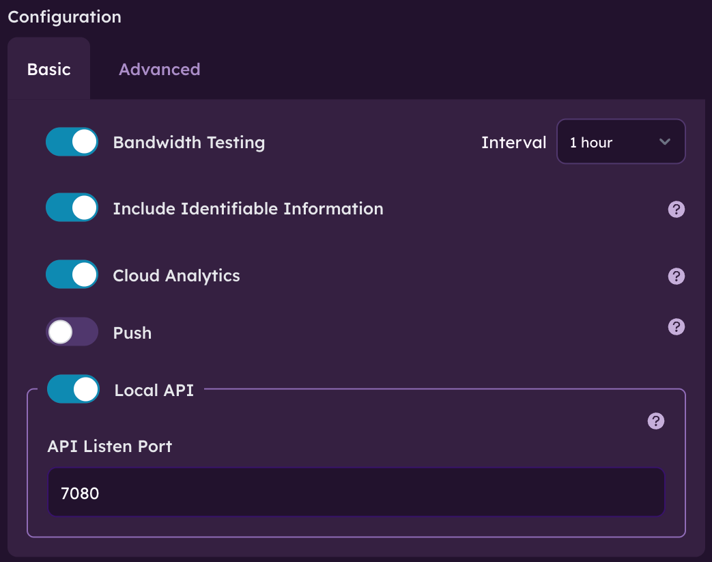
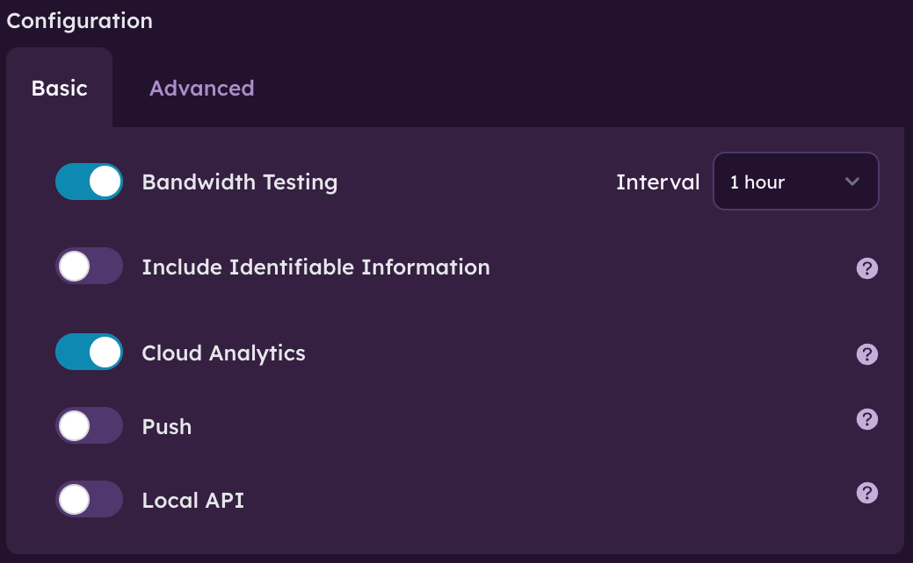
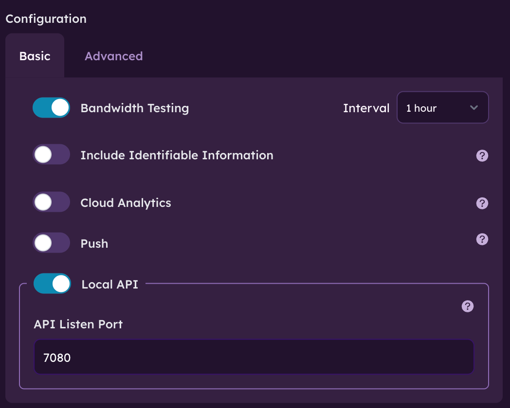

# Datasets Configuration

[Datasets](/docs/deploy-and-configure/datasets) can be configured on a per-Orb basis in the [Orb Cloud Status page](https://cloud.orb.net/status) or via Deployment Tokens in the [Orchestration page](https://cloud.orb.net/orchestration). For more details on configuration, see [Remote Configuration](/docs/deploy-and-configure/configuration#remote-configuration)

You can configure which Datasets your Orbs generate, where they are sent, and enable the inclusion of potentially [Identifiable](/docs/deploy-and-configure/datasets-configuration#identifiable-information) yet useful information (e.g. IP address).

:::info
Datasets Configuration requires Orb app and sensor versions 1.3 and above.
:::

## Destinations

Orbs can send data to [Orb Cloud](/docs/orb-cloud), to backends you control, or both. There are three modes available:

1. [Orb Cloud](/docs/deploy-and-configure/datasets-configuration#orb-cloud) - data is streamed to Orb Cloud for visualization in Orb Cloud Analytics dashboards
2. [Local API](/docs/deploy-and-configure/datasets-configuration#local-api) - each Orb serves a local HTTP endpoint, allowing other machines to access Datasets via polling
3. Data Push - each Orb pushes data to a custom endpoint via HTTP(S) POST

## Example Configuration

Below is an example configuration, which enables the Scores, Responsiveness, Web Responsiveness, and Speed Datasets, enables serving these Datasets via Local API with the inclusion of identifiable data, and enables sending these Datasets to Orb Cloud:

```json
{
  "datasets.api": [
    "identifiable=true",    
    "port=7080",
    "scores_1m",
    "responsiveness_1s",
    "speed_results",
    "web_responsiveness_results"
  ],
  "datasets.cloud_push": [
    "scores_1m",
    "speed_results",
    "responsiveness_1s",
    "web_responsiveness_results"
  ]
}
```

This same configuration can also be achieved using the visual configuration editor:



See [Remote Configuration](/docs/deploy-and-configure/configuration#remote-configuration) for details on editing your configuration.

## Identifiable Information

Identifiable Information is information that can potentially be used to identify an individual (e.g. public IP address, network name). By default, this information is masked, hashed, or not sent. If you want access to Identifiable Information, you must explicitely enable it via configuiration. Currently, the following fields are classified as "identifiable": `orb_name, device_name, network_name, public_ip, latitude, longitude`. For more information, see [Datasets](/docs/deploy-and-configure/datasets) and note the fields containing `identifiable=true`.

## Defaults and Plans

The default configuration:

* Enables the Scores Dataset
* Sends the Scores Dataset to Orb Cloud
* Does not include Identifiable Information

Sending additional Datsets to Orb Cloud requires an Orb Cloud Personal, Business, or Enterprise subscription. In addition, while the Local API is available to Free users, Data Push requires a Personal, Business, or Enterprise plan.

## Disable Orb Cloud

Whether you're a free user or a user on a paid plan, you may choose to not send Datasets to Orb Cloud. To prevent your Orb from sending data to Orb Cloud, simply update the configuration to have an empty array as the value of the `datasets.cloud_push` key. For example:

```json
{
  "datasets.cloud_push": []
}
```

Would generate no Datasets and send no Datasets to Orb Cloud. Orb Cloud will still be used to manage your subscription entitlements and Orb configuration.

See [Remote Configuration](/docs/deploy-and-configure/configuration#remote-configuration) for details on editing your configuration.

## Datasets Modes

### Orb Cloud

Sending your Datasets to Orb Cloud is the easiest way to leverage your Orb Personal, Business, or Enterprise plan. When you send your data to Orb Cloud, the data is fully managed by Orb in our secure cloud, with access to [Orb Cloud Analytics](/docs/orb-cloud/analytics) on a per-Orb and aggregate basis to view the health of your Orbs at scale.

Configuring your Orbs to send Datasets to Orb Cloud can be accomplished with a simple configuration that enables all datasets and pushes them to Orb Cloud:



:::info
Datasets Configuration requires Orb app and sensor versions 1.3 and above.
:::

See [Remote Configuration](/docs/deploy-and-configure/configuration#remote-configuration) for details on editing your configuration.

### Local API

Local API allows you to configure an Orb to serve a local HTTP endpoint that can be used to access datasets with polling (recurring) requests. The response payloads will contain an array of JSON objects with each key described in the [Datasets](/docs/deploy-and-configure/datasets) documentation.

Local API is a great option if you have a small number of Orbs running on the same network and do not wish to use Orb Cloud. You can build an Orb Cloud-like experience for your home lab with complete control, and it even works with our Free plan!

You can either configure/build your own receiver listener, or use the open source and well supported [Telegraf](https://www.influxdata.com/time-series-platform/telegraf/) collector with the [HTTP input plugin](https://docs.influxdata.com/influxdb/v2/write-data/no-code/use-telegraf/use-telegraf-plugins/use-http-plugin/).

The easiest way to get started with Orb Local API is using our Orb [Local Analytics](/docs/deploy-and-configure/local-analytics) open source project.

#### Configuration options

- `port` - Port on which Data API server will start (default: `7080`)
- `identifiable` - Whether to include Identifiable Information (default: `false`)
- `buffer` – Maximum in-memory records to retain (default: `100`)

#### Example configuration



:::info
Datasets Configuration requires Orb app and sensor versions 1.3 and above.
:::

See [Remote Configuration](/docs/deploy-and-configure/configuration#remote-configuration) for details on editing your configuration.

#### Accessing the API

To get data from Local Data API, callers should poll the GET API to fetch new dataset records since the last request. To keep track of which records have already been received and only fetch new records, the caller should use its own unique `caller_id` that is consistent across polling requests.

```
GET /api/v2/datasets/{name}.{format}?id={caller_id}
```

**Parameters:**

- `name` - Name of a configured dataset (e.g. `"responsiveness_1s"`,  `"speed_results"`)
- `caller_id` - Unique ID of caller, to allow API to ensure only new records are served and no duplicates from previous polling requests are served. This can be any string, so a collecting process can generate a random string if desired. If you know there will only be one calling process/destination, you can use a static/consistent ID like `id=123`.
- `name` - Format extension (`json` or `jsonl`) for JSON (array) response or NDJSON (line separated objects) response payload

**Example:**

```
GET http://localhost:7080/api/v2/datasets/speed_results.json?id=123
```

**Example Response:**

```json
[{"orb_id":"dc9t7y9xry3hmtka859p92agqe5m","orb_name":"Fi****la","device_name":"Fi****la","timestamp":1756935043000,"dataset":"speed","orb_version":"v1.2.3","network_type":2,"network_state":6,"country_code":"US","city":"Lynnwood","isp_name":"Ziply Fiber","public_ip":"50.125.0.0","latitude":47.8,"longitude":-122.29,"location_source":1,"speed_test_server":"https://speed.cloudflare.com/","download_kbps":518022,"upload_kbps":291284},{"orb_id":"dc9t7y9xry3hmtka859p92agqe5m","orb_name":"Fi****la","device_name":"Fi****la","timestamp":1756935051000,"dataset":"speed","orb_version":"v1.2.3","network_type":2,"network_state":6,"country_code":"US","city":"Lynnwood","isp_name":"Ziply Fiber","public_ip":"50.125.0.0","latitude":47.8,"longitude":-122.29,"location_source":1,"speed_test_server":"https://speed.cloudflare.com/","download_kbps":556665,"upload_kbps":171058}]
```

### Data Push

Data Push allows you to configure an HTTP or HTTPS endpoint to which each Orb sensor will POST data to. The posted payloads will contain JSON objects with each key described in the [Datasets](/docs/deploy-and-configure/datasets) documentation.

Data Push is a great option if you have lots of Orbs across different networks, and want to utilize an existing analytics solution or build your own. The Data Push capability requires a Business or Enterprise plan.

You can either configure/build your own receiver listener, or use the open source and well supported [Telegraf](https://www.influxdata.com/time-series-platform/telegraf/) collector with the [HTTP Listener V2 input plugin](https://docs.influxdata.com/telegraf/v1/plugins/#input-http_listener_v2).

#### Configuration options

- `url` - Endpoint to push data to
- `interval_ms` - Push frequency in milliseconds (default: `60000`)
- `format` - `jsonl` (ND-JSON) or `json` (array). (default: `jsonl`)
- `identifiable` - Whether to include Identifiable Information (default: `false`)
- `buffer_kb` - Maximum in-memory buffer if POSTs fail (default: `2MB`)

#### Example configuration


:::info
Datasets Configuration requires Orb app and sensor versions 1.3 and above.
:::

See [Remote Configuration](/docs/deploy-and-configure/configuration#remote-configuration) for details on editing your configuration.
