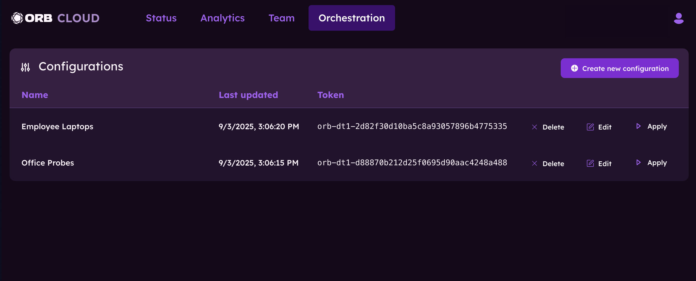
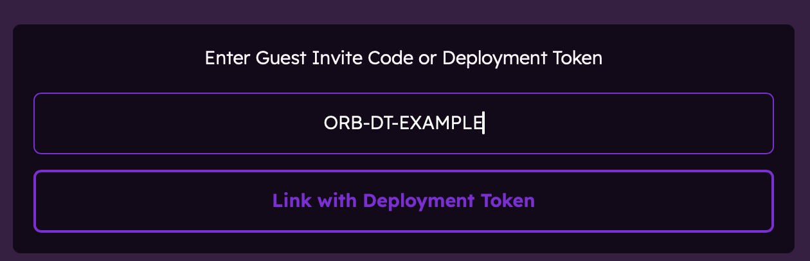

# Deployment Tokens

Deployment Tokens are an Orb Cloud feature that allow you to:

1. Easily link many Orbs to your Orb Space
2. Manage the [Configuration](/docs/deploy-and-configure/configuration) of Orbs at scale
3. Set different Tags and Configurations for different sets of Orbs

By visiting the [Orchestration](https://cloud.orb.net/orchestration) section of Orb Cloud, you can create and delete Deployment Tokens, edit attached Configrations and Tags, and apply these changes to the Orbs associated with the Configuration Token.



## Generating Tokens

Each Orb Cloud Space comes with a Token already generated, named "Default Token".

## Using Tokens for Deployment

Deployment Tokens can be utilized to easily link Orbs to your Space and ensure they are configured as desired. There are many options for utilizing Deployment Tokens for linking:

1. [Directly in the Orb mobile and desktop application interfaces](/docs/deploy-and-configure/deployment-tokens#using-the-apps)
2. [Utilizing an environment variable](/docs/deploy-and-configure/deployment-tokens#using-environment-variable)
3. [Utilizing a .txt file](/docs/deploy-and-configure/deployment-tokens#using-a-txt-file)
4. [Utilizing Mobile Device Management (MDM) tools for Windows and macOS](/docs/deploy-and-configure/deployment-tokens#using-mdm)

:::tip
If you are managing a handful of Orbs, Deployment Tokens are not necessary for Linking or Configuration, as you may use other options such as logging into the application, discovery from another logged in Orb application, or using the CLI. See [Linking an Orb to your account](/docs/orb-app/linking-orb-to-account) for more details.
:::

### Using the apps

Using the Orb applications, you may manully link an Orb to your Space using Deployment Tokens. This is a great approach for managing a small number of Orbs or for testing purposes.

:::info
In-app Deployment Token linking requires Orb app versions 1.3 and above.
:::

To link using Deployment Tokens in the Orb apps:

1. Visit the [Orchestration](https://cloud.orb.net/orchestration) section of Orb Cloud and copy the desired Token from the Configuration table.
2. In the Orb app on the device you wish to link, tap or click the settings cog, select "App Settings", and select "Link to existing account".
3. Paste the Deployment Token from step 1 into the "Enter token" field and hit "Apply".



Your Orb is now linked to your Space! If you receive an error, the Orb is likely already linked to another Space and will need to be un-linked before trying again. Ensure the "View Only" mode is disabled in the Orb app, or the linked Orb will not collect any data.

### Using environment variable

The environment variable `ORB_DEPLOYMENT_TOKEN` can be used to set the Deployment Token and link an Orb with your Space.

:::warning
As macOS apps run in restricted sandboxes, they do not have access to your shell environment. Therefore, using an environment variable does not function for the macOS app. The Orb macOS binary, Docker images, and Homebrew install options all support environment variables.
:::

You can simply insert the environment variable before running `orb sensor`:

```bash
ORB_DEPLOYMENT_TOKEN=orb-dt1-yourdeploymenttoken678 orb sensor
```

Alternatively, you can export the environment variable to make it available to your shell and Orb.

```bash
export ORB_DEPLOYMENT_TOKEN=orb-dt1-yourdeploymenttoken678
```

Adding this line to your shell's configuration is outside of the scope of this document.

:::tip
If you're unsure how to add ORB_DEPLOYMENT_TOKEN to your shell's configuration file and source it, an AI chatbot can walk you through this task.
:::

### Using a .txt file

A simple text file named `deployment_token.txt` containing your Deployment Token and placed in Orb's configuration directory will be used on the start of Orb to link to your Space.

1. Determine the location of your Orb configuration directory (typically `~/.config/orb`). See [Configuration](/docs/deploy-and-configure/configuration) for details.
2. Open a terminal and run the command:

```bash
echo "orb-dt1-yourdeploymenttoken678" > ~/.config/orb/deployment_token.txt
```

Ensure you replace the deployment token and specify the correct configuration directory for your system. Orb will utilize the Deployment Token in the text file on the next run.
