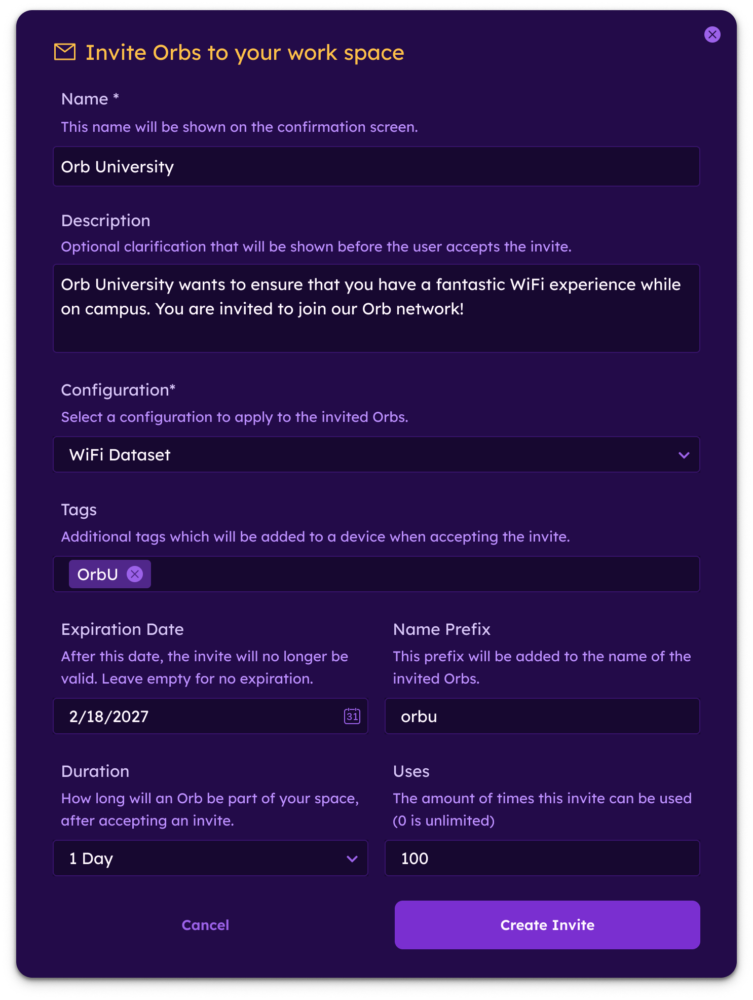
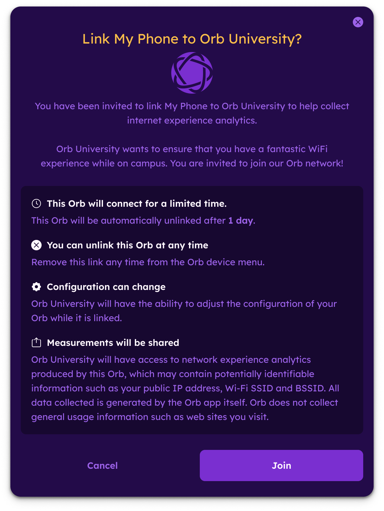
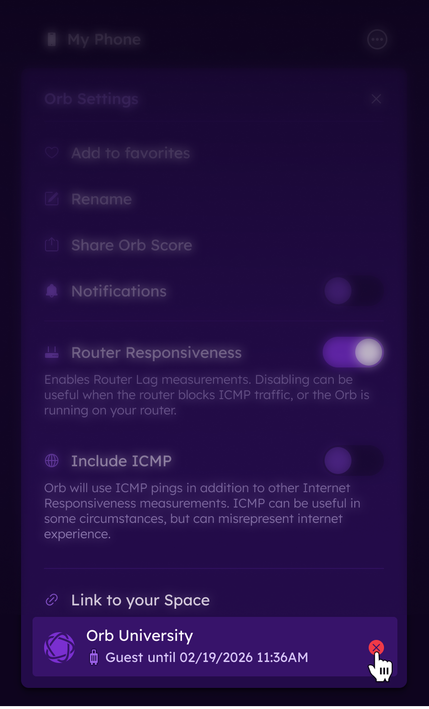

# Guest Orbs

Guest Orbs allow network administrators to invite users on a managed network to participate in end-user monitoring with Orb.

This feature is designed for large public or high-density networks such as campuses, airports, hotels, venues, libraries, cruise ships, and convention centers.

Guest Orbs enable consistent configuration, standardized data collection, and scalable end-user visibility across unmanaged guest devices.

## Creating a Guest Orb invitation

To create a Guest Invite:

1. Log in to Orb Cloud
2. Navigate to Orchestration
3. Locate the Guest Orbs section
4. Select "Create One" or "New Invite"

When creating an invite, administrators can configure the following settings:

1. Network Name: Specify the name of the managed Orb network. This name is shown to invited users.
2. Invitation Message: Customize the message presented to users explaining the purpose of the invite and encouraging participation.
3. Configuration Assignment: Select the Orb configuration that will be automatically applied to any guest who accepts the invite.
This ensures:
- Standardized monitoring behavior
- Consistent test parameters
- Comparable results across devices and operating systems
4. Invite Duration: Define how long the invite remains valid.
You may:
- Set a fixed expiration date
- Create a short-term invite for events
- Leave the invite active for ongoing programs
5. Usage Limits: Specify how many times the invite can be used.
Options include:
- A limited number of uses
- Unlimited uses

## Sharing a Guest Invite

Once created, Orb Cloud generates:
1. A short code
2. A QR code
3. A deep link

These can be distributed to users on the managed network.

Common distribution methods include:
- Posting printed QR codes in public areas
- Embedding a deep link in a captive portal
- Sharing short codes via email or event materials
- Including the invite in onboarding instructions

## Guest Experience

When a guest:

- Connects to the managed network
- Accesses the invite via QR code, short code, or deep link
- Accepts the invitation

Their Orb is automatically configured using the selected configuration.

This ensures:

- Consistent monitoring setup
- Comparable telemetry across devices
- Alignment with the managed network deployment

## Device Ownership and Control

The device owner always retains full control of the Orb installed on their device.

Guests may unlink their Orb from the managed network at any time directly within the Orb app.

## Account Limits

Each Guest Orb counts toward the total number of Orbs allowed under your suscription plan.

Guest Orbs will consume available capacity.

## Best Practices

For large public networks, consider the following:

- Use clear messaging to explain the value of participation
- Post QR codes in high-traffic areas
- Use limited-duration invites for temporary events
- Use configuration templates to ensure standardized data collection
- Monitor account capacity before launching large-scale campaigns

## Use Cases

Guest Orbs are commonly used for:

- University campus WiFi optimization
- Airport and transportation hub performance monitoring
- Hospitality guest experience measurement
- Event-based network monitoring
- Venue congestion analysis
