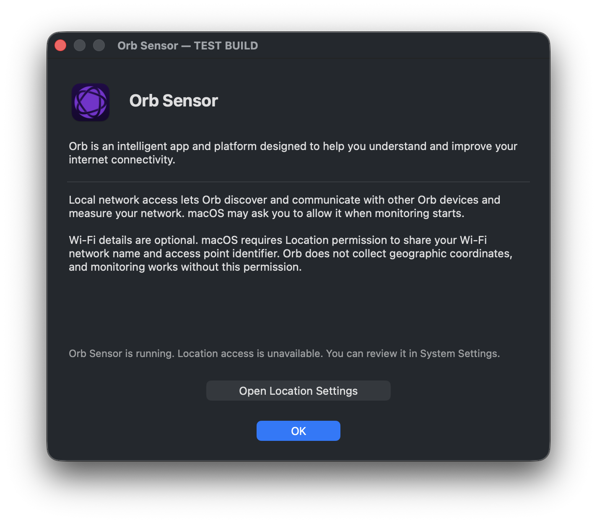
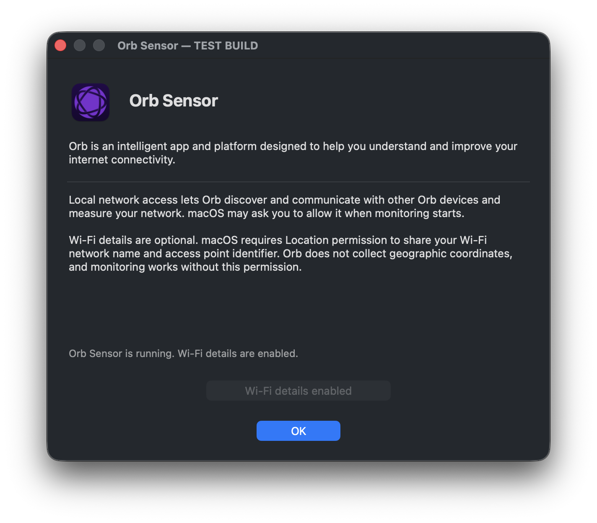
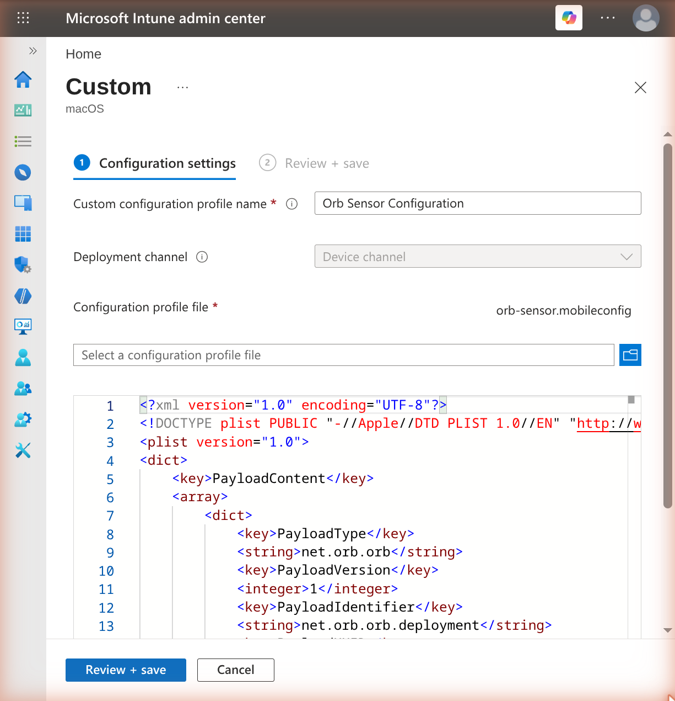
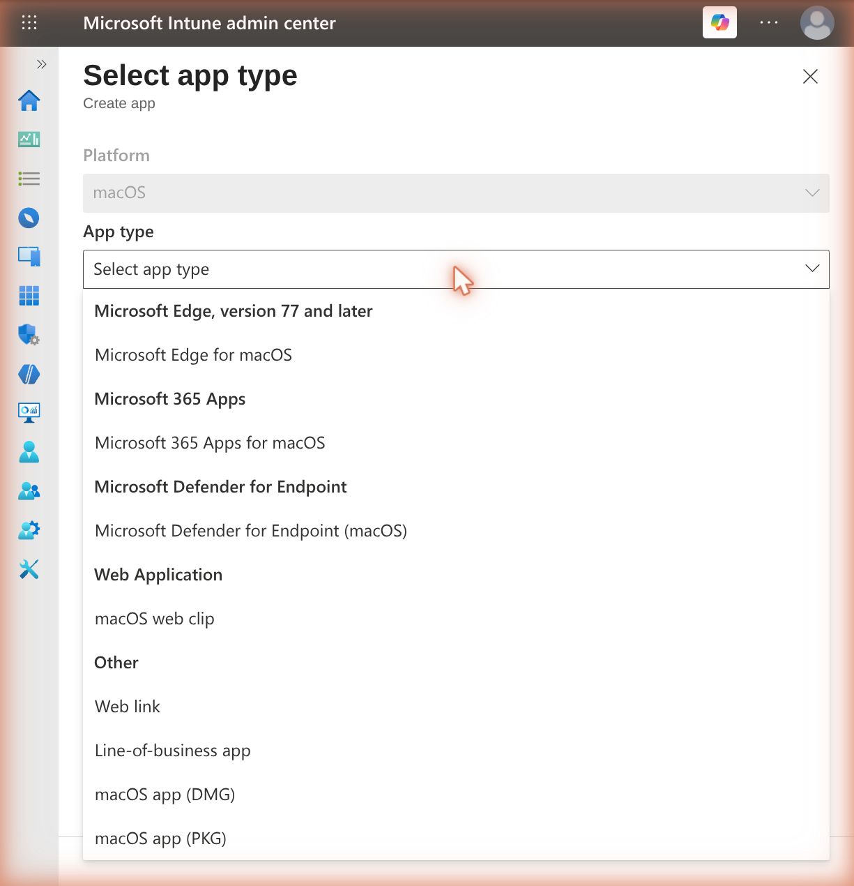
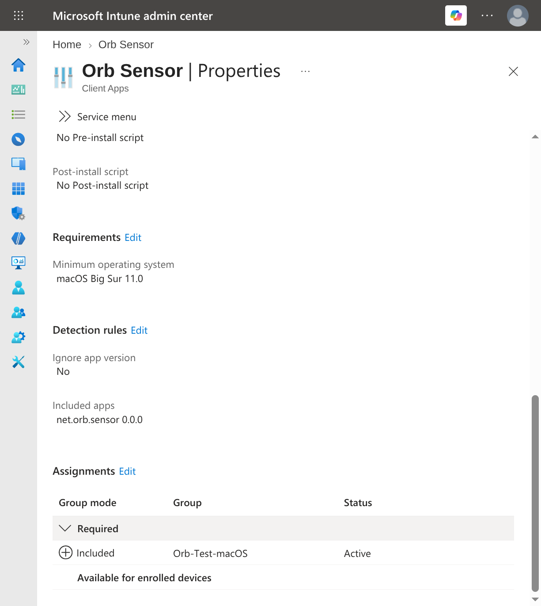
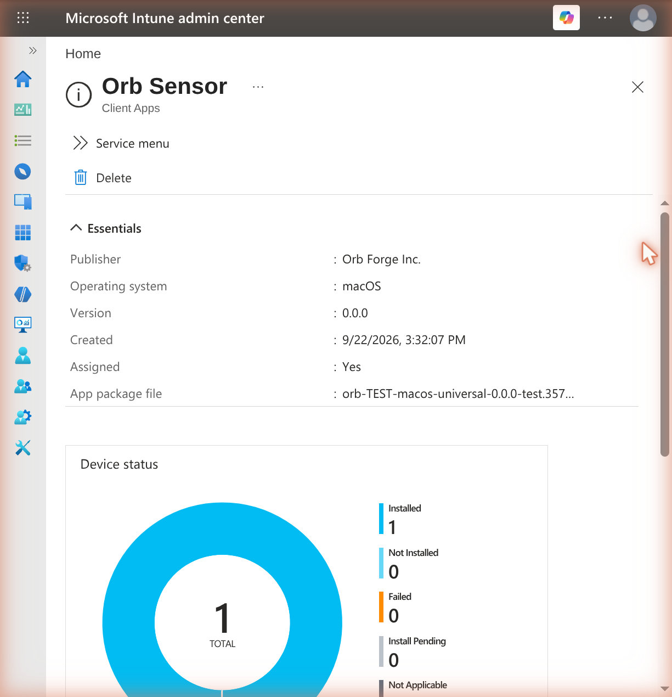

# Deploy the Orb sensor on macOS using Microsoft Intune

This guide walks you through deploying the Orb **sensor** to a macOS fleet using Microsoft Intune. The guide covers:

1. What the sensor package installs, and how it differs from the Orb app
2. Delivering your Deployment Token with a configuration profile
3. Allowing the sensor's background item so it starts at login
4. Adding the package as a macOS PKG app, and assigning it
5. Verifying, controlling updates, and uninstalling

Requirements:

1. An Orb Cloud subscription that includes Deployment Tokens (all paid plans)
2. Microsoft Intune, and administrative access to the [Microsoft Intune admin center](https://intune.microsoft.com)
3. macOS 11.0 or later, enrolled in Intune, with the Intune macOS agent installed
4. A [Deployment Token](/docs/deploy-and-configure/deployment-tokens) for your Space

:::info
This documentation covers installing the Orb **sensor** via Intune on macOS. Installing the Orb **app** from the Mac App Store documentation is coming soon, but follows a similar process to [Jamf Pro](/docs/deploy-and-configure/mdm/jamf-pro) or [Mosyle](/docs/deploy-and-configure/mdm/mosyle).
:::

## Orb sensor package

The sensor ships as a flat, signed installer package. The package is currently available for testing on request.

:::info
The macOS sensor runs as a **LaunchAgent in the user's GUI session** (`LimitLoadToSessionType` is `Aqua`), not as a system daemon. A user must be logged in for it to report.

If you need reporting from an unattended Mac, contact Orb support.
:::

:::warning
The sensor and the Orb app register with Orb Cloud separately, so a Mac running both appears **twice** in your Space under the same hostname. Deploy one or the other unless you specifically want both.
:::

## Deploy the configuration profile first

The sensor reads its managed settings from `/Library/Managed Preferences/net.orb.orb.plist`, which macOS writes when a configuration profile containing a `net.orb.orb` payload is installed.

Create and assign the configuration profile **before** the app, to the same group.

Intune does not guarantee the order in which a profile and an app reach a device, so this is not a hard guarantee — but in practice a configuration profile applies well before a PKG app, because the app cannot install until the Intune management agent is itself installed. Getting the profile in place first makes the race moot.

If a sensor does start before its token arrives, it runs unlinked and the Mac does not appear in your Space. Once the profile lands, restart the agent to pick it up:

```bash
launchctl kickstart -k "gui/$(id -u)/net.orb.sensor"
```

### Create a Deployment Token

1. Visit [https://cloud.orb.net/orchestration](https://cloud.orb.net/orchestration)
2. Select **Create new token**
3. Enter a name and select **Create**
4. Keep this page open for the next step

Use a **dedicated, revocable token per deployment** so you can attribute devices and revoke access without disrupting other rollouts.

### Create the .mobileconfig

Create a file named `orb-sensor.mobileconfig` with the following contents. This is the recommended baseline for a managed deployment: it links the Orb to your Space, keeps the introduction visible so users can grant Location, and keeps the sensor off mDNS.

```xml
<?xml version="1.0" encoding="UTF-8"?>
<!DOCTYPE plist PUBLIC "-//Apple//DTD PLIST 1.0//EN" "http://www.apple.com/DTDs/PropertyList-1.0.dtd">
<plist version="1.0">
<dict>
    <key>PayloadContent</key>
    <array>
        <dict>
            <key>PayloadType</key>
            <string>net.orb.orb</string>
            <key>PayloadVersion</key>
            <integer>1</integer>
            <key>PayloadIdentifier</key>
            <string>net.orb.orb.deployment</string>
            <key>PayloadUUID</key>
            <string>REPLACE-WITH-UUID-1</string>
            <key>PayloadDisplayName</key>
            <string>Orb Deployment Configuration</string>
            <key>PayloadOrganization</key>
            <string>Your Organization</string>
            <key>OrbDeploymentToken</key>
            <string>REPLACE-WITH-YOUR-DEPLOYMENT-TOKEN</string>
            <key>OrbSkipIntroduction</key>
            <false/>
            <key>OrbZeroconfPublish</key>
            <false/>
            <key>OrbZeroconfBrowse</key>
            <false/>
        </dict>
    </array>
    <key>PayloadDisplayName</key>
    <string>Orb Sensor Configuration</string>
    <key>PayloadIdentifier</key>
    <string>net.orb.orb.configuration</string>
    <key>PayloadOrganization</key>
    <string>Your Organization</string>
    <key>PayloadRemovalDisallowed</key>
    <false/>
    <key>PayloadType</key>
    <string>Configuration</string>
    <key>PayloadUUID</key>
    <string>REPLACE-WITH-UUID-2</string>
    <key>PayloadVersion</key>
    <integer>1</integer>
    <key>PayloadScope</key>
    <string>System</string>
</dict>
</plist>
```

Replace the placeholders:

1. Generate two UUIDs. On macOS, run `uuidgen` twice in Terminal, or `uuidgen | pbcopy` to copy one at a time.
2. Substitute them for `REPLACE-WITH-UUID-1` and `REPLACE-WITH-UUID-2`.
3. Substitute your Deployment Token for `REPLACE-WITH-YOUR-DEPLOYMENT-TOKEN`.

Why each setting is as it is:

| Setting | Why |
|---|---|
| `OrbSkipIntroduction` `false` | Keeps the first-run introduction visible, which is how users learn that Location is needed and where they grant it. Without it you lose SSID and BSSID. |
| `OrbZeroconfPublish` `false` | Stops the sensor advertising itself over mDNS, which most managed fleets do not want. |
| `OrbZeroconfBrowse` `false` | Stops the sensor discovering other Orbs over mDNS. |

If you want the sensor to report a name other than the hostname, add `OrbDeviceNameOverride`. Leave the remaining keys unset unless Orb support directs otherwise.

### Supported keys

| Key | Type | Effect |
|---|---|---|
| `OrbDeploymentToken` | String | Links the Orb to your Space. Required for unattended deployment. |
| `OrbDeviceNameOverride` | String | Name the device reports in your Space. Omit to use the hostname. |
| `OrbSkipIntroduction` | Boolean | Suppresses the first-run introduction. See the warning below before setting this. |
| `OrbZeroconfPublish` | Boolean | `false` stops the sensor advertising itself over mDNS. |
| `OrbZeroconfBrowse` | Boolean | `false` stops the sensor discovering other Orbs over mDNS. |

**Do not suppress the sensor's interface if you want SSID and BSSID.**

The sensor shows a short introduction the first time it runs for a user. That introduction is where the user is told that macOS requires Location permission to report the Wi-Fi network name (SSID) and access point (BSSID), and it is where they are given the button to grant it. Setting `OrbSkipIntroduction` to `true` hides the introduction, so the user is never told and never grants Location — and those fields stay empty, with nothing in the console to indicate why.

Without Location, the introduction reports that Wi-Fi details are unavailable and offers **Open Location Settings**:



Once Location is granted, it confirms that Wi-Fi details are enabled:



Monitoring itself works either way. Only the Wi-Fi network name and access point identifier depend on this permission, and Orb does not collect geographic coordinates.

Leave both unset, or set them explicitly to `false`, on any deployment where you want per-network detail. Only set them to `true` if you have accepted losing SSID and BSSID.

:::warning
Beware when testing this: once a user has granted Location, macOS keeps the grant in `/var/db/locationd`, keyed by bundle identifier and signature. It survives uninstalling and reinstalling the sensor, and it cannot be cleared from the command line. A Mac that has ever run Orb will therefore report SSID and BSSID even under a configuration that would fail on a fresh machine. Validate this on a Mac that has never run Orb.
:::

:::note
The introduction appears as soon as the package installs, not at the next login: the installer loads the sensor into every GUI session already running. On a Mac where someone is working, a window will appear mid-deployment and macOS may prompt for Location on top of it. Tell users to expect it, and that granting Location is what allows Orb to report which Wi-Fi network they are on.
:::

### Upload the profile to Intune

1. Sign in to the [Microsoft Intune admin center](https://intune.microsoft.com).
2. Go to **Devices → macOS → Configuration**, and select **Create → New Policy**.
3. Set **Profile type** to **Templates**, choose **Custom**, and select **Create**.
4. Give the profile a name, for example `Orb Sensor Configuration`, then select **Next**.
5. Set **Custom configuration profile name** to `Orb Sensor Configuration`, leave **Deployment channel** set to **Device channel**, upload `orb-sensor.mobileconfig`, and select **Next**.

   Intune shows the payload it parsed, which is the quickest way to confirm the profile is the `net.orb.orb` type the sensor reads.

   

6. On **Assignments**, add the device group you will deploy the sensor to, then select **Next**.
7. Review and select **Create**.

## Allow the sensor's background item

On macOS 13 and later, a newly installed LaunchAgent shows the user a *Background Items Added* notification, and the user can disable it in **System Settings → General → Login Items & Extensions**. A disabled agent stops the sensor from reporting, and the package deliberately does not re-enable an agent an administrator or user has turned off.

Deploy a second custom profile containing a Service Management payload so the agent is managed, always enabled, and not user-removable. Save this as `orb-sensor-loginitem.mobileconfig`, replacing the two UUIDs as before:

```xml
<?xml version="1.0" encoding="UTF-8"?>
<!DOCTYPE plist PUBLIC "-//Apple//DTD PLIST 1.0//EN" "http://www.apple.com/DTDs/PropertyList-1.0.dtd">
<plist version="1.0">
<dict>
    <key>PayloadContent</key>
    <array>
        <dict>
            <key>PayloadType</key>
            <string>com.apple.servicemanagement</string>
            <key>PayloadVersion</key>
            <integer>1</integer>
            <key>PayloadIdentifier</key>
            <string>net.orb.orb.loginitems</string>
            <key>PayloadUUID</key>
            <string>REPLACE-WITH-UUID-3</string>
            <key>PayloadDisplayName</key>
            <string>Orb Sensor Login Item</string>
            <key>PayloadOrganization</key>
            <string>Your Organization</string>
            <key>Rules</key>
            <array>
                <dict>
                    <key>RuleType</key>
                    <string>TeamIdentifier</string>
                    <key>RuleValue</key>
                    <string>YL5R46QP4A</string>
                </dict>
            </array>
        </dict>
    </array>
    <key>PayloadDisplayName</key>
    <string>Orb Sensor Login Item</string>
    <key>PayloadIdentifier</key>
    <string>net.orb.orb.loginitems.configuration</string>
    <key>PayloadOrganization</key>
    <string>Your Organization</string>
    <key>PayloadRemovalDisallowed</key>
    <false/>
    <key>PayloadType</key>
    <string>Configuration</string>
    <key>PayloadUUID</key>
    <string>REPLACE-WITH-UUID-4</string>
    <key>PayloadVersion</key>
    <integer>1</integer>
    <key>PayloadScope</key>
    <string>System</string>
</dict>
</plist>
```

Upload it the same way as the configuration profile above, and assign it to the same group.

:::note
The rule above allows every background item signed by Orb Forge Inc. To allow only the sensor, use a `RuleType` of `Label` with a `RuleValue` of `net.orb.sensor`.
:::

## Add the sensor package

1. Go to **Apps → macOS → macOS apps**, and select **Create**.
2. Set **App type** to **macOS app (PKG)**, and select **Select**.

   

3. On **App information**, select **Select app package file**, upload the sensor `.pkg`, and select **OK**.

   Intune reads the package and reports its name, platform and size before you confirm.

4. Correct the metadata, then select **Next**.

   Intune pre-fills **Name** and **Description** with the *package filename*, which is not what you want users or reports to see. Replace **Name** with `Orb Sensor` and write a real description. **Publisher** is required and is left empty — set it to `Orb Forge Inc.`
5. On **Program**, leave both the pre-install and post-install script boxes **empty**. The package runs its own pre- and post-install scripts, which create the launchd jobs, the log directory and the CLI symlink. Select **Next**.
6. On **Requirements**, set **Minimum operating system** to **macOS Big Sur 11.0**, then select **Next**.
7. On **Detection rules**, confirm the included app Intune read from the package is `net.orb.sensor`, with the version you are deploying.

   Set **Ignore app version** to match how you manage updates. It defaults to **Yes**.

   | Setting | Use when |
   |---|---|
   | **No** | Intune owns the version. Intune reinstalls whenever the installed version differs from the package. Pair this with disabling the sensor's own updater — see [Control updates](#control-updates). |
   | **Yes** | The sensor self-updates. Intune installs it once and stops checking the version. |

   :::warning
   Do not set **Ignore app version** to **No** while the sensor's own updater is still enabled. The updater moves the Mac to a newer version, Intune sees a version that no longer matches the package, and reinstalls the older one — the two fight each other indefinitely.
   :::
8. On **Assignments**, add your device group under **Required**, then select **Next**.
9. Review and select **Create**.

The app's **Properties** page afterwards shows the minimum operating system, the detection rule and the assignment together, which is the quickest way to confirm the deployment is configured as intended:



## Verify the deployment

In the admin center, open the app and review **Overview** and **Device install status**.

Once a Mac has installed the sensor, the app's **Overview** reports it:



To make a Mac check in immediately rather than waiting for its next cycle, use **Sync** on the device in the admin center. This is the more reliable lever: it drives the MDM channel, which delivers configuration profiles within seconds. **Company Portal → Devices → ⋯ → Check status** on the Mac does the same thing from the device side.

:::
:::note
Apps and profiles arrive by different routes. Configuration profiles come over MDM and land almost immediately after a sync. Apps are delivered by the **Microsoft Intune Agent**, which polls on its own schedule and a sync does not drive that loop. A Mac that has its profiles but not the sensor is usually waiting on the agent, not broken.
:::

On a target Mac:

```bash
# The package is installed
pkgutil --pkg-info net.orb.orbcli

# The managed preferences arrived, including the token
sudo plutil -p "/Library/Managed Preferences/net.orb.orb.plist"

# The agent is loaded in the logged-in user's session
launchctl print "gui/$(id -u)/net.orb.sensor" | head -20

# The sensor version
/usr/local/bin/orb version

# Recent sensor activity
tail -20 ~/.config/orb/logs/orb_$(date +%Y-%m-%d).log
```

In [Orb Cloud](https://cloud.orb.net), confirm the Mac appears in your Space and is reporting.

## Control updates

Coming soon.

## Uninstall the sensor

The package does not include an uninstaller, and Intune does not remove it for you.

:::warning
A macOS app deployed through the Intune agent is **not** removed when the device is retired or unenrolled. The sensor, its launchd jobs and its local data stay on the Mac, and it keeps reporting to your Space until it is removed explicitly. Uninstall before retiring a device.
:::

Remove it with a shell script run as root, or as an Intune **Uninstall** assignment:

```bash
#!/bin/bash
set -euo pipefail

# Stop the updater
/bin/launchctl bootout system/net.orb.updater 2>/dev/null || true

# Stop the sensor in every logged-in session
while read -r uid; do
    [[ "$uid" =~ ^[0-9]+$ ]] && (( uid > 500 )) || continue
    /bin/launchctl bootout "gui/$uid/net.orb.sensor" 2>/dev/null || true
done < <(/bin/ps -axo uid= | /usr/bin/sort -un)

/bin/rm -f /Library/LaunchAgents/net.orb.sensor.plist
/bin/rm -f /Library/LaunchDaemons/net.orb.updater.plist
/bin/rm -rf "/Applications/Orb Sensor.app"
/bin/rm -rf "/Library/Application Support/Orb"
/bin/rm -rf /Library/Logs/Orb
/bin/rm -f /usr/local/bin/orb /Library/Preferences/net.orb.plist

# Per-user state: identity, measurement data and logs.
for home in /Users/*; do
    [[ -d "$home/.config/orb" ]] && /bin/rm -rf "$home/.config/orb"
done

# Clear any administrator disable overrides, which outlive the job definitions
# and would otherwise stop a later installation from starting the sensor.
/bin/launchctl enable system/net.orb.updater 2>/dev/null || true

/usr/sbin/pkgutil --forget net.orb.orbcli 2>/dev/null || true
```

:::warning
Removing `~/.config/orb` discards the Orb's identity, so a later installation enrols as a **new** Orb rather than returning as the same one. Delete the stale entry from your Space, or keep the directory if you want the device to come back as itself.
:::

Also remove the configuration profile assignment, so the Deployment Token is withdrawn from the device.

Lastly, login to Orb Cloud, select the Orb, and select "Remove device" to ensure the Orb license is reclaimed.

## Troubleshooting

### The Mac does not appear in my Space

Confirm the managed preferences arrived and contain your token:

```bash
sudo plutil -p "/Library/Managed Preferences/net.orb.orb.plist"
```

If the file is missing, the configuration profile has not installed — check its assignment in Intune and the device's profile list under **System Settings → General → Device Management**. If the token is present but the device still does not appear, confirm the token is still valid in [Orchestration](https://cloud.orb.net/orchestration) and that the Mac can reach the internet.

### The sensor is installed but not running

The sensor only runs in a logged-in GUI session. Confirm a user is logged in, then check the agent:

```bash
launchctl print "gui/$(id -u)/net.orb.sensor"
launchctl print-disabled "gui/$(id -u)" | grep net.orb.sensor
```

If it reports as disabled, the user turned it off in **Login Items & Extensions**. Deploy the Service Management profile described above so the item is managed and cannot be disabled.

### Installation fails

Check the Intune agent logs on the device:

```bash
sudo tail -100 /Library/Logs/Microsoft/Intune/*.log
```

The package refuses to install and reports the reason if it finds a symlink, or a group- or world-writable directory, at any of the privileged paths it owns, or if it is targeted at a volume other than the startup volume.
