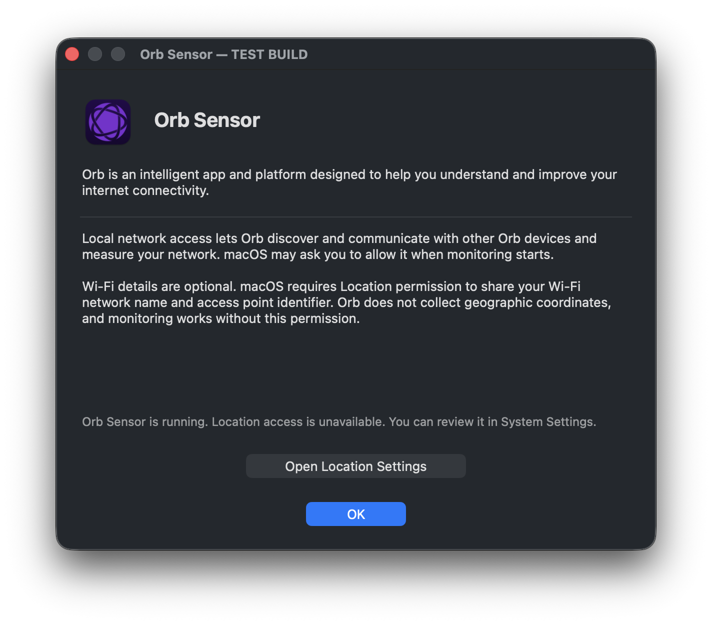
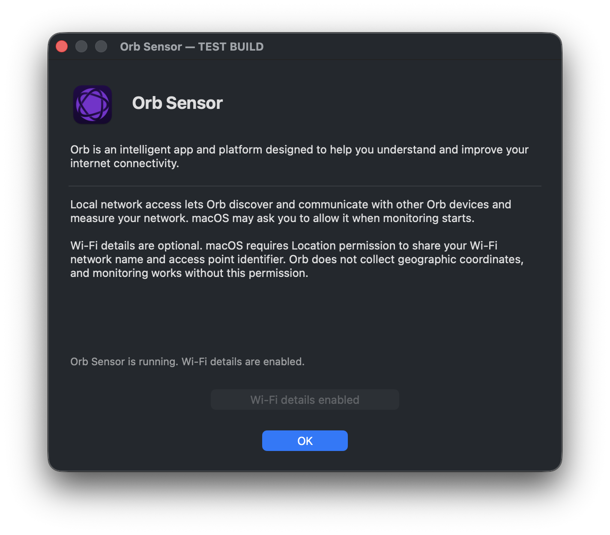
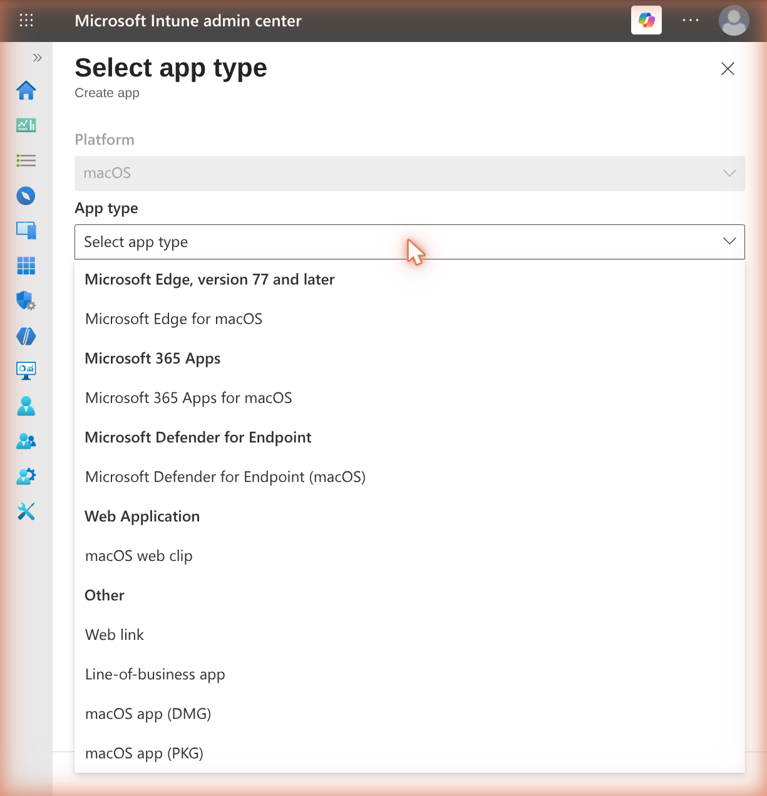
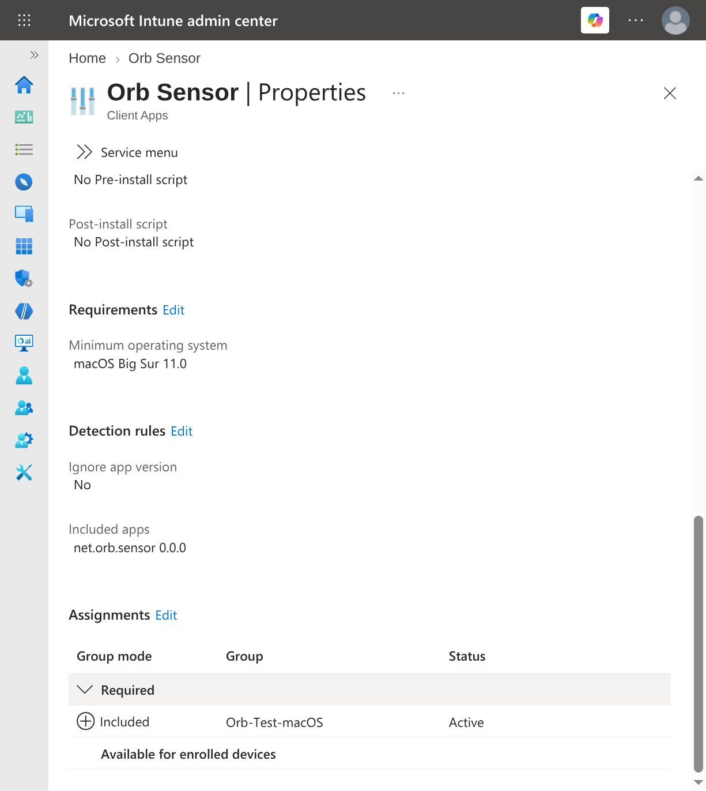
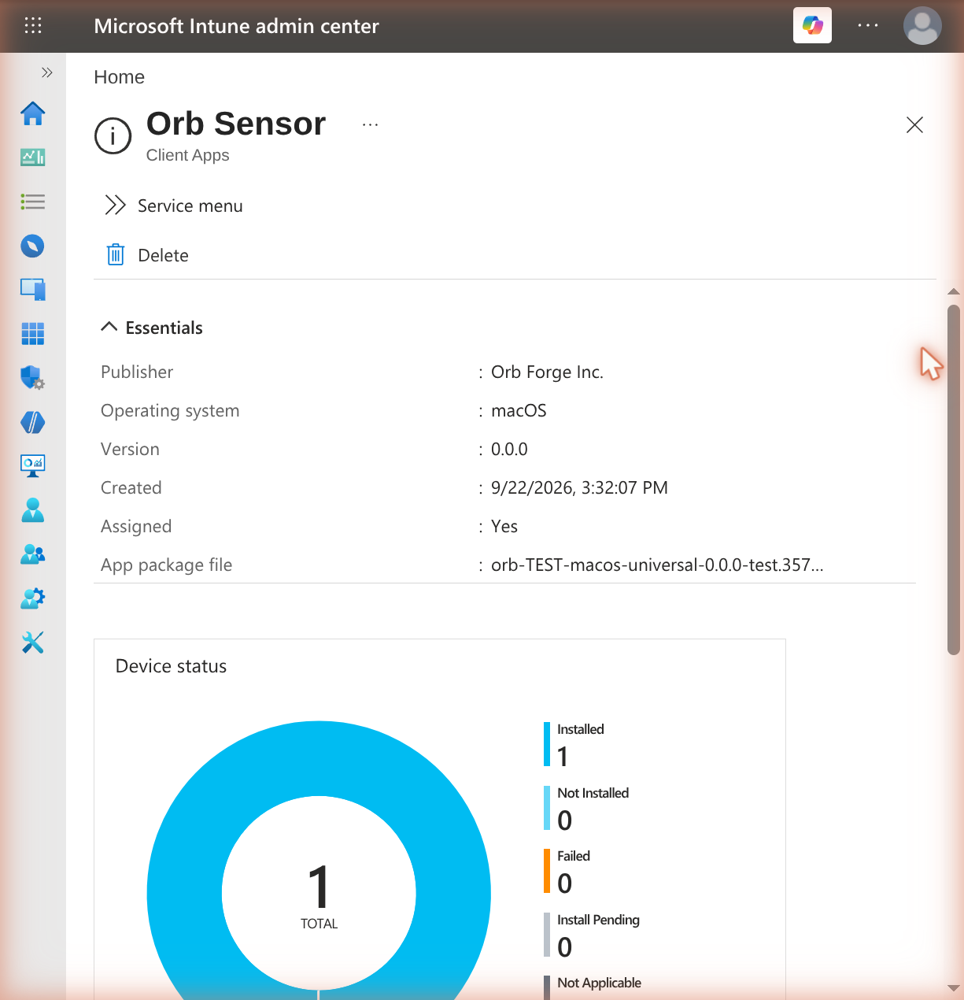

# Deploy the Orb sensor on macOS using Microsoft Intune

This guide walks you through deploying the Orb **sensor** to a macOS fleet using Microsoft Intune. The guide covers:

1. What the sensor package installs, and how it differs from the Orb app
2. Delivering your Deployment Token with a configuration profile
3. Allowing the sensor's background item so it starts at login
4. Adding the package as a macOS PKG app, and assigning it
5. Verifying, controlling updates, and uninstalling
6. The files and processes to allow-list in endpoint security tools

Requirements:

1. An Orb Cloud subscription that includes Deployment Tokens (all paid plans)
2. Microsoft Intune, and administrative access to the [Microsoft Intune admin center](https://intune.microsoft.com)
3. macOS 11.0 or later, enrolled in Intune, with the Intune macOS agent installed
4. A [Deployment Token](/docs/deploy-and-configure/deployment-tokens) for your Space

:::info
This documentation covers installing the Orb **sensor** via Intune on macOS. Installing the Orb **app** from the Mac App Store documentation is coming soon, but follows a similar process to [Jamf Pro](/docs/deploy-and-configure/mdm/jamf-pro) or [Mosyle](/docs/deploy-and-configure/mdm/mosyle).
:::

## Orb sensor package

The sensor ships as a flat, signed installer package, which always points to the latest stable release:

[https://pkgs.orb.net/stable/macos/orb-sensor.pkg](https://pkgs.orb.net/stable/macos/orb-sensor.pkg)

To verify the download, compare its SHA-256 with the checksum published beside that release. `orb-sensor-version.txt` holds the current version number:

```bash
curl -fsSLO https://pkgs.orb.net/stable/macos/orb-sensor.pkg
VERSION="$(curl -fsSL https://pkgs.orb.net/stable/macos/orb-sensor-version.txt)"
curl -fsSL "https://pkgs.orb.net/stable/macos/orb-sensor-$VERSION.pkg.sha256"
shasum -a 256 orb-sensor.pkg
```

The two hashes must match.

:::info
The macOS sensor runs as a **LaunchAgent in the user's GUI session** (`LimitLoadToSessionType` is `Aqua`), not as a system daemon. A user must be logged in for it to report.

If you need reporting from an unattended Mac, contact Orb support.
:::

:::warning
The sensor and the Orb app register with Orb Cloud separately, so a Mac running both appears **twice** in your Space under the same hostname. Deploy one or the other unless you specifically want both.
:::

## Deploy the configuration profile first

The sensor reads its managed settings from `/Library/Managed Preferences/net.orb.orb.plist`, which macOS writes when a configuration profile containing a `net.orb.orb` payload is installed.

Create and assign the configuration profile **before** the app, to the same group.

Intune does not guarantee the order in which a profile and an app reach a device, so this is not a hard guarantee — but in practice a configuration profile applies well before a PKG app, because the app cannot install until the Intune management agent is itself installed. Getting the profile in place first makes the race moot.

The order matters twice. The installer reads `SensorOnboarding` only while the package installs, so a profile that arrives afterwards cannot delay that Mac's introduction. And the sensor reads the token only when it starts.

If a sensor does start before its token arrives, it runs unlinked and the Mac does not appear in your Space. Once the profile lands, restart the agent to pick it up:

```bash
launchctl kickstart -k "gui/$(id -u)/net.orb.sensor"
```

### Create a Deployment Token

1. Visit [https://cloud.orb.net/orchestration](https://cloud.orb.net/orchestration)
2. Select **Create new token**
3. Enter a name and select **Create**
4. Keep this page open for the next step

Use a **dedicated, revocable token per deployment** so you can attribute devices and revoke access without disrupting other rollouts.

### Create the .mobileconfig

Create a file named `orb-sensor.mobileconfig` with the following contents. This is the recommended baseline for a managed deployment. It does three things:

- links the Orb to your Space
- keeps the sensor off mDNS
- names each Mac after its Intune device name and serial number
- delays the first-run introduction until the user next logs in, so no window appears on screen while someone is working

```xml
<?xml version="1.0" encoding="UTF-8"?>
<!DOCTYPE plist PUBLIC "-//Apple//DTD PLIST 1.0//EN" "http://www.apple.com/DTDs/PropertyList-1.0.dtd">
<plist version="1.0">
<dict>
    <key>PayloadContent</key>
    <array>
        <dict>
            <key>PayloadType</key>
            <string>net.orb.orb</string>
            <key>PayloadVersion</key>
            <integer>1</integer>
            <key>PayloadIdentifier</key>
            <string>net.orb.orb.deployment</string>
            <key>PayloadUUID</key>
            <string>REPLACE-WITH-UUID-1</string>
            <key>PayloadDisplayName</key>
            <string>Orb Deployment Configuration</string>
            <key>PayloadOrganization</key>
            <string>Your Organization</string>
            <key>OrbDeploymentToken</key>
            <string>REPLACE-WITH-YOUR-DEPLOYMENT-TOKEN</string>
            <key>OrbEnvironment</key>
            <dict>
                <key>ORB_ZEROCONF_PUBLISH</key>
                <string>false</string>
                <key>ORB_ZEROCONF_BROWSE</key>
                <string>false</string>
                <key>ORB_DEVICE_NAME_OVERRIDE</key>
                <string>{{devicename}}-{{serialnumber}}</string>
            </dict>
            <key>SensorOnboarding</key>
            <string>next-login</string>
        </dict>
    </array>
    <key>PayloadDisplayName</key>
    <string>Orb Sensor Configuration</string>
    <key>PayloadIdentifier</key>
    <string>net.orb.orb.configuration</string>
    <key>PayloadOrganization</key>
    <string>Your Organization</string>
    <key>PayloadRemovalDisallowed</key>
    <false/>
    <key>PayloadType</key>
    <string>Configuration</string>
    <key>PayloadUUID</key>
    <string>REPLACE-WITH-UUID-2</string>
    <key>PayloadVersion</key>
    <integer>1</integer>
    <key>PayloadScope</key>
    <string>System</string>
</dict>
</plist>
```

Replace the placeholders:

1. Generate two UUIDs. On macOS, run `uuidgen` twice in Terminal, or `uuidgen | pbcopy` to copy one at a time.
2. Substitute them for `REPLACE-WITH-UUID-1` and `REPLACE-WITH-UUID-2`.
3. Substitute your Deployment Token for `REPLACE-WITH-YOUR-DEPLOYMENT-TOKEN`.

Why each setting is as it is:

| Setting | Why |
|---|---|
| `OrbDeploymentToken` | Links the Orb to your Space without any user action. |
| `OrbEnvironment` → `ORB_ZEROCONF_PUBLISH` `"false"` | Stops the sensor advertising itself over mDNS, which most managed fleets do not want. |
| `OrbEnvironment` → `ORB_ZEROCONF_BROWSE` `"false"` | Stops the sensor discovering other Orbs over mDNS. The sensor does not browse by default; setting it keeps the profile explicit. |
| `OrbEnvironment` → `ORB_DEVICE_NAME_OVERRIDE` `"{{devicename}}-{{serialnumber}}"` | Names the Orb after the Mac's Intune device name and serial number, for example `frontdesk-mac-C02XK1ABCDEF`, so it is easy to match to the device in Intune. Intune fills in the variables for each Mac. See [Name each Mac](#name-each-mac). |
| `SensorOnboarding` `next-login` | The sensor starts monitoring as soon as the package installs, but the introduction and its Location request wait until the user next logs in. |

The profile leaves `OrbSkipIntroduction` unset on purpose. The introduction is where users grant Location, and without Location you lose SSID and BSSID. See [Keep the introduction](#keep-the-introduction).

### Set environment variables with OrbEnvironment

`OrbEnvironment` is a dictionary. Each key is the name of an Orb environment variable, and the sensor applies it at startup as if it had been set in the sensor's environment. Any variable listed in [Configuration](/docs/deploy-and-configure/configuration#environment-variables) can be set this way.

For example, to also turn off first-hop measurement, add `ORB_FIRSTHOP_DISABLED` beside the variables already in the profile:

```xml
<key>OrbEnvironment</key>
<dict>
    <key>ORB_ZEROCONF_PUBLISH</key>
    <string>false</string>
    <key>ORB_ZEROCONF_BROWSE</key>
    <string>false</string>
    <key>ORB_DEVICE_NAME_OVERRIDE</key>
    <string>{{devicename}}-{{serialnumber}}</string>
    <key>ORB_FIRSTHOP_DISABLED</key>
    <string>1</string>
</dict>
```

Rules:

- **Every value must be a `<string>`**, including booleans and numbers: `<string>false</string>`, `<string>1</string>`, never `<false/>` or `<integer>1</integer>`.
- **Names must start with `ORB_`** and contain only uppercase letters, digits and underscores.

:::warning
The sensor checks the whole `OrbEnvironment` dictionary before applying any of it. If one value is not a string, or one name breaks the naming rule, the sensor ignores the **entire** profile, including `OrbDeploymentToken`. The Mac then runs unlinked. Check the profile on a test Mac before assigning it widely.
:::

The sensor reads these settings when it starts. After you change the profile, the change takes effect when the sensor next starts, for example at the user's next login. To apply it sooner, restart the agent:

```bash
launchctl kickstart -k "gui/$(id -u)/net.orb.sensor"
```

The sensor logs `Using environment setting from MDM configuration` for each variable it applies. The log line includes the variable name but never its value, so tokens do not end up in logs.

If `OrbEnvironment` contains `ORB_DEPLOYMENT_TOKEN`, that value takes precedence over `OrbDeploymentToken`. Use one or the other. A setting pushed from [Remote Configuration](/docs/deploy-and-configure/configuration#remote-configuration) can block local overrides, and that includes these.

### Name each Mac

By default the sensor reports the Mac's hostname. To report a different name, set `ORB_DEVICE_NAME_OVERRIDE` in `OrbEnvironment`.

One profile is usually assigned to many Macs, so do not use a fixed name: every Mac in the group would appear with the same name. Use Intune's device variables instead. Intune replaces them with each Mac's own values before it delivers the profile:

| Value | Reports as |
|---|---|
| `{{devicename}}-{{serialnumber}}` | `frontdesk-mac-C02XK1ABCDEF` |
| `{{serialnumber}}` | `C02XK1ABCDEF` |
| `{{devicename}}` | `frontdesk-mac` |

Variables are case-sensitive, and Intune does not check them when you upload the profile. A misspelled variable, such as `{{DeviceName}}`, reaches the Mac as literal text. To confirm Intune substituted the values, check the managed preferences on a Mac:

```bash
plutil -extract OrbEnvironment.ORB_DEVICE_NAME_OVERRIDE raw "/Library/Managed Preferences/net.orb.orb.plist"
```

This command should print the Mac's own values, not the text in braces. For other variables, see Microsoft's list of [supported tokens](https://learn.microsoft.com/en-us/intune/app-management/configuration/configure-managed-ios#tokens-used-in-the-property-list).

The sensor reads the name when it starts. A Mac that is already reporting picks up a new name the next time its sensor starts. A package upgrade also restarts the sensor, and so does the `launchctl kickstart` command above.

### Supported keys

| Key | Type | Effect |
|---|---|---|
| `OrbDeploymentToken` | String | Links the Orb to your Space. Required for unattended deployment. |
| `OrbEnvironment` | Dictionary of strings | Sets any Orb [environment variable](/docs/deploy-and-configure/configuration#environment-variables). See [above](#set-environment-variables-with-orbenvironment). |
| `SensorOnboarding` | String | `immediate` (default) or `next-login`. With `next-login`, the introduction and Location request wait until the next login. The sensor starts monitoring immediately either way. Read only by the installer, at installation or upgrade. |
| `OrbAllowIntroductionLater` | Boolean | Adds a **Later** button to the introduction. It closes the introduction without requesting Location, and the introduction appears again at the next login. Defaults to `false`. |
| `OrbSkipIntroduction` | Boolean | Suppresses the first-run introduction. It does not grant any permission. See the warning below before setting this. |
| `OrbEnableRestrictions` | Boolean | Skips the introduction and stops the sensor requesting permissions. It also keeps mDNS discovery off. Defaults to `false`. |
| `OrbEnableLocationPrompt` | Boolean | With `OrbEnableRestrictions`, allows the Location request again. Ignored without restrictions. |
| `OrbEnableNetworkPrompt` | Boolean | With `OrbEnableRestrictions`, allows mDNS discovery and direct DNS lookups. These can trigger a Local Network prompt. Ignored without restrictions. |
| `OrbAutoUpdateEnabled` | Boolean | `false` stops the sensor's own updater. Defaults to `true`. See [Control updates](#control-updates). |

:::note
Earlier test builds read `OrbZeroconfPublish`, `OrbZeroconfBrowse` and `OrbDeviceNameOverride`. Current builds ignore those keys. Set `ORB_ZEROCONF_PUBLISH`, `ORB_ZEROCONF_BROWSE` and `ORB_DEVICE_NAME_OVERRIDE` in `OrbEnvironment` instead.
:::

### Keep the introduction

**Do not suppress the sensor's interface if you want SSID and BSSID.**

The sensor shows a short introduction the first time it runs for a user. That introduction tells the user that macOS requires Location permission to report the Wi-Fi network name (SSID) and access point (BSSID), and gives them the button to grant it. Two keys hide it:

- **`OrbSkipIntroduction`** hides the introduction, but the sensor can still request Location. The user sees the macOS Location prompt with nothing to explain why Orb is asking.
- **`OrbEnableRestrictions`** hides the introduction and stops the sensor requesting Location at all, unless you also set `OrbEnableLocationPrompt`. The user is never asked, and SSID and BSSID stay empty. Nothing in the console says why.

Without Location, the introduction reports that Wi-Fi details are unavailable and offers **Open Location Settings**:



Once Location is granted, it confirms that Wi-Fi details are enabled:



Monitoring works either way. Only the Wi-Fi network name and access point identifier depend on this permission, and Orb does not collect geographic coordinates.

On any deployment where you want per-network detail, leave both keys unset or set them to `false`. Set `OrbEnableRestrictions` to `true` only if you accept losing SSID and BSSID.

:::warning
Test this on a Mac that has never run Orb. Once a user grants Location, macOS keeps the grant in `/var/db/locationd`, keyed by bundle identifier and signature. The grant survives uninstalling and reinstalling the sensor, and it cannot be cleared from the command line. A Mac that has ever run Orb will therefore report SSID and BSSID even under a configuration that would fail on a fresh machine.
:::

:::note
When the introduction appears depends on `SensorOnboarding`, which the installer reads when the package installs:

- **`next-login`** (recommended): the installer starts the sensor in every running session without the introduction. The introduction and the Location request appear at the user's next login or restart. Users can open **Orb Sensor** to finish sooner. Until they do, SSID and BSSID are not reported.
- **`immediate`**, or no profile present at install time: the introduction appears in every running session as soon as the package installs. On a Mac where someone is working, a window appears mid-deployment, and macOS may show the Location prompt on top of it.

Either way, tell users to expect the introduction, and that granting Location is what allows Orb to report which Wi-Fi network they are on.
:::

### Upload the profile to Intune

1. Sign in to the [Microsoft Intune admin center](https://intune.microsoft.com).
2. Go to **Devices → macOS → Configuration**, and select **Create → New Policy**.
3. Set **Profile type** to **Templates**, choose **Custom**, and select **Create**.
4. Give the profile a name, for example `Orb Sensor Configuration`, then select **Next**.
5. Set **Custom configuration profile name** to `Orb Sensor Configuration`, leave **Deployment channel** set to **Device channel**, upload `orb-sensor.mobileconfig`, and select **Next**.

   Intune shows the file it parsed. Check that it contains your token and the `net.orb.orb` payload type before you continue.

6. On **Assignments**, add the device group you will deploy the sensor to, then select **Next**.
7. Review and select **Create**.

## Allow the sensor's background item

On macOS 13 and later, a newly installed LaunchAgent shows the user a *Background Items Added* notification, and the user can disable it in **System Settings → General → Login Items & Extensions**. A disabled agent stops the sensor from reporting, and the package deliberately does not re-enable an agent an administrator or user has turned off.

Deploy a second custom profile containing a Service Management payload so the agent is managed, always enabled, and not user-removable. Save this as `orb-sensor-loginitem.mobileconfig`, replacing the two UUIDs as before:

```xml
<?xml version="1.0" encoding="UTF-8"?>
<!DOCTYPE plist PUBLIC "-//Apple//DTD PLIST 1.0//EN" "http://www.apple.com/DTDs/PropertyList-1.0.dtd">
<plist version="1.0">
<dict>
    <key>PayloadContent</key>
    <array>
        <dict>
            <key>PayloadType</key>
            <string>com.apple.servicemanagement</string>
            <key>PayloadVersion</key>
            <integer>1</integer>
            <key>PayloadIdentifier</key>
            <string>net.orb.orb.loginitems</string>
            <key>PayloadUUID</key>
            <string>REPLACE-WITH-UUID-3</string>
            <key>PayloadDisplayName</key>
            <string>Orb Sensor Login Item</string>
            <key>PayloadOrganization</key>
            <string>Your Organization</string>
            <key>Rules</key>
            <array>
                <dict>
                    <key>RuleType</key>
                    <string>TeamIdentifier</string>
                    <key>RuleValue</key>
                    <string>YL5R46QP4A</string>
                </dict>
            </array>
        </dict>
    </array>
    <key>PayloadDisplayName</key>
    <string>Orb Sensor Login Item</string>
    <key>PayloadIdentifier</key>
    <string>net.orb.orb.loginitems.configuration</string>
    <key>PayloadOrganization</key>
    <string>Your Organization</string>
    <key>PayloadRemovalDisallowed</key>
    <false/>
    <key>PayloadType</key>
    <string>Configuration</string>
    <key>PayloadUUID</key>
    <string>REPLACE-WITH-UUID-4</string>
    <key>PayloadVersion</key>
    <integer>1</integer>
    <key>PayloadScope</key>
    <string>System</string>
</dict>
</plist>
```

Upload it the same way as the configuration profile above, and assign it to the same group.

:::note
The rule above allows every background item signed by Orb Forge Inc. To allow only the sensor, use a `RuleType` of `Label` with a `RuleValue` of `net.orb.sensor`.
:::

## Add the sensor package

1. Go to **Apps → macOS → macOS apps**, and select **Create**.
2. Set **App type** to **macOS app (PKG)**, and select **Select**.

   

3. On **App information**, select **Select app package file**, upload `orb-sensor.pkg`, and select **OK**.

   Intune reads the package and reports its name, platform and size before you confirm.

4. Correct the metadata, then select **Next**.

   Intune pre-fills **Name** and **Description** with the *package filename*, which is not what you want users or reports to see. Replace **Name** with `Orb Sensor` and write a real description. **Publisher** is required and is left empty — set it to `Orb Forge Inc.`
5. On **Program**, leave both the pre-install and post-install script boxes **empty**. The package runs its own pre- and post-install scripts, which create the launchd jobs, the log directory and the CLI symlink. Select **Next**.
6. On **Requirements**, set **Minimum operating system** to **macOS Big Sur 11.0**, then select **Next**.
7. On **Detection rules**, confirm the included app Intune read from the package is `net.orb.sensor`, with the version you are deploying.

   Set **Ignore app version** to match how you manage updates. It defaults to **Yes**.

   | Setting | Use when |
   |---|---|
   | **No** | Intune owns the version. Intune reinstalls whenever the installed version differs from the package. Pair this with disabling the sensor's own updater — see [Control updates](#control-updates). |
   | **Yes** | The sensor self-updates. Intune installs it once and stops checking the version. |

   :::warning
   Do not set **Ignore app version** to **No** while the sensor's own updater is still enabled. The updater moves the Mac to a newer version, Intune sees a version that no longer matches the package, and reinstalls the older one — the two fight each other indefinitely.
   :::
8. On **Assignments**, add your device group under **Required**, then select **Next**.
9. Review and select **Create**.

The app's **Properties** page afterwards shows the minimum operating system, the detection rule and the assignment together, which is the quickest way to confirm the deployment is configured as intended:



## Verify the deployment

In the admin center, open the app and review **Overview** and **Device install status**.

Once a Mac has installed the sensor, the app's **Overview** reports it:



To make a Mac check in immediately rather than waiting for its next cycle, use **Sync** on the device in the admin center. This is the more reliable lever: it drives the MDM channel, which delivers configuration profiles within seconds. **Company Portal → Devices → ⋯ → Check status** on the Mac does the same thing from the device side.

:::
:::note
Apps and profiles arrive by different routes. Configuration profiles come over MDM and land almost immediately after a sync. Apps are delivered by the **Microsoft Intune Agent**, which polls on its own schedule and a sync does not drive that loop. A Mac that has its profiles but not the sensor is usually waiting on the agent, not broken.
:::

On a target Mac:

```bash
# The package is installed
pkgutil --pkg-info net.orb.sensor

# The managed preferences arrived, including the token
sudo plutil -p "/Library/Managed Preferences/net.orb.orb.plist"

# The sensor applied your OrbEnvironment settings (names only, never values)
grep -h "Using environment setting from MDM configuration" ~/.config/orb/logs/orb_*.log | tail -5

# The agent is loaded in the logged-in user's session
launchctl print "gui/$(id -u)/net.orb.sensor" | head -20

# The sensor version
/usr/local/bin/orb version

# Recent sensor activity
tail -20 ~/.config/orb/logs/orb_$(date +%Y-%m-%d).log
```

In [Orb Cloud](https://cloud.orb.net), confirm the Mac appears in your Space and is reporting.

## Control updates

The sensor updates itself by default: a daily updater installs new stable releases.

To have Intune own the version instead, add `OrbAutoUpdateEnabled` to the `net.orb.orb` payload of your configuration profile:

```xml
<key>OrbAutoUpdateEnabled</key>
<false/>
```

The updater reads this key on every run, so a change takes effect at the next daily check. You do not need to restart the sensor or reinstall the package. With updates off, the updater still runs daily but exits without downloading or installing anything. To upgrade, upload the new package to the app in Intune, and set **Ignore app version** to **No** so Intune replaces older installations.

Removing the key, or the profile, turns self-updating back on. If the preferences file is malformed, the updater skips updates and logs an error to `/Library/Logs/Orb/updater-error.log`.

## Uninstall the sensor

Intune does not remove the sensor for you.

:::warning
A macOS app deployed through the Intune agent is **not** removed when the device is retired or unenrolled. The sensor, its launchd jobs and its local data stay on the Mac, and it keeps reporting to your Space until it is removed explicitly. Uninstall before retiring a device.
:::

The package installs an uninstaller. Run it as root, in Terminal or as an Intune shell script (**Devices → macOS → Scripts**, with **Run script as signed-in user** set to **No**):

```bash
sudo /bin/bash "/Library/Application Support/Orb/uninstall.sh"
```

It removes the sensor for every user on the Mac:

- It stops the updater, and the sensor in every logged-in session.
- It removes `Orb Sensor.app`, both launchd jobs, the updater and its logs, and the `/usr/local/bin/orb` link if the package created it.
- It forgets the package receipt.

If an update is being installed at that moment, it waits and asks you to retry rather than interrupting it.

It deliberately keeps each user's `~/.config/orb` folder, the Orb's identity and data, and it keeps your configuration profiles. If you reinstall later, the Mac returns to your Space as the same Orb.

To remove the Orb for good, also delete each user's data after running the uninstaller:

```bash
for home in /Users/*; do
    [[ -d "$home/.config/orb" ]] && /bin/rm -rf "$home/.config/orb"
done
```

:::warning
Removing `~/.config/orb` discards the Orb's identity, so a later installation enrols as a **new** Orb rather than returning as the same one. Delete the stale entry from your Space, or keep the directory if you want the device to come back as itself.
:::

Then finish in Intune and Orb Cloud:

1. In Intune, remove the Mac from the app's **Required** assignment. Otherwise Intune reinstalls the sensor at its next check-in.
2. Remove the Mac from the configuration profile assignment, which withdraws the Deployment Token from the device.
3. In Orb Cloud, select the Orb and select **Remove device**. This reclaims its license.

## Files and processes for endpoint security

Use this section to allow-list the Orb sensor in antivirus, EDR and data loss prevention tools. It describes what the package installs and what the sensor writes while it runs.

### Code signing

| Item | Signed by |
|---|---|
| The `.pkg` | `Developer ID Installer: Orb Forge Inc. (YL5R46QP4A)` |
| `Orb Sensor.app` (bundle ID `net.orb.sensor`) | `Developer ID Application: Orb Forge Inc. (YL5R46QP4A)` |

Allow by **Team ID** `YL5R46QP4A` rather than by file hash, which changes with every release. The same Team ID is what the [Service Management profile](#allow-the-sensor-s-background-item) uses.

### Processes

| Process | Runs as | When |
|---|---|---|
| `/Applications/Orb Sensor.app/Contents/MacOS/orb-sensor --background` | The logged-in user, from the LaunchAgent `net.orb.sensor` | Continuously, in each GUI session. launchd restarts it if it exits abnormally. |
| `/bin/bash "/Library/Application Support/Orb/updater.sh"` | `root`, from the LaunchDaemon `net.orb.updater` | Once a day, unless the updater is disabled. It calls `curl`, `pkgutil`, `spctl` and `installer`, and only runs `installer` when a newer release is available. A disabled updater never runs, and none of these tools are called. |

### Files

**Installed by the package**, owned by `root`:

| Path | Purpose |
|---|---|
| `/Applications/Orb Sensor.app` | The sensor. |
| `/usr/local/bin/orb` | Symlink to the sensor binary, for use as a command-line tool. Created by the post-install script. |
| `/Library/LaunchAgents/net.orb.sensor.plist` | Starts the sensor in each user's GUI session. |
| `/Library/LaunchDaemons/net.orb.updater.plist` | Runs the updater daily as `root`. |
| `/Library/Application Support/Orb/updater.sh` | Self-updater. It downloads from `https://pkgs.orb.net/stable/macos/` and installs a release only if its SHA-256 matches, it is signed by the Developer ID Installer identity above, it passes Gatekeeper, and its package ID and version match the release. |
| `/Library/Application Support/Orb/uninstall.sh` | Uninstaller. See [Uninstall the sensor](#uninstall-the-sensor). |
| `/Library/Application Support/Orb/updater.lock` | Stops two updater runs from overlapping. Created the first time the updater runs, which is a day after installation. |
| `/Library/Logs/Orb/updater.log`, `updater-error.log` | Updater output. |

**Configuration**, written by macOS rather than the package:

| Path | Purpose | Sensitive |
|---|---|---|
| `/Library/Managed Preferences/net.orb.orb.plist` | Written by macOS from your [configuration profile](#deploy-the-configuration-profile-first). Read by the sensor at startup, by the installer for `SensorOnboarding`, and by the updater for `OrbAutoUpdateEnabled`. Contains your Deployment Token, and any values you set in `OrbEnvironment`. macOS makes this file readable by every account on the Mac (`0644`, owned by `root`). | **Yes** |

**Per-user data**, in `~/.config/orb`. The sensor writes this folder as the logged-in user. The folder is `0700` and its files are `0600`, so other accounts on the Mac cannot read it.

| Path | Purpose | Sensitive |
|---|---|---|
| `private.key` | The Orb's private key (ECC, PEM). This is the device's identity in Orb Cloud. | **Yes** |
| `certificate.crt` | Client certificate for that key, issued by *Orb Intermediate CA*. Short-lived and renewed automatically, so expect this file to be rewritten regularly. | No |
| `deployment_token.txt` | Not created on an Intune deployment, which delivers the token through managed preferences. The sensor reads it if someone creates it by hand. | **Yes** |
| `remoteconfig.json` | Local copy of the configuration pushed from Orb Cloud. | No |
| `orbstore/filestore/` | Local measurement database. It holds `catalog.json`, a `filestore.lock`, and one folder per dataset (for example `scores_1m`, `responsiveness_1s`, `wifi_link_1m`, `speed_results`), partitioned by day into `.jsonl` files that are compressed to `.jsonl.gz`. Written continuously. | No |
| `spool/` | Queue for results that are waiting to be sent to Orb Cloud. | No |
| `logs/orb_YYYY-MM-DD.log` | Daily sensor log, one JSON object per line. | No |

Each user who logs in gets their own `~/.config/orb`, and so their own identity. A Mac shared by several users can therefore appear in your Space once per user.

**Updater working files:**

| Path | Purpose |
|---|---|
| `/private/tmp/net.orb.updater.XXXXXX/` | Created for each update check, readable only by `root`. Holds the downloaded package and its checksum. Removed when the run ends. |

### Recommendations

- **Treat `private.key` and the managed preferences file as secrets.** Anyone who has them can impersonate this Orb, or link a device to your Space. Keep them out of backups and support bundles that leave the device, and rotate the token in [Orchestration](https://cloud.orb.net/orchestration) if it leaks.
- **Exclude `~/.config/orb/orbstore` from real-time scanning** if scanning causes high CPU. The sensor writes many small files there continuously. Leave the rest of `~/.config/orb` monitored.
- **Do not quarantine or block `updater.sh`** while the sensor updates itself. A blocked updater leaves the Mac on its installed version and logs a failure every day.

## Troubleshooting

### The Mac does not appear in my Space

Confirm the managed preferences arrived and contain your token:

```bash
sudo plutil -p "/Library/Managed Preferences/net.orb.orb.plist"
```

If the file is missing, the configuration profile has not installed — check its assignment in Intune and the device's profile list under **System Settings → General → Device Management**. If the token is present but the device still does not appear, check whether the sensor rejected the profile:

```bash
grep -hE "Failed to (load|decode) MDM configuration" ~/.config/orb/logs/orb_*.log | tail -5
```

A rejected profile usually means an `OrbEnvironment` value that is not a `<string>`, or a variable name that does not start with `ORB_`. When that happens, the sensor ignores every setting in the profile, including the token. See [Set environment variables with OrbEnvironment](#set-environment-variables-with-orbenvironment).

Otherwise, confirm the token is still valid in [Orchestration](https://cloud.orb.net/orchestration) and that the Mac can reach the internet.

### The sensor is installed but not running

The sensor only runs in a logged-in GUI session. Confirm a user is logged in, then check the agent:

```bash
launchctl print "gui/$(id -u)/net.orb.sensor"
launchctl print-disabled "gui/$(id -u)" | grep net.orb.sensor
```

If it reports as disabled, the user turned it off in **Login Items & Extensions**. Deploy the Service Management profile described above so the item is managed and cannot be disabled.

### Installation fails

Check the Intune agent logs on the device:

```bash
sudo tail -100 /Library/Logs/Microsoft/Intune/*.log
```

The package refuses to install and reports the reason if it finds a symlink, or a group- or world-writable directory, at any of the privileged paths it owns, or if it is targeted at a volume other than the startup volume.
