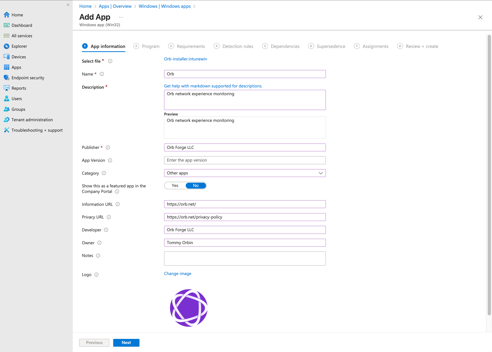
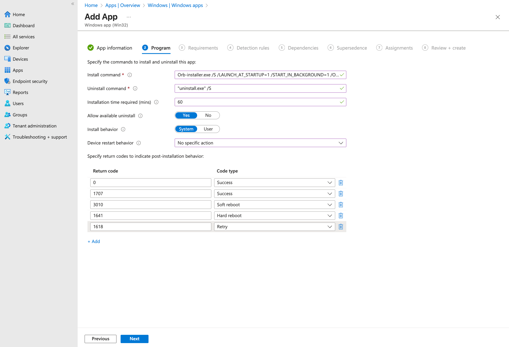
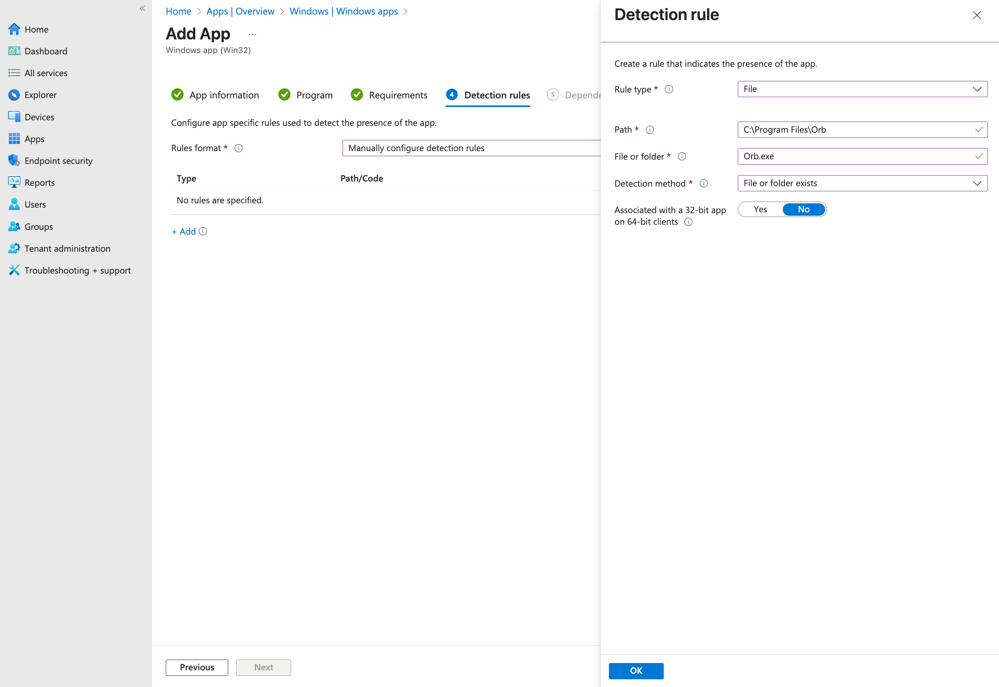

# Deploy Orb on Microsoft Windows using Intune

This guide walks you through using Microsoft Intune to deploy Orb to run in an automated and unobtrusive fashion across your fleet of Windows devices. The guide covers:

1. Preparing the Orb installer for Intune deployment
2. Creating a Win32 app package using Microsoft's Content Prep Tool
3. Configuring installation parameters including Deployment Token
4. Setting up detection rules to verify successful installation
5. Deploying Orb to your Windows devices

Requirements:

1. An Orb Cloud subscription
2. A Microsoft Intune subscription with Win32 app deployment capabilities
3. Windows 10 version 1607 or later on target devices
4. Administrative access to the Microsoft Intune admin center

## Prepare the Installer

Before deploying Orb through Intune, we need to convert the standard Windows installer into an Intune-compatible format using Microsoft's Win32 Content Prep Tool.

### Download Required Tools

First, we'll download the Microsoft Win32 Content Prep Tool and the Orb installer.

1. Visit the Microsoft Win32 Content Prep Tool repository at [https://github.com/Microsoft/Microsoft-Win32-Content-Prep-Tool](https://github.com/Microsoft/Microsoft-Win32-Content-Prep-Tool)
2. Click on "Releases" on the right side of the page
3. Download the latest release (typically named `Microsoft-Win32-Content-Prep-Tool-v1.8.4.zip` or similar)
4. Extract the downloaded archive to a convenient location
5. Download the Orb Windows installer from [https://pkgs.orb.net/earlyaccess/windows/Orb-installer.exe](https://pkgs.orb.net/earlyaccess/windows/Orb-installer.exe)

### Create the Intune Package

Now we'll convert the Orb installer into an Intune-compatible `.intunewin` package.

1. Navigate to the extracted Microsoft Win32 Content Prep Tool folder
2. Locate the `IntuneWinAppUtil.exe` file
3. Create a new folder named `Orb` in the same directory
4. Create another new folder named `Orb-MDM` in the same directory
5. Move the downloaded `Orb-installer.exe` into the `Orb` folder
6. Open PowerShell in the current directory
7. Run the following command:
   ```powershell
   .\IntuneWinAppUtil.exe -c "Orb" -s "Orb-installer.exe" -o "Orb-MDM"
   ```
8. Once complete, you'll find `Orb-installer.intunewin` in the `Orb-MDM` directory

## Configure Intune Deployment

### Create a Deployment Token

We will generate a Deployment Token to associate your MDM Orb installs with your Orb Cloud Team.

1. Visit [https://cloud.orb.net/orchestration](https://cloud.orb.net/orchestration)
2. Click "Create new token"
3. Enter a descriptive name (e.g., "Intune Windows Deployment")
4. Click "Create"
5. Copy the generated token - you'll need this for the installation command

### Create the Win32 App in Intune

Now we'll configure the app deployment in the Microsoft Intune admin center.

1. Sign in to the [Microsoft Intune admin center](https://intune.microsoft.com)
2. Navigate to **Apps** > **Windows** > **+ Add**
3. Select **App type**: Windows app (Win32)
4. Click **Select**

#### App Information

Configure the basic app information:

1. Click **Select app package file**
2. Upload the `Orb-installer.intunewin` file you created earlier
3. Fill in the app information:
   - **Name**: Orb Network Monitoring
   - **Publisher**: Orb Forge
   - **App Version**: (use the current Orb version)
   - **Show this as a featured app in the Company Portal**: Configure as desired
4. Click **Next**



#### Program Configuration

Configure the installation and uninstallation commands:

1. **Install command**: 
   ```
   Orb-installer.exe /S /LAUNCH_AT_STARTUP=1 /START_IN_BACKGROUND=1 /ORB_DEPLOYMENT_TOKEN=your-token-here
   ```
   Replace `your-token-here` with the Deployment Token you generated earlier

2. **Uninstall command**: 
   ```
   "uninstall.exe" /S
   ```

3. **Installation time required (mins)**: 60 (default)
4. **Install behavior**: System
5. **Device restart behavior**: No specific action
6. **Return codes**: Leave default values
7. Click **Next**



#### Requirements

Set the minimum requirements for devices that will receive this app:

1. **Minimum operating system**: Windows 10 1607
2. Configure additional requirements as needed for your environment
3. Click **Next**

#### Detection Rules

Configure how Intune will detect if Orb is installed:

1. **Rules format**: Manually configure detection rules
2. Click **+ Add**
3. Configure the detection rule:
   - **Rule type**: File
   - **Path**: `C:\Program Files\Orb`
   - **File or folder**: `Orb.exe`
   - **Detection method**: File or folder exists
   - **Associated with a 32-bit app on 64-bit clients**: No
4. Click **OK**
5. Click **Next**



#### Dependencies and Supersedence

1. Configure supersedence if replacing an older version
2. Click **Next**

#### Assignments

Assign the app to the appropriate users, groups, or devices:

1. Under **Required**, **Available for enrolled devices**, or **Uninstall**:
   - Select the appropriate assignment based on your deployment strategy
2. Configure any additional assignment filters if needed
3. Click **Next**

#### Review and Create

1. Review all configured settings
2. Click **Create** to finalize the app deployment

## Monitor Deployment

After creating the app, you can monitor its deployment status:

1. Navigate to **Apps** > **Windows**
2. Select your Orb app from the list
3. View the **Overview** page for deployment statistics
4. Check **Device install status** or **User install status** for detailed deployment information

Orb will start automatically on the next Windows restart. Alternatively, if supported by your deployment, you may use a post-install script or other mechanism to start Orb immediately.

## Troubleshooting

### Orb is not connecting to my team

Verify that the Deployment Token was correctly included in the installation command:

1. Check the installation command in Intune includes the `/ORB_DEPLOYMENT_TOKEN=` parameter
2. Ensure the token value matches what's shown in your Orb Cloud deployment tokens page
3. Verify the device has internet connectivity to reach Orb Cloud services
4. Verify the `OrbDeploymentToken` item exists in the Registry Editor and has the correct value in `COMPUTER\HKEY_LOCAL_MACHINE\SOFTWARE\Orb\MDM`

### Installation fails with error code

Common error codes and solutions:

- **0x80070005**: Access denied - Ensure the app is configured to install as System
- **0x87D00324**: The app installation was canceled - User may have canceled or system policy prevented installation

### Orb doesn't start automatically

Verify the installation parameters:

1. Confirm `/LAUNCH_AT_STARTUP=1` is included in the install command
2. Check that `/START_IN_BACKGROUND=1` is included for silent operation
3. Verify Windows startup items aren't disabled by Group Policy
4. Verify the `LaunchAtStartup` and `StartInBackground` items exists in the Registry Editor and have values of `1` in `COMPUTER\HKEY_LOCAL_MACHINE\SOFTWARE\Orb\MDM`

## Additional Configuration Options

### Device Name Overrides
You can set a custom device name to use during installation by setting the `OrbDeviceNameOverride` item key in the Registry Editor for `COMPUTER\HKEY_LOCAL_MACHINE\SOFTWARE\Orb\MDM`.
