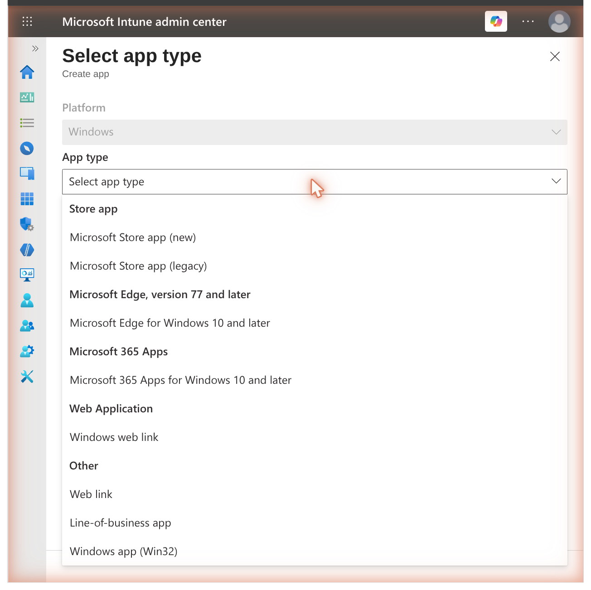
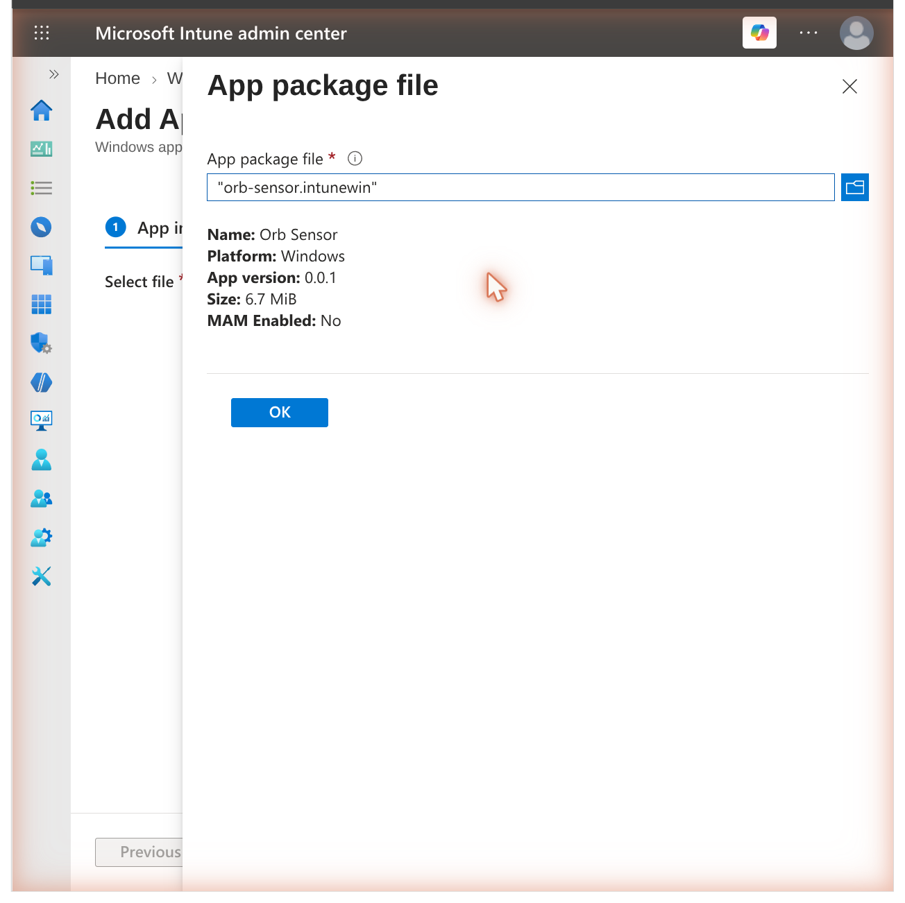
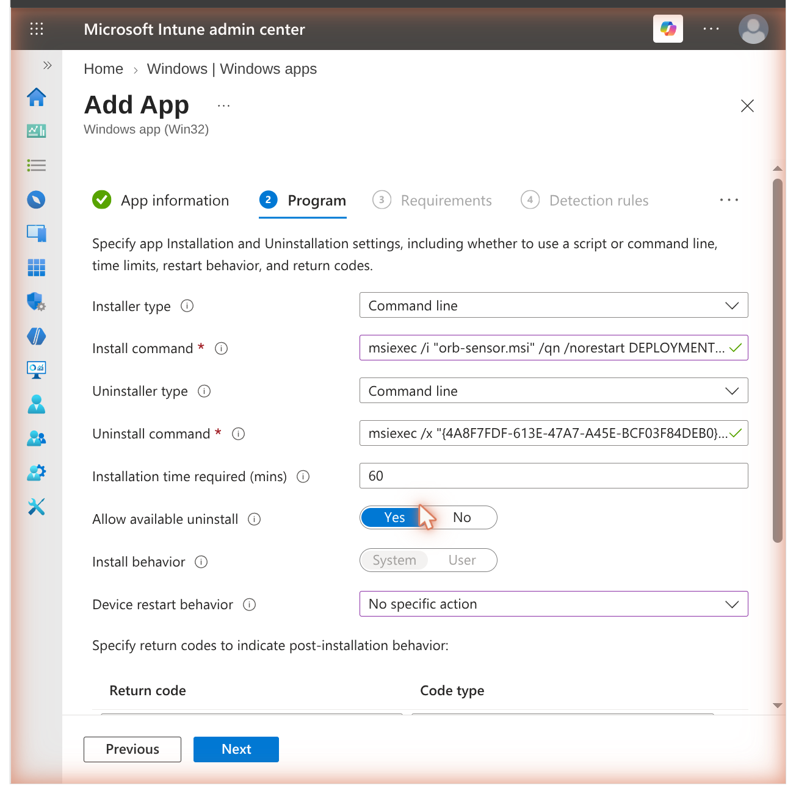
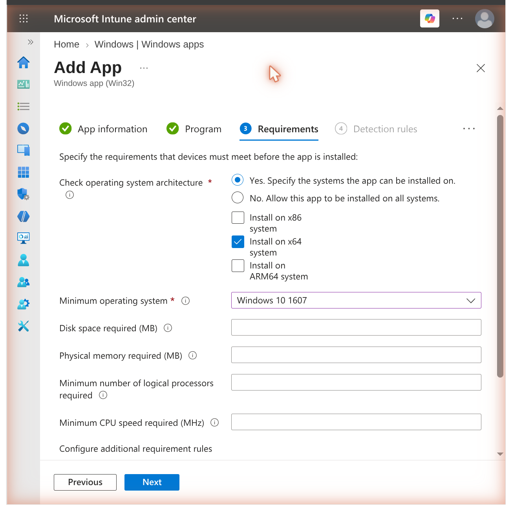
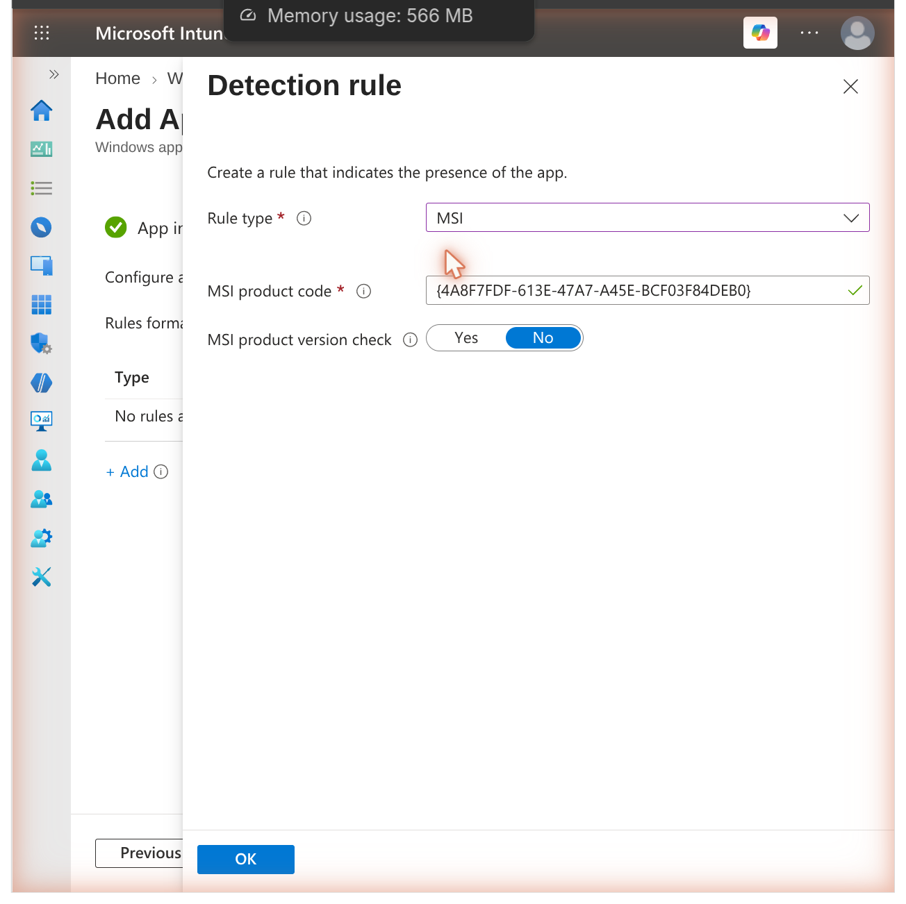
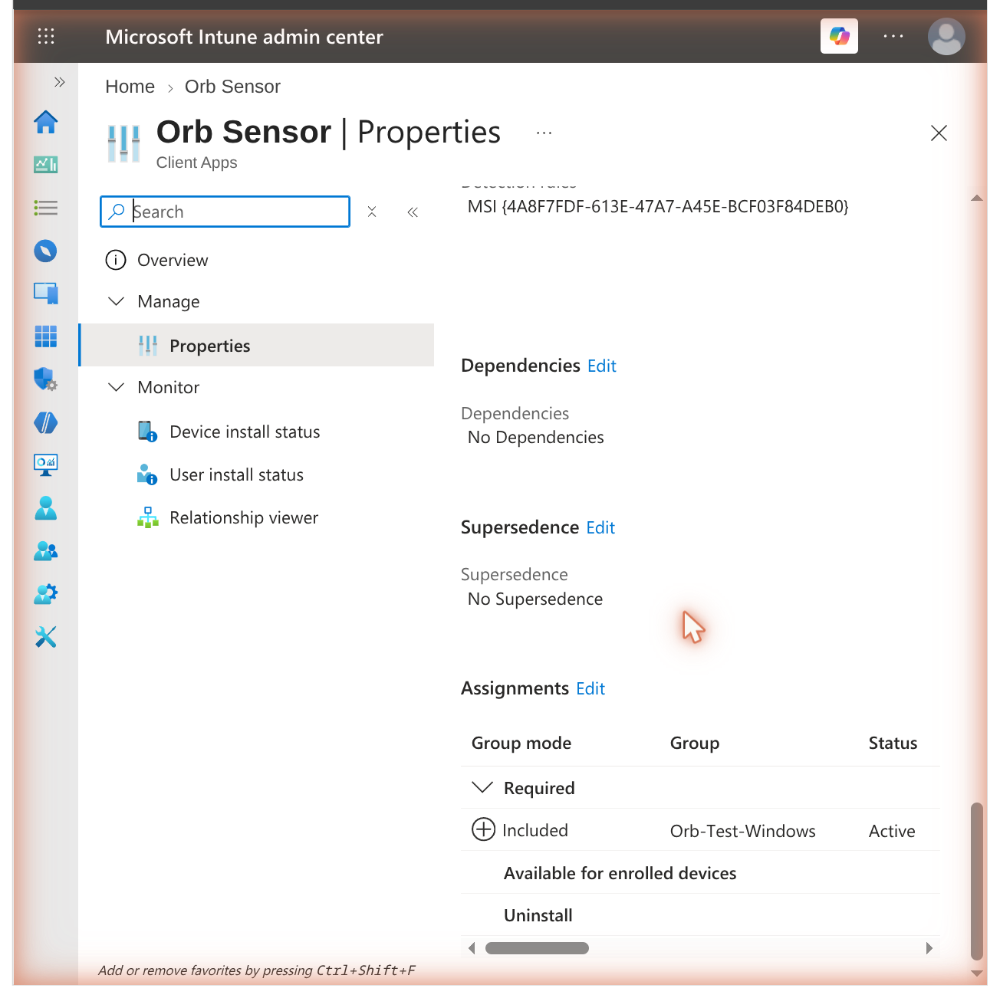
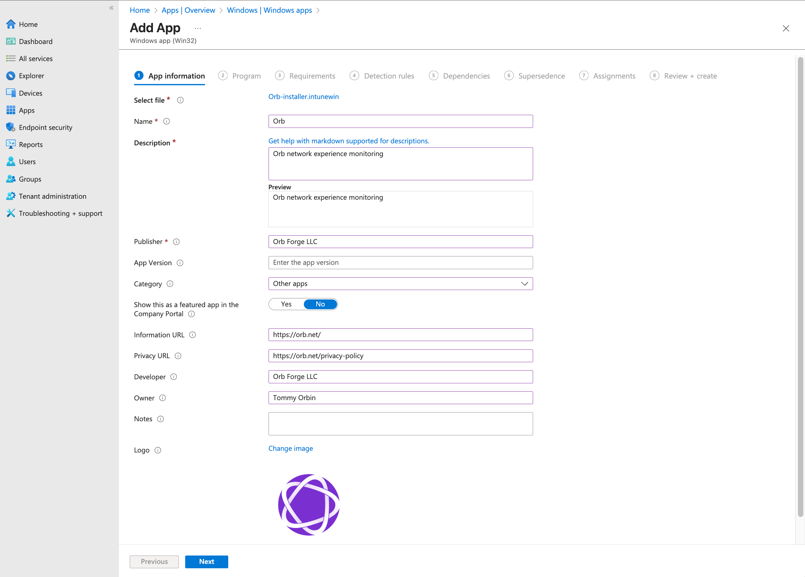
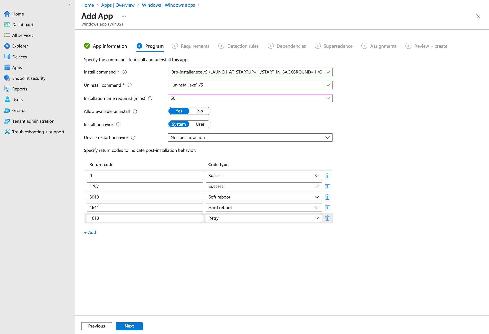
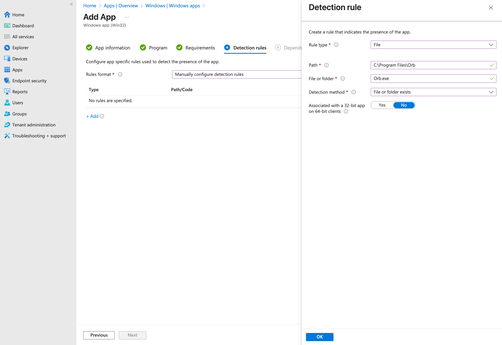
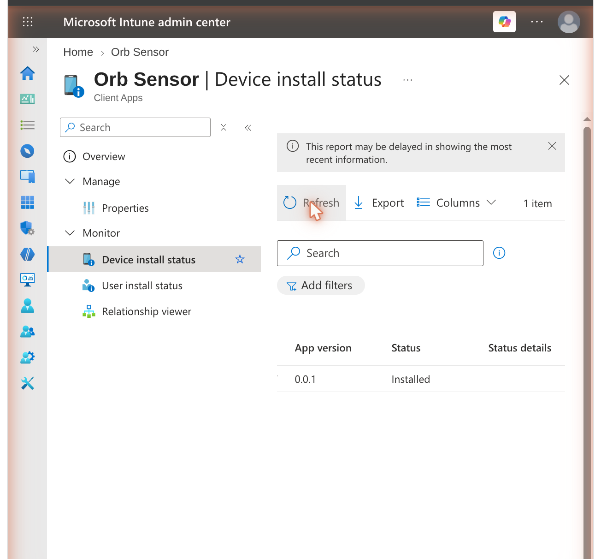

# Deploy Orb on Windows using Microsoft Intune

This guide walks you through deploying Orb across a Windows fleet using Microsoft Intune. The guide covers:

1. Choosing between the Orb sensor and the Orb app
2. Building an Intune package and keeping your Deployment Token out of logs
3. Creating the Win32 app, its install commands and its detection rule
4. Assigning, verifying, updating and uninstalling

Requirements:

1. An Orb Cloud subscription
2. Microsoft Intune with Win32 app deployment, and administrative access to the [Microsoft Intune admin center](https://intune.microsoft.com)
3. Windows 10 version 1607 or later, 64-bit, enrolled in Intune
4. A [Deployment Token](/docs/deploy-and-configure/deployment-tokens) for your Space

## Which should I deploy?

Orb offers two Windows deliverables. They behave very differently under managed deployment, so choose deliberately.

| | Orb sensor | Orb app |
|---|---|---|
| Runs as | Windows service (`LocalSystem`) | User-session desktop app with a tray icon |
| Starts | Automatically at boot, before any user logs in | At user logon, once a startup entry exists |
| Needs a logged-in user | No | Yes |
| Installer | Windows Installer package (`.msi`) | `Orb-installer.exe` |
| Best for | Unattended fleet monitoring, kiosks, point of sale, servers | Devices where a person wants the Orb UI |

:::info
For most managed deployments the **sensor** is the better fit. It runs as a service, starts before login, reports continuously without anyone signing in, and ships as an MSI that Intune can detect and uninstall without any scripting.
:::

:::warning
The sensor and the app register with Orb Cloud separately, so a device running both appears **twice** in your Space, under the same hostname. Deploy one or the other unless you specifically want both.
:::

## Before you start

### Create a Deployment Token

Create a token in the [Orchestration](https://cloud.orb.net/orchestration) section of Orb Cloud. A Deployment Token links each Orb to your Space automatically, with no user interaction.

Use a **dedicated, revocable token per deployment** so you can attribute devices and revoke access without disrupting other rollouts.

### Download the Win32 Content Prep Tool

Intune delivers both Orb packages as Win32 apps, which are built with Microsoft's Win32 Content Prep Tool.

1. Download `IntuneWinAppUtil.exe` from the [Microsoft Win32 Content Prep Tool repository](https://github.com/Microsoft/Microsoft-Win32-Content-Prep-Tool)
2. Extract it somewhere convenient, for example `C:\Intune`

## Deploy the Orb sensor

### Prepare the package

Create a source folder containing the sensor MSI and your token, and an empty output folder:

```
C:\Intune\
  IntuneWinAppUtil.exe
  OrbSensor\
    orb-sensor.msi
    deployment_token.txt
  Output\
```

`deployment_token.txt` contains only your token, with no trailing newline:

```
orb-dt1-yourdeploymenttoken678
```

Build the package:

```powershell
.\IntuneWinAppUtil.exe -c "OrbSensor" -s "orb-sensor.msi" -o "Output" -q
```

This produces `Output\orb-sensor.intunewin`. Everything in the source folder is included in the package, so the token file travels with the MSI.

:::info
Ship the token as a file in the package rather than on the install command line. Intune records the install command line in `IntuneManagementExtension.log` on every device and shows it in the app's properties in the console. The MSI keeps a token passed by file out of its own log as well.
:::

### Create the Win32 app

1. Sign in to the [Microsoft Intune admin center](https://intune.microsoft.com).
2. Go to **Apps → Windows → Windows apps**, select **Create**, choose app type **Windows app (Win32)**, and select **Select**.

   

3. On **App information**, select **Select app package file** and upload `orb-sensor.intunewin`.

   Intune reads the MSI and shows what it found, including the product version and that the package installs per machine.

   

   Select **OK**. The name (`Orb Sensor`), publisher and version are filled in from the package. Add a description, then select **Next**.

4. On **Program**, set:

   **Install command**

   ```
   msiexec /i "orb-sensor.msi" /qn /norestart DEPLOYMENTTOKENFILE=deployment_token.txt
   ```

   **Uninstall command**

   ```
   msiexec /x "{ProductCode}" /qn /norestart
   ```

   Replace `{ProductCode}` with the product code shown on the **Detection rules** page, including the braces. Intune pre-fills both commands from the MSI; add the `DEPLOYMENTTOKENFILE` property to the install command as above.

   - **Install behavior**: *System* — locked, because the package installs per machine
   - **Device restart behavior**: *No specific action* — the MSI does not require a restart
   - **Return codes**: leave the defaults

   

5. On **Requirements**, set the operating system architecture to **x64** and **Minimum operating system** to **Windows 10 1607**, then select **Next**.

   

6. On **Detection rules**, choose **Manually configure detection rules**, select **Add**, and set **Rule type** to **MSI**. The MSI product code is filled in from the package. Leave **MSI product version check** set to **No** unless you want to pin a minimum version, then select **OK**.

   

   :::note
   MSI product code detection is the reason the sensor is packaged as an MSI. Do not use a file-based rule: `Orb.exe` carries no Windows file version resource, so a rule of the form *file exists and version is at least X* never matches, and Intune would reinstall the app on every evaluation.
   :::

7. Skip **Dependencies**. On **Supersedence**, leave it empty for a first deployment — see [Update Orb](#update-orb).

8. On **Assignments**, add your device group under **Required**, then select **Next**.

9. Review and select **Create**.

The service installs and links to your Space with no user interaction and without anyone logging in.

The app's **Properties** page afterwards shows the detection rule and the assignment, which is the quickest way to confirm the deployment is configured as intended:



### Configuration properties

Set any of these as `PROPERTY=value` pairs on the install command. They are persisted so that they survive upgrades.

| Property | Effect |
|---|---|
| `DEPLOYMENTTOKENFILE` | Path to a token file in the package content. Relative paths resolve against the package. |
| `DEPLOYMENTTOKEN` | The token itself. Kept out of the MSI log, but recorded in the Intune install command — prefer the file. |
| `ORB_DEVICE_NAME_OVERRIDE` | Name the device reports in your Space. Quote values containing spaces. |
| `AUTOUPDATE` | `1` lets the sensor update itself on a schedule. Defaults to `0` when installed from the MSI, which is what you want when Intune manages versions. |
| `PURGEDATA` | Uninstall only. `1` also removes `C:\ProgramData\Orb` — see [Uninstall Orb](#uninstall-orb). |

Other sensor options from [Orb Configuration](/docs/deploy-and-configure/configuration) are available as properties of the same name, including `ORB_FIRSTHOP_DISABLED`, `ORB_BANDWIDTH_DISABLED`, `ORB_EPHEMERAL_MODE`, `ORB_MEASURE_SERVER_ENABLED` and `ORB_MEASURE_SERVER_PORT`.

:::note
Changing a property and redeploying applies the new value. Removing a property from the command line does **not** clear it — the previous value is kept, by design, so that settings survive upgrades. To clear a setting, uninstall and reinstall.
:::

### Migrating from a scripted sensor installation

If a device already runs a sensor installed with `install.ps1`, the MSI takes over the existing service in place, keeps the device's identity, and removes the old executable, its folder and its firewall rule. The device stays the same Orb in your Space.

[Install Orb on Windows](/docs/setup-sensor/windows) describes an optional **Orb Auto-Update** scheduled task for scripted installations. The MSI removes that task if it finds it. Do not recreate it on devices you manage with Intune: it would replace MSI-owned files, after which Intune reports a version that no longer matches what is running.

## Deploy the Orb app

The app follows the same Win32 app pattern, with two important differences: how it is detected, and making it start.

### Prepare the package

```
C:\Intune\
  OrbApp\
    Orb-installer.exe
    Install-OrbApp.ps1
    Uninstall-OrbApp.ps1
    deployment_token.txt
```

Download the installer from [https://pkgs.orb.net/earlyaccess/windows/Orb-installer.exe](https://pkgs.orb.net/earlyaccess/windows/Orb-installer.exe).

**`Install-OrbApp.ps1`**:

```powershell
[CmdletBinding()]
param([string] $DeploymentToken)

$ErrorActionPreference = 'Stop'

if (-not $DeploymentToken) {
    $sidecar = Join-Path $PSScriptRoot 'deployment_token.txt'
    if (Test-Path $sidecar) { $DeploymentToken = (Get-Content $sidecar -Raw).Trim() }
}
if (-not $DeploymentToken) { exit 2 }

$installer = Join-Path $PSScriptRoot 'Orb-installer.exe'
$flags = @('/S', '/LAUNCH_AT_STARTUP=1', '/START_IN_BACKGROUND=1', "/ORB_DEPLOYMENT_TOKEN=$DeploymentToken")
$p = Start-Process -FilePath $installer -ArgumentList $flags -Wait -PassThru
if ($p.ExitCode -ne 0) { exit 1 }

# Create the all-users startup entry so the app runs at each user's next logon.
$startupDir = Join-Path $env:ProgramData 'Microsoft\Windows\Start Menu\Programs\StartUp'
New-Item -ItemType Directory -Path $startupDir -Force | Out-Null
$shell = New-Object -ComObject WScript.Shell
$lnk   = $shell.CreateShortcut((Join-Path $startupDir 'Orb.lnk'))
$lnk.TargetPath       = 'C:\Program Files\Orb\Orb.exe'
$lnk.WorkingDirectory = 'C:\Program Files\Orb'
$lnk.Save()
exit 0
```

:::warning
The startup shortcut step is required. Intune installs as `SYSTEM`, and `/LAUNCH_AT_STARTUP=1` on its own creates no startup entry — it only records the preference under `HKLM\SOFTWARE\Orb\MDM`. Without the shortcut the app is installed but never runs, so it never links to Orb Cloud and does not appear in your Space until each user launches it by hand.

Do not launch `Orb.exe` from the installation script instead. The script runs as `SYSTEM` in session 0, where the app has no visible interface.
:::

**`Uninstall-OrbApp.ps1`**:

```powershell
$ErrorActionPreference = 'Continue'

$lnk = Join-Path $env:ProgramData 'Microsoft\Windows\Start Menu\Programs\StartUp\Orb.lnk'
if (Test-Path $lnk) { Remove-Item $lnk -Force -ErrorAction SilentlyContinue }

Get-Process Orb -ErrorAction SilentlyContinue | Stop-Process -Force -ErrorAction SilentlyContinue

$un = 'C:\Program Files\Orb\uninstall.exe'
if (Test-Path $un) { Start-Process -FilePath $un -ArgumentList '/S' -Wait }
exit 0
```

Build the package:

```powershell
.\IntuneWinAppUtil.exe -c "OrbApp" -s "Install-OrbApp.ps1" -o "Output" -q
```

### Create the Win32 app

Create a second Win32 app from `Install-OrbApp.intunewin`, with these settings.



**Program**

```
powershell.exe -ExecutionPolicy Bypass -NoProfile -File .\Install-OrbApp.ps1
```

```
powershell.exe -ExecutionPolicy Bypass -NoProfile -File .\Uninstall-OrbApp.ps1
```

Set **Install behavior** to **System**.



:::warning
If you install the app without a wrapper script, use the full path in the uninstall command: `"C:\Program Files\Orb\uninstall.exe" /S`. A relative `uninstall.exe /S` fails, because the working directory is Intune's content folder rather than the installation directory.
:::

**Detection rules** — detect the app through its Add/Remove Programs entry:

- **Rule type**: Registry
- **Key path**: `HKEY_LOCAL_MACHINE\SOFTWARE\Microsoft\Windows\CurrentVersion\Uninstall\Orb Forge Inc.Orb`
- **Value name**: `DisplayVersion`
- **Detection method**: String comparison, **Equals** or **Greater than or equal to**, with the version you are deploying



:::note
Detect the app through its Add/Remove Programs entry rather than the presence of `C:\Program Files\Orb\Orb.exe`. The app's `Orb.exe` has no version resource, so no version rule is possible on the file, and the sensor uses a similar path. The Add/Remove Programs entry carries a version and is unambiguous.
:::

## Verify the deployment

In the admin center, open the app and review **Overview** and **Device install status**, which reports each device as *Installed*, *Failed*, *Pending* or *Not applicable*.



:::note
The console lags the device. A device that has already installed Orb can still show *Install Pending* for some time, because the status only updates when the device next reports in. Confirm on the device itself, or in Orb Cloud, before treating a pending status as a problem.
:::

On a target device:

```powershell
# Sensor
Get-Service Orb
& 'C:\Program Files\Orb Sensor\Orb.exe' version

# App
Get-Process Orb
```

In [Orb Cloud](https://cloud.orb.net), confirm the device appears in your Space and is reporting.

Useful device-side logs:

| Log | Shows |
|---|---|
| `C:\ProgramData\Microsoft\IntuneManagementExtension\Logs\IntuneManagementExtension.log` | Content download, install and uninstall, exit codes, detection results |
| `C:\ProgramData\Microsoft\IntuneManagementExtension\Logs\AgentExecutor.log` | Output from script-based install commands |
| Verbose MSI log | Add `/l*v C:\Windows\Temp\orb-sensor.log` to the sensor install command while troubleshooting |

To make a device check in immediately rather than waiting for its next cycle, use **Sync** on the device in the admin center, or **Settings → Accounts → Access work or school → Info → Sync** on the device itself.

## Update Orb

An MSI-based Win32 app updates through **supersedence**, which is also what keeps Intune's reported version accurate.

1. Build a new `.intunewin` from the newer `orb-sensor.msi`.
2. Create a new Win32 app for that version.
3. On the new app's **Supersedence** page, add the previous app and leave **Uninstall previous version** set to **No**. The MSI performs a major upgrade in place.
4. Assign the new app and remove the assignment from the old one.

Upgrading keeps the device's identity: it stays the **same Orb** in your Space rather than appearing as a duplicate, and its Deployment Token and configuration properties are preserved.

For the app, replace `Orb-installer.exe` in the package source, rebuild, and raise the version in the detection rule.

:::warning
Do not enable the sensor's own auto-update (`AUTOUPDATE=1`) on devices you manage with Intune. Devices would move to new versions outside your change control, and self-replaced files leave Intune reporting a version that is no longer installed.
:::

## Uninstall Orb

Assign the app to a group under **Uninstall**, or remove the *Required* assignment and add an *Uninstall* assignment for the same group.

Uninstalling the sensor removes the service, the program folder, the firewall rule and the Add/Remove Programs entry, and leaves `C:\ProgramData\Orb` in place. That folder holds the sensor's identity and Deployment Token, which is what allows a reinstall to return as the same Orb rather than creating a duplicate in your Space.

:::warning
When you decommission or repurpose a device, remove `C:\ProgramData\Orb` as well. It contains the Deployment Token and the sensor's private key. Add `PURGEDATA=1` to the uninstall command to remove it — note that a later installation then enrolls as a **new** Orb:

```
msiexec /x "{ProductCode}" /qn /norestart PURGEDATA=1
```
:::

## Troubleshooting

### The app installs but Intune reports it as failed or keeps reinstalling

Detection is failing. For the sensor, confirm the detection rule is an **MSI** rule with the product code of the package you deployed; a new version has a new product code. For the app, confirm the registry rule points at the Add/Remove Programs key above. Check the detection result in `IntuneManagementExtension.log`.

### The app is installed but does not appear in Orb Cloud

The app only reports while it is running, and it runs only in a user session. Confirm that `C:\ProgramData\Microsoft\Windows\Start Menu\Programs\StartUp\Orb.lnk` exists and that a user has logged on since installation.

The sensor does not have this constraint: it runs as a service and reports without anyone logging in.

### Orb does not link to my Space

1. Confirm `C:\ProgramData\Orb\deployment_token.txt` exists (sensor), or that `HKLM\SOFTWARE\Orb\MDM\OrbDeploymentToken` is set (app).
2. Confirm the token is still valid in [Orchestration](https://cloud.orb.net/orchestration).
3. Confirm the device can reach the internet.

If the token was rejected, the sensor MSI fails the installation immediately with `1603` and reports the reason in its verbose log rather than installing a sensor that never links. If Orb Cloud is merely unreachable, installation succeeds and the device links when it next has connectivity.

### Installation fails with an error code

| Code | Means |
|---|---|
| `1603` | Fatal installation error. Read the verbose MSI log; a rejected Deployment Token reports this. |
| `1618` | Another installation is in progress. Intune retries. |
| `0x80070005` | Access denied. Confirm **Install behavior** is *System*. |

## Additional configuration

Both deliverables support the configuration options described in [Orb Configuration](/docs/deploy-and-configure/configuration). For the sensor, set them as MSI properties as described above. For the app, MDM settings are read from `HKLM\SOFTWARE\Orb\MDM`, where `OrbDeviceNameOverride` sets the name the device reports in your Space.

To deploy Orb with Microsoft Configuration Manager instead, see [Microsoft Configuration Manager (SCCM)](/docs/deploy-and-configure/mdm/sccm).
