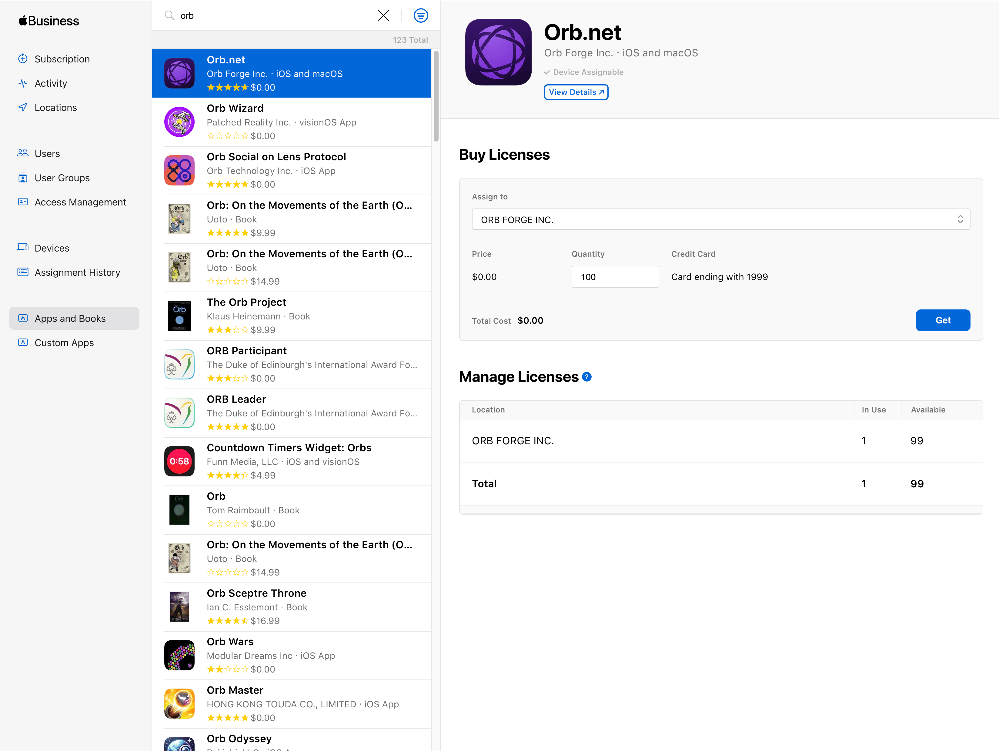
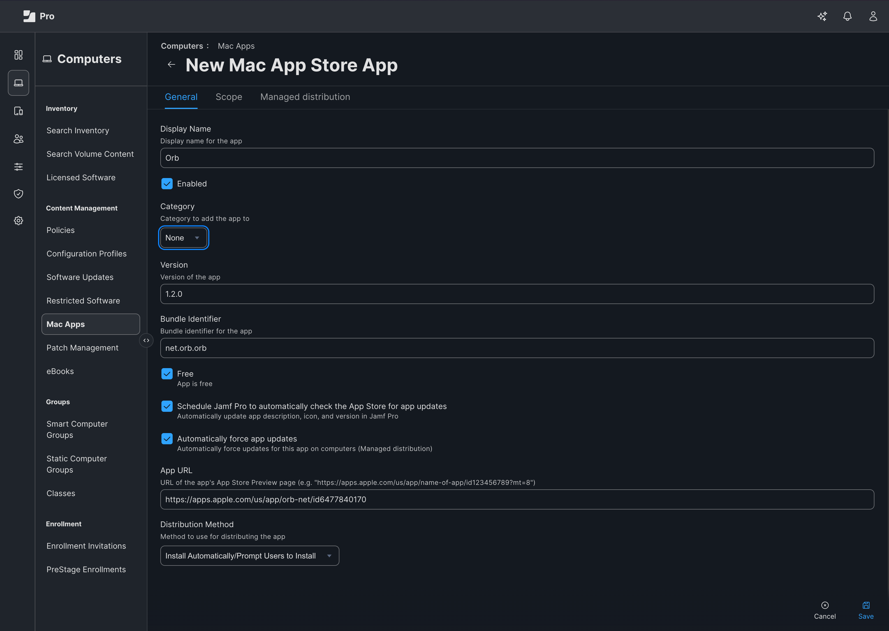
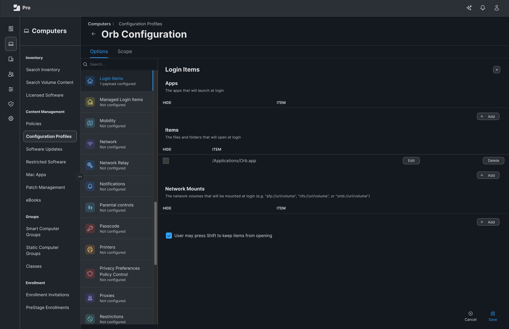

# Deploy Orb on macOS using Jamf Pro

This guide walks you through using Jamf Pro to deploy Orb to run in an automated an unobtrusive fashion across your fleet of macOS devices. The guide covers:

1. Installing Orb from the App Store
2. Setting Orb as a Login Item to run at boot
3. Provisioning an Orb Cloud Deployment Token
4. Configuring Orb to use the Deployment Token to associate your Orbs with your Orb Cloud Team
5. Configure Orb to hide the Dock icon and not open the GUI on launch

Requirements:

1. An Orb Cloud subscription that includes Deployment Tokens (all paid plans)
2. A Jamf Pro subscription
3. Apple Business Apps and Books (VPP) is configured and linked to your Jamf Pro account

## Install Orb

This guide assumes you have set up Apple Apps and Books (VPP) and linked to your Jamf Pro instance. This is configured in Settings > Global > Volume purchasing.

### Set up Orb Licenses

First, we will "buy" Orb licenses in the Apps and Books interface by Apple.

1. Visit https://business.apple.com
2. Click "Apps and Books"
3. Type "orb" in the search bar
4. Click "Orb.net"
5. Under "Assign to", select a Location
6. Enter a "Quantity" and click "Get"



### Install Orb via Jamf Pro

Now we will use these licenses to install Orb to our macOS devices via Jamf Pro.

1. Visit your Jamf Pro administration interface
2. Navigate to Computers > Mac Apps > App Store
3. Click "New"
4. Under "App Source", select "Mac App Store". Click "Next"
6. In the search box, type "orb"
7. Next to Orb.net by Orb Forge Inc. click "Add"
8. Enable the "Schedule Jamf Pro to automatically check the App Store for app updates" and "Automatically force app updates" options if desired.
9. Under "Distribution Method", select "Install Automatically/Prompt Users to Install"
10. Configure the settings in the "Scope" tab as desired
11. If using VPP, navigate to the "Managed distribution" tab, toggle to "VPP Codes", enable "Assign Content Purchased in Volume" and select the correct Location from the drop-down
12. Click "Save"



## Configure Orb

### Create a Deployment Token

We will now generate a Deployment Token to associate your MDM Orb installs with your Orb Cloud Team.

1. Visit [https://cloud.orb.net/orchestration](https://cloud.orb.net/orchestration)
2. Click "Create new token"
3. Enter a Name and click "Create"
4. Keep this window open for the next step

### Create .mobileconfig

We will now create a .mobileconfig file to configure Orb to:

1. Use the deployment token we generated to link the provisioned Orbs to your Orb Cloud Team
2. Hide Orb from the macOS Dock (optional)
3. Prevent the Orb GUI from appearing on log in (optional)

In a text editor, such as Visual Studio Code, create a new file called my-configuration.mobileconfig with the following contents:

```xml
<?xml version="1.0" encoding="UTF-8"?>
<!DOCTYPE plist PUBLIC "-//Apple//DTD PLIST 1.0//EN" "http://www.apple.com/DTDs/PropertyList-1.0.dtd">
<plist version="1.0">
<dict>
    <key>PayloadContent</key>
    <array>
        <dict>
            <key>PayloadType</key>
            <string>net.orb.orb</string>
            <key>PayloadVersion</key>
            <integer>1</integer>
            <key>PayloadIdentifier</key>
            <string>net.orb.orb.deployment</string>
            <key>PayloadUUID</key>
            <string>REPLACE-WITH-UUID-1</string>
            <key>PayloadDisplayName</key>
            <string>Orb Deployment Configuration</string>
            <key>PayloadDescription</key>
            <string>Configures deployment token for Orb network monitoring</string>
            <key>PayloadOrganization</key>
            <string>Your Organization</string>
            <key>ORB_DEPLOYMENT_TOKEN</key>
            <string>REPLACE-WITH-YOUR-DEPLOYMENT-TOKEN</string>
            <key>LaunchInBackground</key>
            <true/>
            <key>HideDockIcon</key>
            <true/>
        </dict>
    </array>
    <key>PayloadDisplayName</key>
    <string>Orb Configuration</string>
    <key>PayloadIdentifier</key>
    <string>net.orb.orb.configuration</string>
    <key>PayloadDescription</key>
    <string>Configures Orb network monitoring service</string>
    <key>PayloadOrganization</key>
    <string>Your Organization</string>
    <key>PayloadRemovalDisallowed</key>
    <false/>
    <key>PayloadType</key>
    <string>Configuration</string>
    <key>PayloadUUID</key>
    <string>REPLACE-WITH-UUID-2</string>
    <key>PayloadVersion</key>
    <integer>1</integer>
</dict>
</plist>
```

We need to edit this configuration. Part of the configuration requires generating UUIDs to meet the .mobileconfig specification. The instructions will assume you are using macOS to have access to `uuidgen`.

1. Open the macOS Terminal.app
2. Execute the command `uuidgen | pbcopy`
3. Select `REPLACE-WITH-UUID-1` in the .mobileconfig file and replace with the contents of your clipboard
4. Repeat steps 2 and 3 for `REPLACE-WITH-UUID-2`
5. Return to [https://cloud.orb.net/orchestration](https://cloud.orb.net/orchestration) in your browser, copy the generated Deployment Token to your clipboard, and replace `REPLACE-WITH-YOUR-DEPLOYMENT-TOKEN` in the .mobileconfig with the contents of your clipboard.
6. Save the .mobileconfig file

### Configure Custom Profile

We will now import the .mobileconfig file into Jamf Pro to configure Orb as desired. We will set Orb as a Login Item so it starts on boot as part of the profile.

1. Reurning to Jamf Pro, Navigate to Computers > Configuration Profiles
2. Click "Upload"
3. Select your .mobileconfig file from your computer
4. Modify the Name as desired
5. Set the Profile Assignment as desired.
6. Click "Login Items" and click "Configure"
7. Under "Items", click "+ Add"
8. Enter in the Item field: /Applications/Orb.app
9. Click "Save" next to the Item (not the "Save" at the bottom of the page)
10. Navigate to the "Scope" tab and modify as desired
11. Click "Save"



## Troubleshooting

### Devices are not automatically joining my team.

Verify that the .plist file we created from the .mobileconfig exists and contains your Deployment Token

```bash
%  sudo plutil -p "/Library/Managed Preferences/net.orb.orb.plist"
```