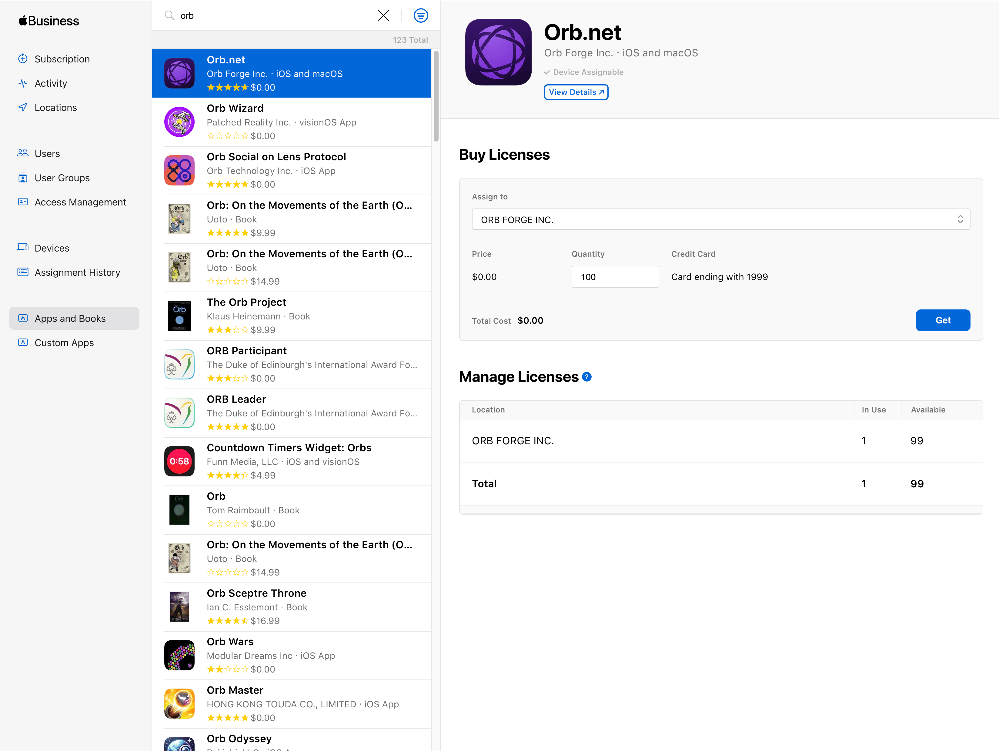
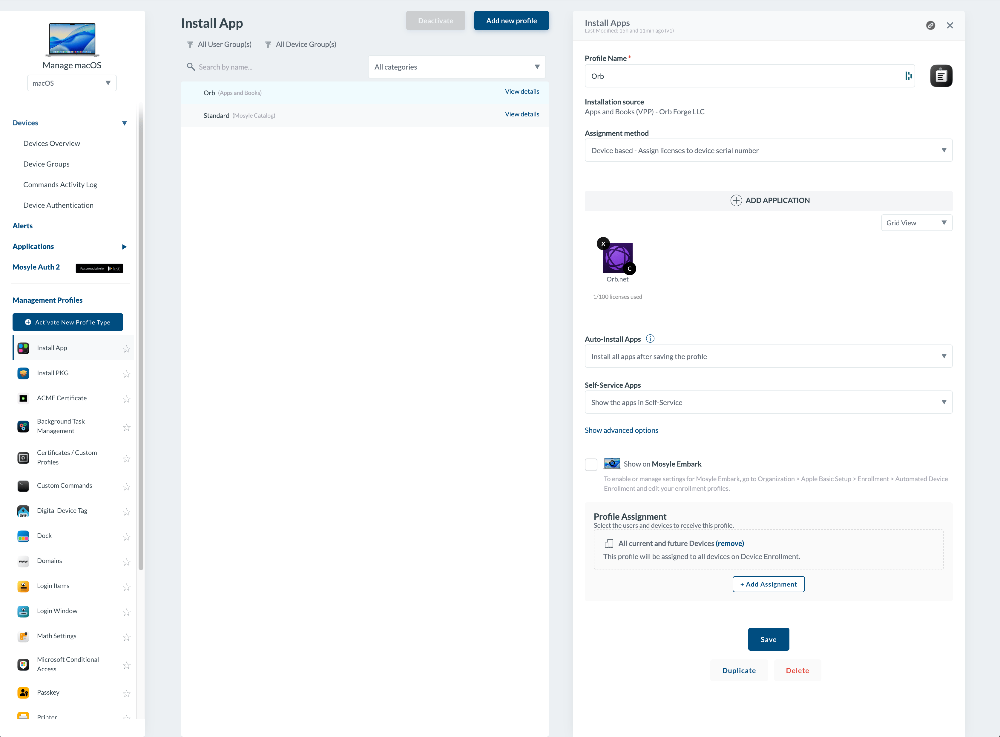
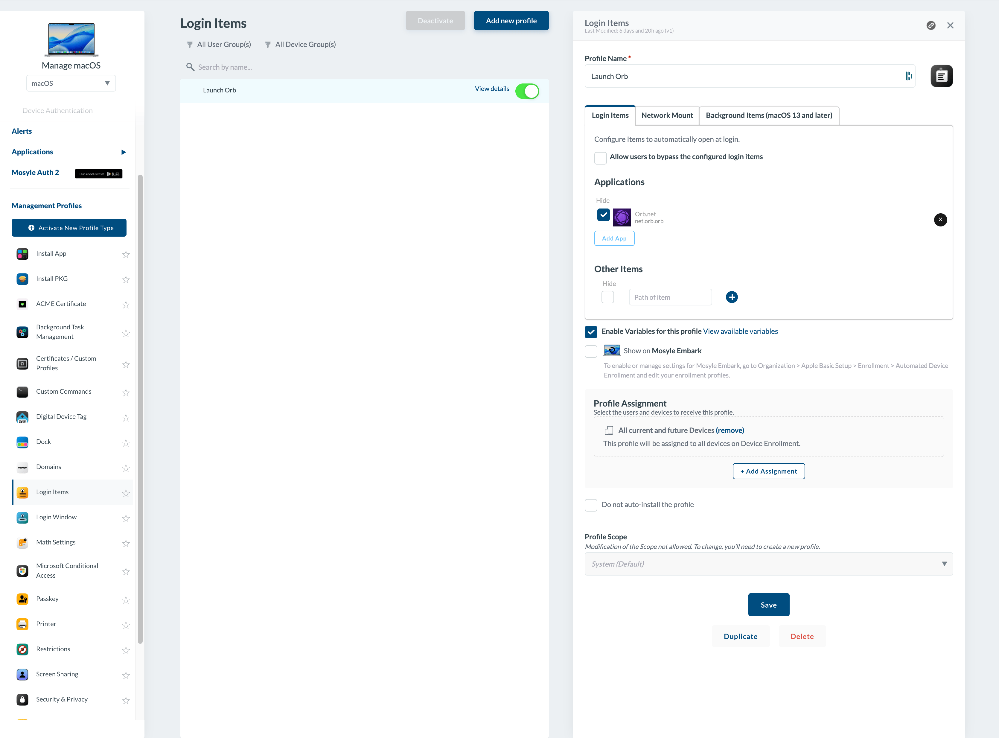
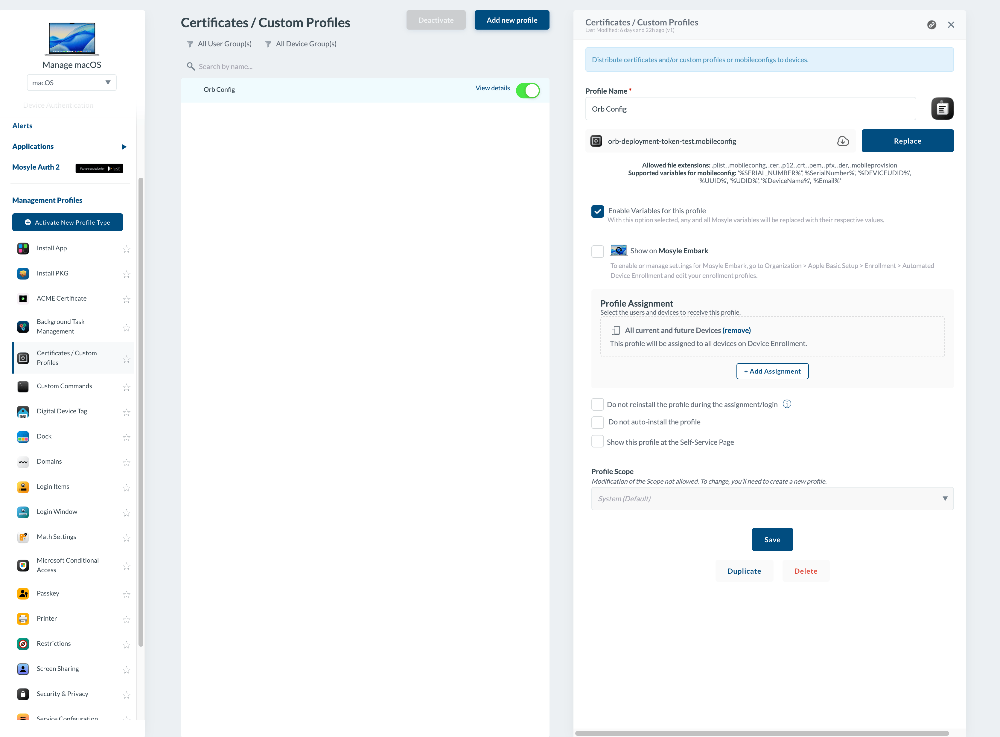

# Deploy Orb on macOS using Mosyle

This guide walks you through using Mosyle to deploy Orb to run in an automated an unobtrusive fashion across your fleet of macOS devices. The guide covers:

1. Installing Orb from the App Store
2. Setting Orb as a Login Item to run at boot
3. Provisioning an Orb Cloud Deployment Token
4. Configuring Orb to use the Deployment Token to associate your Orbs with your Orb Cloud Team
5. Configure Orb to hide the Dock icon and not open the GUI on launch

Requirements:

1. An Orb Cloud subscription that includes Deployment Tokens (all paid plans)
2. A Mosyle subscription
3. Apple Business Apps and Books (VPP) is configured and linked to your Mosyle account

## Install Orb

This guide assumes you have set up Apple Apps and Books (VPP) and linked to your Mosyle instance. This is configured in Management > Applications > Apple Apps and Books (VPP).

### Set up Orb Licenses

First, we will "buy" Orb licenses in the Apps and Books interface by Apple.

1. Visit https://business.apple.com
2. Click "Apps and Books"
3. Type "orb" in the search bar
4. Click "Orb.net"
5. Under "Assign to", select a Location
6. Enter a "Quantity" and click "Get"



### Install Orb via Mosyle

Now we will use these licenses to install Orb to our macOS devices via Mosyle.

1. Visit your Mosyle administration interface
2. Navigate to Management > Management Profiles > Install App
3. Click "Add new profile" (or add to an existing profile)
4. Ensure a name is entered under "Profile Name"
5. Under "Installation source", select "Apps and Books (VPP)"
6. Click "+ ADD APPLICATION"
7. Select Orb.net and click the check mark icon
8. Configure the remaining settings and Profile Assignment as desired



## Configure Login Item

Now, we will configure Orb to start on macOS boot.

1. Remaining in Mosyle, Navigate to Management > Management Profiles > Login Items
2. Click "Add new profile" (or add to an existing profile)
3. Click "Add App"
4. In the "Filtering the apps by" dropdown, select "Apps and Books (VPP)"
5. Select Orb.net and click the check mark icon
6. Configure the remaining settings and Profile Assignment as desired



## Configure Orb

### Create a Deployment Token

We will now generate a Deployment Token to associate your MDM Orb installs with your Orb Cloud Team.

1. Visit [https://cloud.orb.net/orchestration](https://cloud.orb.net/orchestration)
2. Click "Create new token"
3. Enter a Name and click "Create"
4. Keep this window open for the next step

### Create .mobileconfig

We will now create a .mobileconfig file to configure Orb to:

1. Use the deployment token we generated to link the provisioned Orbs to your Orb Cloud Team
2. Hide Orb from the macOS Dock (optional)
3. Prevent the Orb GUI from appearing on log in (optional)

In a text editor, such as Visual Studio Code, create a new file called my-configuration.mobileconfig with the following contents:

```xml
<?xml version="1.0" encoding="UTF-8"?>
<!DOCTYPE plist PUBLIC "-//Apple//DTD PLIST 1.0//EN" "http://www.apple.com/DTDs/PropertyList-1.0.dtd">
<plist version="1.0">
<dict>
    <key>PayloadContent</key>
    <array>
        <dict>
            <key>PayloadType</key>
            <string>net.orb.orb</string>
            <key>PayloadVersion</key>
            <integer>1</integer>
            <key>PayloadIdentifier</key>
            <string>net.orb.orb.deployment</string>
            <key>PayloadUUID</key>
            <string>REPLACE-WITH-UUID-1</string>
            <key>PayloadDisplayName</key>
            <string>Orb Deployment Configuration</string>
            <key>PayloadDescription</key>
            <string>Configures deployment token for Orb network monitoring</string>
            <key>PayloadOrganization</key>
            <string>Your Organization</string>
            <key>OrbDeploymentToken</key>
            <string>REPLACE-WITH-YOUR-DEPLOYMENT-TOKEN</string>
            <key>LaunchInBackground</key>
            <true/>
            <key>HideDockIcon</key>
            <true/>
            <key>OrbDeviceNameOverride</key>
            <string>REPLACE WITH DESIRED NAME (optional)</string>
        </dict>
    </array>
    <key>PayloadDisplayName</key>
    <string>Orb Configuration</string>
    <key>PayloadIdentifier</key>
    <string>net.orb.orb.configuration</string>
    <key>PayloadDescription</key>
    <string>Configures Orb network monitoring service</string>
    <key>PayloadOrganization</key>
    <string>Your Organization</string>
    <key>PayloadRemovalDisallowed</key>
    <false/>
    <key>PayloadType</key>
    <string>Configuration</string>
    <key>PayloadUUID</key>
    <string>REPLACE-WITH-UUID-2</string>
    <key>PayloadVersion</key>
    <integer>1</integer>
</dict>
</plist>
```

We need to edit this configuration. Part of the configuration requires generating UUIDs to meet the .mobileconfig specification. The instructions will assume you are using macOS to have access to `uuidgen`.

1. Open the macOS Terminal.app
2. Execute the command `uuidgen | pbcopy`
3. Select `REPLACE-WITH-UUID-1` in the .mobileconfig file and replace with the contents of your clipboard
4. Repeat steps 2 and 3 for `REPLACE-WITH-UUID-2`
5. Return to [https://cloud.orb.net/orchestration](https://cloud.orb.net/orchestration) in your browser, copy the generated Deployment Token to your clipboard, and replace `REPLACE-WITH-YOUR-DEPLOYMENT-TOKEN` in the .mobileconfig with the contents of your clipboard.
6. Save the .mobileconfig file

### Configure Custom Profile

We will now import the .mobileconfig file into Mosyle to configure Orb as desired.

1. Reurning to Mosyle, Navigate to Management > Management Profiles > Certificates / Custom Profiles
2. Click "Add new profile"
3. Name the profile
4. Click "Select the file" and Open the .mobileconfig file we created
5. Set the Profile Assignment as desired.



## Troubleshooting

### Devices are not automatically joining my team.

Verify that the .plist file we created from the .mobileconfig exists and contains your Deployment Token

```bash
%  sudo plutil -p "/Library/Managed Preferences/net.orb.orb.plist"
```