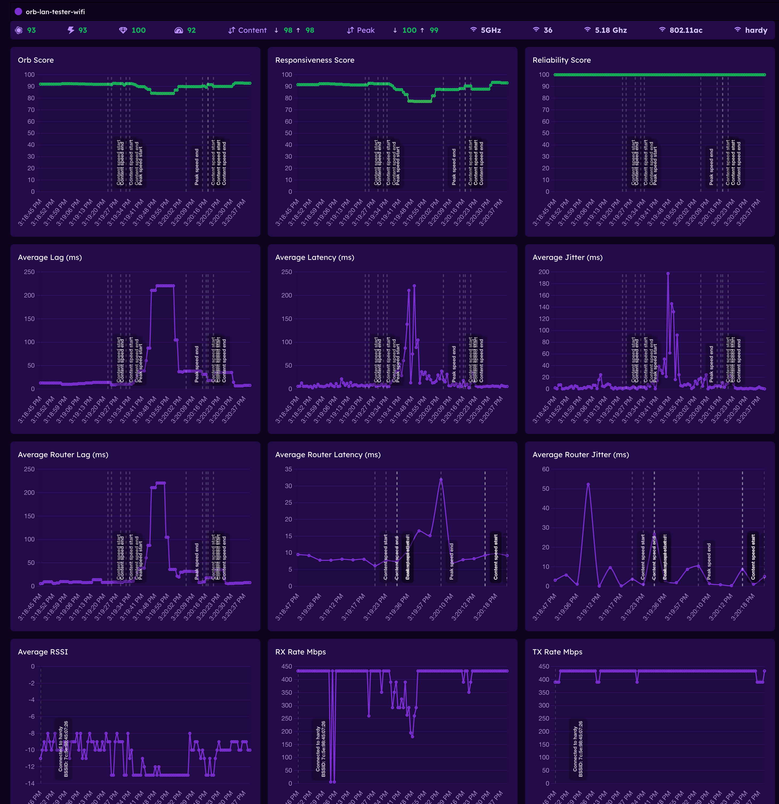
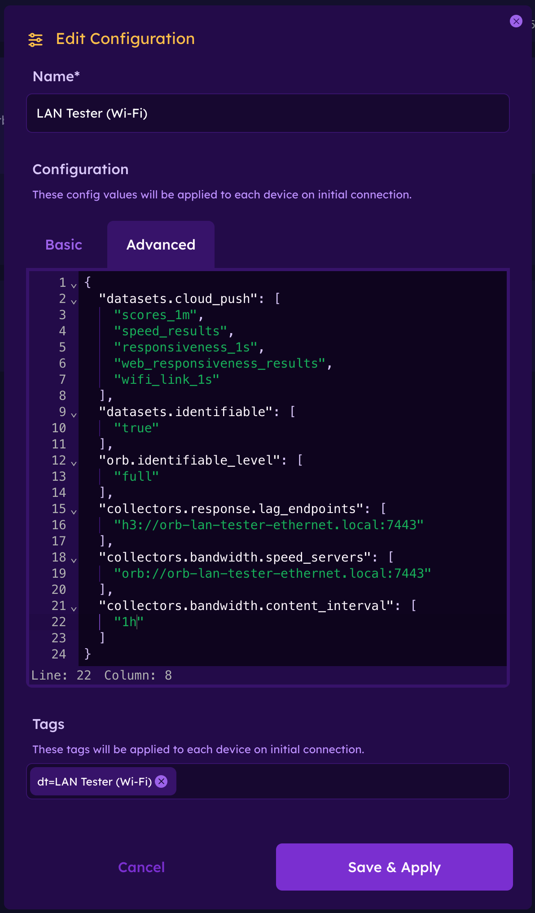
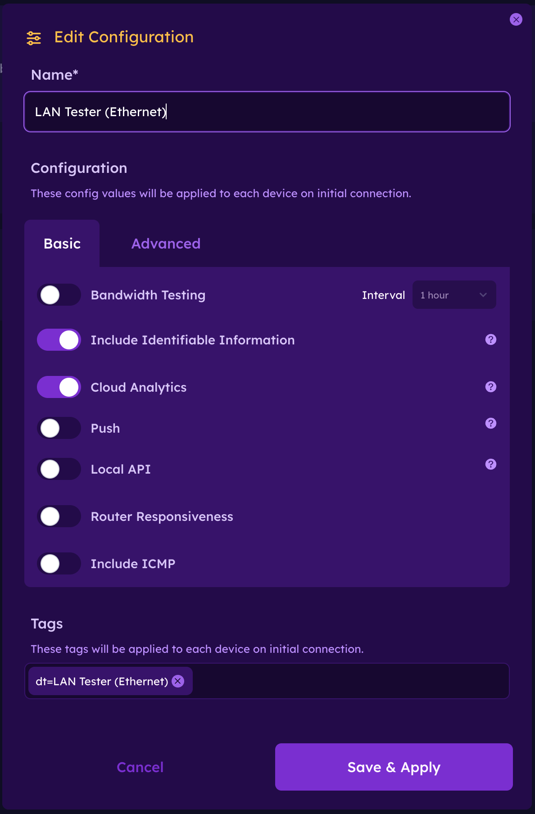

# Orb LAN Tester

:::danger
This guide is intended to setup a dedicated LAN measurement devices. We do not recommend following this guide on a multi-use machine, as it will make impactful changes to the networking setup specifically tailored to LAN measurement. These changes may be detrimental to the general usability of you device. For SD-card based devices like Raspberry Pi, we recommend using a dedicated SD card.

This guide also uses features from [Endpoints & Engines](/docs/deploy-and-configure/endpoints) that are experimental, and not yet intended for production environments.

We appreciate your testing and feedback. Please use our [Help & Support](https://orb.net/support) page or [Discord](https://discord.gg/orbforge) to report issues and ask questions.
:::


This guide walks you through setting up an **Orb LAN Tester**: a dual-interface device that measures the real-world performance of your Wi-Fi network by routing Orb measurement traffic from a Wi-Fi interface, through your router, and back to an Ethernet-connected Orb measurement server — all from a single device.

This setup gives you a clean way to isolate and analyze Wi-Fi network performance. You'll receive realistic and full-fidelity Orb measurements of the network path from a Wi-Fi client to your router, and back to an Ethernet client.

We'll be setting up 2 Orbs on your device:
1. An Orb Docker container, with self-contained DHCP client, bound to the Ethernet interface (using `macvlan` driver as detailed in the [multi-interface setup guide](/docs/setup-sensor/docker-multiple-interfaces)).
2. An Orb bound to the Wi-Fi interface, testing to the resolved private IP of the Ethernet Orb container on the network (technically it's bound to the default interface, but we'll make sure Wi-Fi interface is the default).

Even though both Orbs run on the same device, traffic actually traverses your network while measuring from the Wi-Fi Orb to the Ethernet Orb (container), giving you a measurement of the LAN loop.




---

## 🧰 Requirements

- A Debian-based system (e.g. Raspberry Pi OS, Ubuntu)
- Both **Wi-Fi (`wlan0`) and Ethernet (`eth0`) connected**
- An Orb Cloud account

In this guide we use a **Raspberry Pi 4 Model B**, but any Debian host with both interfaces works.

See setup notes for specific devices that may require additional considerations or steps:
 - [WLAN Pi R4](#wlan-pi-r4)

---

## ☁️ Step 1: Create Two Orb Configurations

In [Orb Cloud Orchestration tab](https://cloud.orb.net/orchestration), create two sensor configurations, and copy the Deployment Token for each.

### 1. Config for the Wi-Fi Orb

Give this configuration a reconizable name like `Orb Lan Tester (Wi-Fi)` (recommended, name whatever you like).

This configuration will be used by the Wi-Fi interface Orb running on the host. This will be the Orb measuring the "LAN Loop".

- Uses `orb-lan-tester-ethernet.local` as the measurement endpoint for both Speed and Responsiveness testing. This will be mapped to the resolved IP of the Orb Ethernet container at run time.
- Collects Wi-Fi metrics (RSSI, link quality, etc.)
- Sends analytics data to Orb Cloud Analytics (alternatively, you can configure [Orb Local Analytics](/docs/deploy-and-configure/local-analytics))



**Advanced Config**
```json
{
  "datasets.cloud_push": [
    "scores_1m",
    "speed_results",
    "responsiveness_1s",
    "web_responsiveness_results",
    "wifi_link_1s"
  ],
  "datasets.identifiable": [
    "true"
  ],
  "orb.identifiable_level": [
    "full"
  ],
  "collectors.response.lag_endpoints": [
    "h3://orb-lan-tester-ethernet.local:7443"
  ],
  "collectors.bandwidth.speed_servers": [
    "orb://orb-lan-tester-ethernet.local:7443"
  ],
  "collectors.bandwidth.content_interval": [
    "1h"
  ]
}
```

> [!NOTE]
> This configuration sends full identifiable information to Orb Cloud. This means Private IP and MAC Address will be reported to Orb Cloud for your device, which can help diagnose setup issues. This is not required, you can remove the `identification_level` block if you do not want that behavior.

### 2. Config for the Ethernet Orb (Container)
Give this configuration a reconizable name like `Orb Lan Tester (Ethernet)` (recommended, name whatever you like).

This configuration will be used by the Wi-Fi interface Orb running on the host. This will be the Orb acting as a measurement server for the LAN Loop.
In addition to acting as a server, this Orb will also measure the WAN connectivity (default behavior).
Since we are focusing on the LAN performance measurement in this guide, we will disable Speed test measurement for this Orb to keep it's WAN measurements very lightweight.

- Disables Speed measurement
- Sends analytics data to Orb Cloud Analytics (alternatively, you can configure [Orb Local Analytics](/docs/deploy-and-configure/local-analytics))



> [!NOTE]
> This configuration sends full identifiable information to Orb Cloud. This means Private IP and MAC Address will be reported to Orb Cloud for your device, which can help diagnose setup issues. This is not required, you can uncheck "Include Identifiable Information" if you do not want that behavior.
---

## ⚙️ Step 2: Run the Setup Script

Export your tokens:

```bash
export ORB_DEPLOYMENT_TOKEN_WIFI="your-wifi-deployment-token"
export ORB_DEPLOYMENT_TOKEN_ETHERNET="your-ethernet-deployment-token"
```

Optionally, override the Orb names:

```bash
export HOST_ORB_NAME="custom-name-for-wifi-orb"
export ETH_ORB_NAME="custom-name-for-ethernet-orb"
```

Then run the setup:

```bash
curl -fsSL https://orb.net/docs/scripts/orb-lan-tester/setup.sh | sudo -E bash
```

This script will:

- Install Docker
- Configure Wi-Fi as the preferred interface  
- Enable ARP filtering to avoid multi-interface routing issues  
- Install Orb directly on the host (Wi-Fi)  
- Start a Docker Orb bound to Ethernet using macvlan  
- Install a scheduled helper to resolve the Orb Ethernet container’s real DHCP IP and update `/etc/hosts` to ensure `orb-lan-tester-ethernet.local` resolves to it
- Ensure everything self-heals across reboots and interface changes

After completion, the device will reboot.

---

## 🔍 Step 3: Verify the Setup

Once the device comes back online:

```bash
getent hosts orb-lan-tester-ethernet.local
```

You should see something like:

```
192.168.1.42 orb-lan-tester-ethernet.local
```

This IP is dynamically tracked and updated automatically.

**NOTE:** it may take up to 30 seconds for the hosts file to be updated on changes. It is expected for Orb measurements to time out briefly on startup while things are being initialized.

---

## 📊 Step 4: View Results in Orb Cloud

In Orb Cloud, use Analytics and/or Live View for the **Wi-Fi Orb** to visualize the LAN performance of your Wi-Fi network.

## ✅ Summary

You now have:

- A dual-interface Orb setup on a single device  
- Real Wi-Fi → LAN → Ethernet testing 
- Full visibility into Wi-Fi performance from Orb Cloud

This is one of the most effective ways to measure **real Wi-Fi experience** without needing multiple physical devices and without including WAN connectivity in your measurements.

## 🧠 Why This Works

Your system is now running:

| Component        | Interface | Role |
|------------------|----------|------|
| Host Orb         | Wi-Fi     | Test source (captures Wi-Fi metrics in addition to Responsiveness, Reliability, and Speed measurements) |
| Docker Orb       | Ethernet  | Test target (also measures WAN connectivity) |

When the Wi-Fi Orb runs tests against:

```
orb-lan-tester-ethernet.local
```

Traffic flows:

```
WiFi → Router/AP → Ethernet → Docker Orb
```

This ensures:

- No kernel shortcutting  
- Real RF + LAN traversal  
- Accurate Wi-Fi performance measurement  

Normally, testing from a device to itself never leaves the kernel.

This setup avoids that by:

- Using a Docker container with its own MAC/IP (via macvlan)  
- Resolving its real DHCP address dynamically  
- Forcing traffic to traverse your network  

The result is a **true loop through your LAN**, not a local shortcut.

This setup is designed to recover automatically in cases where Wi-Fi or Ethernet disconnects, device reboots, etc...
As long as the device is on and both interfaces are connected, the system should always return to a good state.
It is expected that Orb measurements may time out or be invalid for up to 30 seconds after both interfaces are up and in a good state, while the host overrides are adjusted.

---

## Device-specific Setup Notes
### WLAN Pi R4

A [WLAN Pi R4](https://userguide.wlanpi.com/hardware/wlan-pi-r4) makes a great LAN testing device if you have one.

This specific LAN testing setup modifies NetworkManager configurations in ways that are not compatible with functionality of WLAN Pi OS.
We recommend using a separate SD card in your WLAN Pi, with Raspberry Pi OS, for this guide.

Steps:
1. Connect an available/empty SD card to flash
2. Open [Raspberry Pi Imager](https://www.raspberrypi.com/software/)
3. Select "Raspberry Pi 4" device
4. Select "Raspberry Pi OS (other)" > "Raspberry Pi OS Lite (64-bit)" OS
5. Select your connected SD card as the target storage
6. Configure the hostname, localization, user, and Wi-Fi connection details (SSID / password to auto-connect on boot)
7. Enable SSH with password authentication (used to connect to the device for this guide)
8. Write the SD card

Once you install this SD card and boot your WLAN Pi, there's one more step to force Raspberry Pi OS to always use the USB Wi-Fi card and not the Raspberry Pi 4B's built-in Wi-Fi chip.
1. SSH into your WLAN Pi
```sh
ssh <user>@<hostname>
```
2. Disable the onboard WiFi, by adding `ndtoverlay=disable-wifi` to the end of `/boot/firmware/config.txt` (in `[all]` section)
```sh
echo -e "\ndtoverlay=disable-wifi" | sudo tee -a /boot/firmware/config.txt > /dev/null
```
3. Reboot for configuration change to take effect
```sh
sudo reboot
```

After reboot, you can confirm `wlan0` is now the only Wi-Fi interface available:
```sh
iwconfig
```
And confirm it's using the USB device (path should contain `usb`)
```sh
udevadm info -q path -p /sys/class/net/wlan0
```

Once you've confirmed `wlan0` and `eth0` are both up and connected, you can proceed with the normal LAN tester setup guide above.