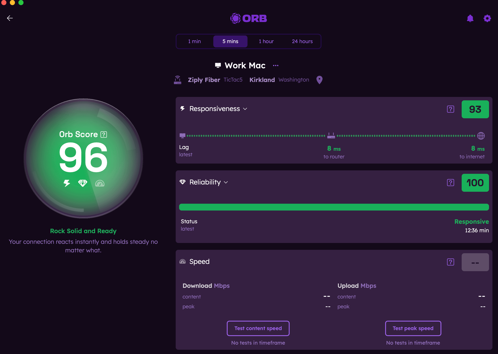

# Intro to the Orb app

The Orb app is your command center for monitoring and understanding your network's performance. This guide provides a quick tour of the app's interface and main features.

## Main Screens

### Orb Summary

The Orb Summary is the first screen you'll see when opening the app. It provides:

- An overall Orb Score for your network
- Orb name, location, connection type (WiFi, Wired LAN, Cellular), and Internet Service Provider (ISP) information
- Current status of each Orb linked to your account and found on the network (Online, Offline, Connecting)
- Timeframe selector to view performance over different periods of time
- Compare Orb Scores across multiple Orbs linked to your account or found nearby

### Orb Detail View

Tap on any Orb card to access the detail view, which shows:

- Orb Score, Status Message, and Suggest Improvements button (when score is below 80)
- Cards for Responsiveness, Reliability, and Speed including
  - A score for each
  - Expand the card to view the metrics used to calculate each score
  - Expand the card to view graphical representations of the data
- Content and peak speed tests that can be manually initiated at any time. Note: content speed runs automatically once per hour and on app start.
- Timeframe selector to view performance over different periods of time

### Account Settings

Access your account settings by tapping on the gear icon in the top right corner.

- Manage your notification settings
- Sign in and out of your account
- Provide feedback or submit bug reports directly from the app

### Notifications

Access your notifications by tapping the bell icon in the top right corner. When enabled, notifications will be catalogued here.

For more detailed information about specific features, check out the [Orb app](/docs/orb-app) section (coming soon!).
