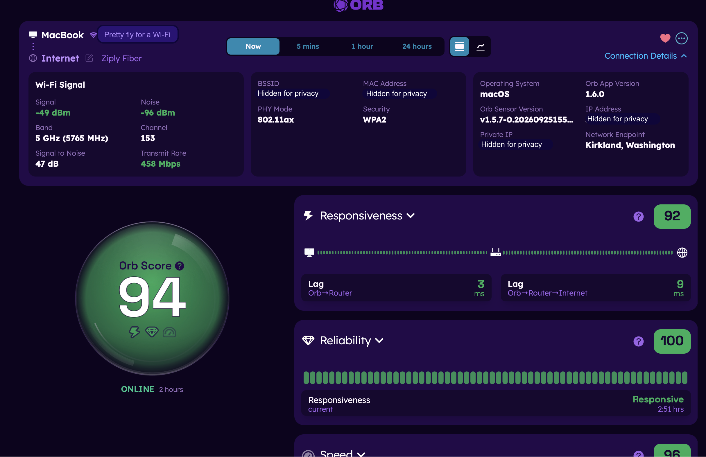
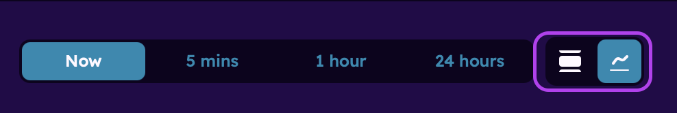

# Intro to the Orb app

The Orb app is your command center for monitoring and understanding your network's performance. This guide provides a quick tour of the app's interface and main features.

<iframe width="560" height="315" src="https://www.youtube.com/embed/OZ4fZ2LPjb4" title="YouTube video player" frameborder="0" allow="accelerometer; autoplay; clipboard-write; encrypted-media; gyroscope; picture-in-picture; web-share" referrerpolicy="strict-origin-when-cross-origin" allowfullscreen></iframe>
 

## Main Screens

### Orb Summary

The Orb Summary is the first screen you'll see when opening the app. It provides:

- An overall Orb Score for your network
- Orb name, location, connection type (WiFi, Wired LAN, Cellular), and Internet Service Provider (ISP) information
- Current status of each Orb linked to your account and found on the network (Online, Offline, Connecting)
- Timeframe selector to view performance over different periods of time
- Compare Orb Scores across multiple Orbs linked to your account or found nearby

### Orb Detail View

Tap on any Orb card to access the detail view, which shows:

- Orb Score, Status Message, and Suggest Improvements button (when score is below 80)
- Cards for Responsiveness, Reliability, and Speed including
  - A score for each
  - Expand the card to view the metrics used to calculate each score
  - Expand the card to view graphical representations of the data
- Check speed score and initiate speed tests at any time. Note: speed score checks run automatically once per hour and on app start by default. This can be disabled or configured to run less frequently by expanding the speed card and changing the settings.
- Timeframe selector to view performance over different periods of time

To access advanced detail view, toggle on the chart icon.

### Settings

Access your app, notification, and account settings by tapping on the gear icon in the top right corner.

- Manage your notification settings
- Sign in and out of your account
- Change your app settings
- Reset password
- Delete your account
- Provide feedback or submit bug reports directly from the app

Access individual Orb settings by tapping on the ... near the Orb name. Here you can:

- Favorite an Orb
- Link and an Orb to your account
- Rename an Orb
- Share your Orb Score
- Advanced settings (example: change testing endpoint)

### Notifications

Access your notifications by tapping the bell icon in the top right corner. When enabled, notifications will be catalogued here.

For more detailed information about specific features, check out the [Orb app](/docs/orb-app) section.
