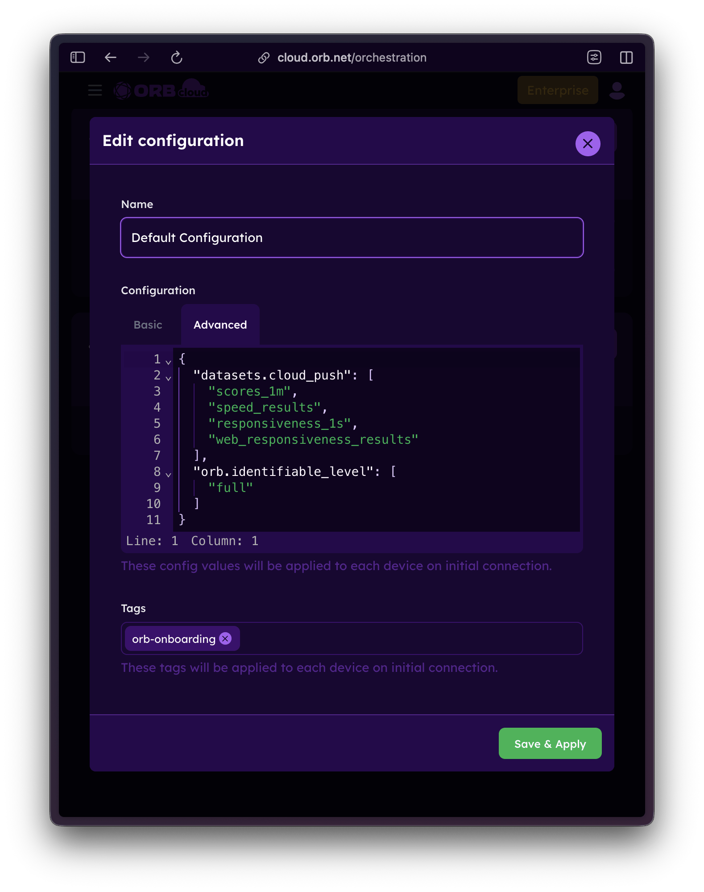
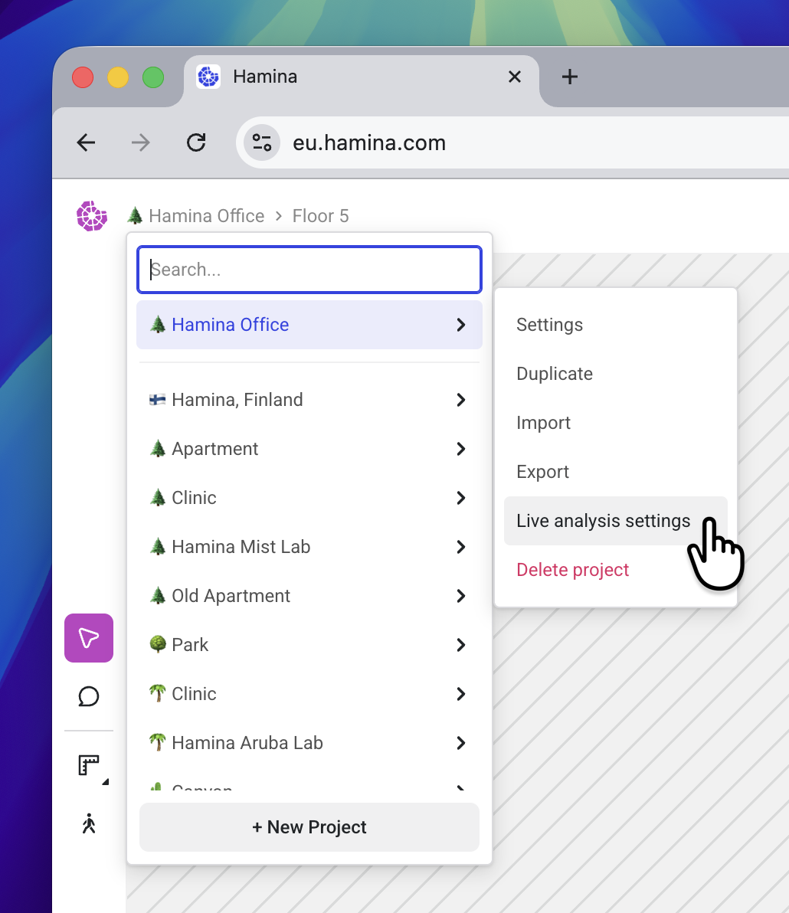
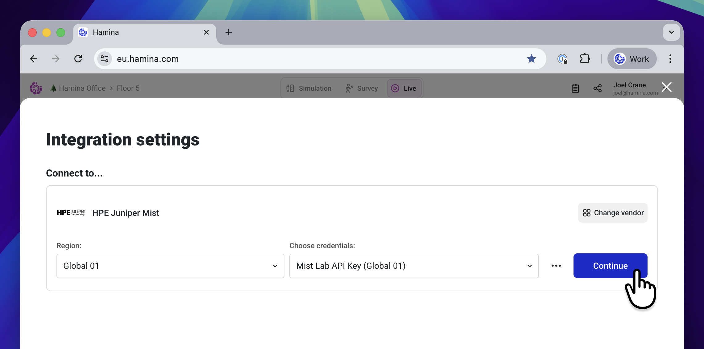
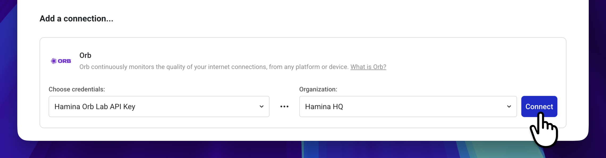
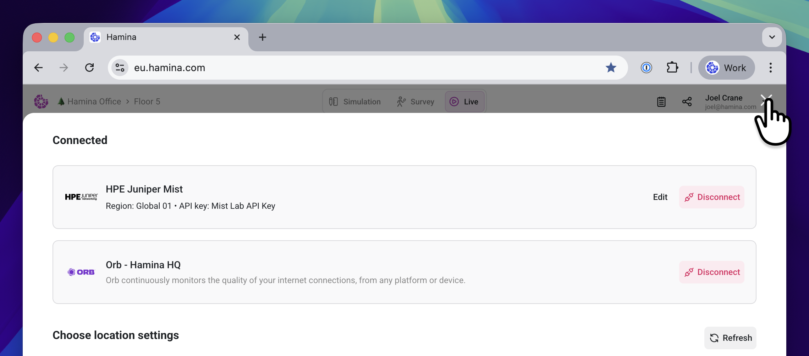
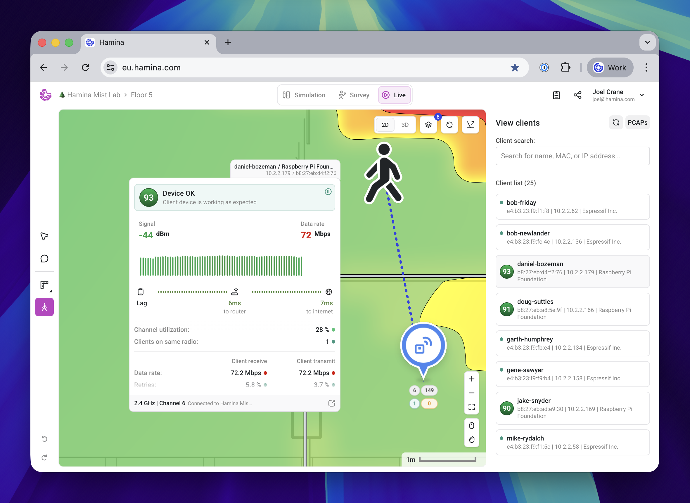

# Orb for Hamina Live View

Integrate Orb with [Hamina Planner](https://www.hamina.com/) to enrich client statistics in Live View with real-time network experience data directly from the device. This integration displays Orb Score and lag measurements for Orb-equipped client devices alongside your network infrastructure data.

## What is Hamina Network Planner?

Hamina Network Planner is a professional Wi-Fi planning and optimization tool used by network engineers to design, deploy, and manage wireless networks. The Live View feature provides real-time visibility into network performance and client connectivity.

## Features

When you integrate Orb with Hamina Live View, you gain:

- **Enriched Client Statistics**: See Orb connectivity data alongside network metrics from your supported equipment vendor
- **Orb Score Display**: View the Orb Score for each client device running Orb
- **Unified View**: Combine Orb's end-user experience metrics with Hamina's infrastructure analysis
- **Real-time Data**: Live streaming of Orb device data into your Hamina projects

## Requirements

Before setting up the integration, ensure you have:

- A Hamina Network Planner Plus subscription
- A Hamina project with Live View enabled
- An [Orb Cloud Business](https://orb.net/plans/business) or [Enterprise](https://orb.net/plans/enterprise) subscription
- Admin access to your Orb Cloud account

## Setup Instructions

### Step 1: Create an Orb API Key

1. Log into [Orb Cloud](https://cloud.orb.net/)
2. Navigate to the **Orchestration** tab


3. In the **API Keys** section, click the **New API Key** button.
4. In the **Create API Key** window:
   - Give the API key a name of your choosing. 
   - Under Organizations, check Read.
   - Under Devices, check Read and Stream.
   - Under Datasets, check Write.
5. Click the **Create** button.


6. In the **API Keys** section, the new key will appear. Click on it to copy it to the clipboard.

### Step 2: Enable Identifiable Data

The Hamina integration requires additional identifiable information (such as MAC address) to match Orb devices with clients in your network infrastructure. You must enable this in your Orb configuration.

1. Visit the [Orchestration](https://cloud.orb.net/orchestration) page.
2. For each Configuration you wish to work with Live View, click the **...** menu next to it and select **Edit**.
3. In the Edit configuration window, select the **Advanced** tab.
4. Add the following to your JSON configuration (see screenshot below):

```json
{
  "orb.identifiable_level": [
    "full"
  ]
}
```



5. Click **Save & Apply**.

### Step 3: Configure Hamina Live View

1. Open a project that is already connected to network infrastructure. If you haven't set up the Live View, see [Live View (Beta)](https://docs.hamina.com/planner/import-export/live-view) for more information.
2. In the **Projects** menu, select the current project, and select **Live analysis settings** from the menu.



3. The **Integration Settings** window will appear. Click the blue **Continue** button.



5. The Integration Settings window will display the current connected network infrastructure and location settings. At the bottom under **Add a connection**, paste in your Orb API key, select an **Organization**, and click the blue **Connect** button.



6. Click the **Close** button in the upper right to return to the project.



## Using the Integration

To view the Orb Score or associated statistics from an Orb-equipped client device, activate the **Live Clients** tool in the toolbar. The **View Clients** pane will appear, showing all of the clients on the network. Any client equipped with Orb will show an Orb Score.

Select a client with an Orb Score, and the **Client Details** window will appear on the map next to the client. 

:::note
You might need to zoom out to find the client and associated Client Details window.
:::

As usual, the Client Details window will show statistics from the network infrastructure vendor, but it will be augmented with information from Orb.



## Learn More

For detailed Hamina-specific documentation and screenshots of the integration process, visit:

[Hamina Documentation: Orb Integration](https://docs.hamina.com/planner/import-export/orb)
