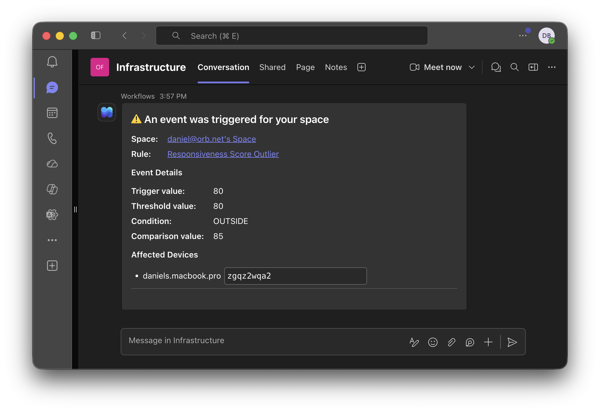
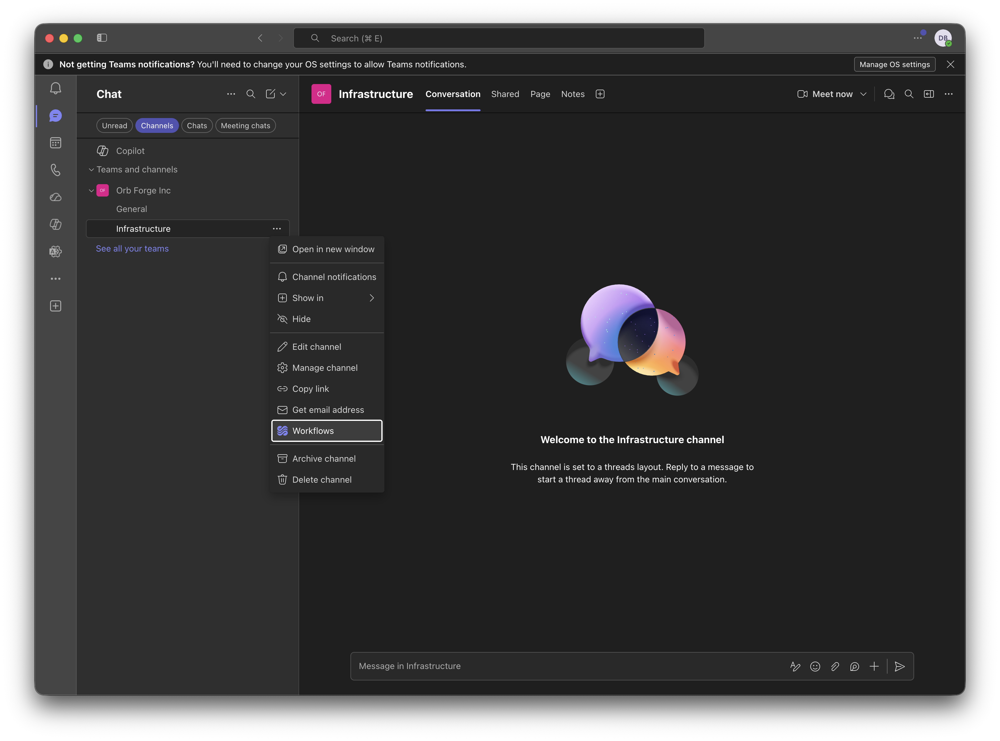
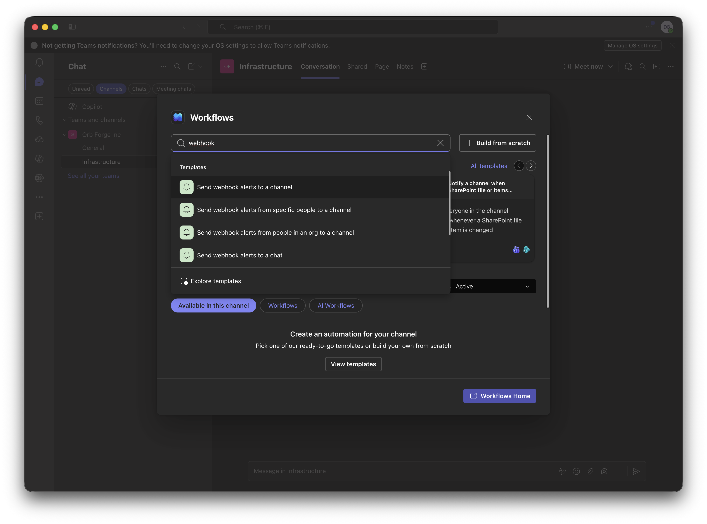
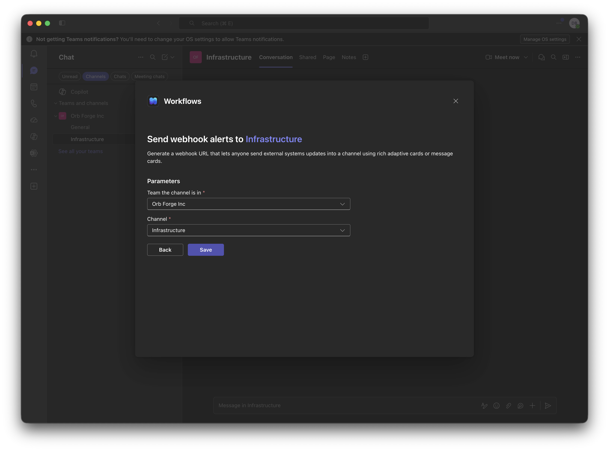
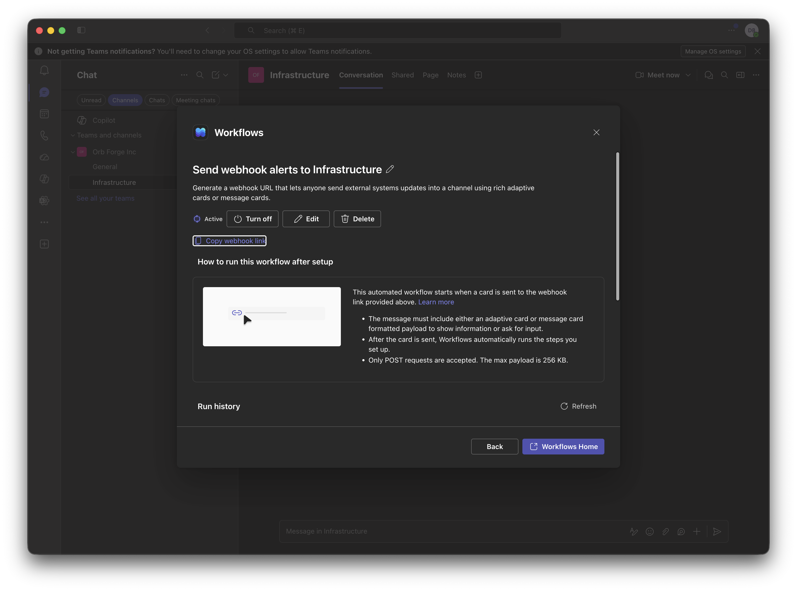
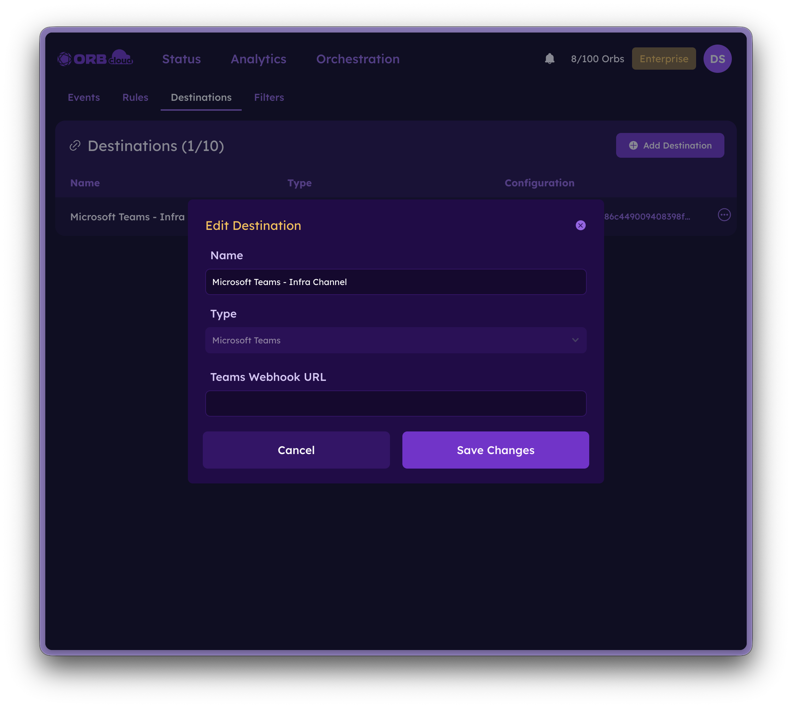

# Orb for Microsoft Teams

The Microsoft Teams integration posts a notification to a Teams channel whenever an Orb Event is triggered. Connect Orb Cloud to a Teams channel using an incoming webhook, then point one or more of your Event Destinations at it to keep your team informed about connectivity and performance changes without leaving Teams.

## How it works

Microsoft Teams provides an incoming webhook URL through its built-in Workflows. When you create a Microsoft Teams Destination in Orb Cloud and paste in that webhook URL, any Event configured to use the Destination will post a message to the channel with the details of what was triggered.

## Requirements

- A Microsoft Teams account with permission to add Workflows to a channel
- Access to [Orb Cloud](https://cloud.orb.net) with permission to manage Events & Alerts

## Step 1: Create a webhook in Microsoft Teams

### Open the channel's Workflows

1. Open the Teams channel where you want messages to appear.
2. Click the **…** (More options) next to the channel.
3. Select **Workflows**.

### Add the webhook workflow

4. Search for **webhook** and select **Send webhook alerts to a channel**.

5. Fill out the parameters, confirming the correct **Team** and **Channel** are selected, then click **Save**.

### Copy the webhook link

6. Click **Copy webhook link**. Keep this URL handy — you'll paste it into Orb Cloud in the next step.

:::warning
Treat the webhook URL like a secret. Anyone with the URL can post messages to your channel.
:::

## Step 2: Create the Destination in Orb Cloud

1. In Orb Cloud, create a new Destination of type **Microsoft Teams**. See the [Events & Alerts documentation](/docs/orb-cloud/events-alerts#creating-and-managing-rule-alert-desinations) for details on managing Destinations.
2. Give the Destination a descriptive name.
3. Paste the webhook link you copied from Teams into the **Teams Webhook URL** field, then save.

## Step 3: Configure an Event

Configure an Event as described in the [Events & Alerts documentation](/docs/orb-cloud/events-alerts) and select the Microsoft Teams Destination you just created. The next time that Event triggers, a notification will be posted to your Teams channel.

## Troubleshooting

### Messages aren't arriving in Teams

- Confirm the workflow is set to **Active** in the Teams Workflows panel.
- Verify the webhook URL was copied in full and pasted into the Orb Cloud Destination without extra spaces.
- Make sure the Event is enabled and the Microsoft Teams Destination is selected on the rule.

### The webhook stopped working

Teams webhook URLs can expire or be revoked. If messages stop arriving, re-open the channel's Workflows, copy a fresh webhook link, and update the URL on your Orb Cloud Destination.

## Support

For additional help with the Microsoft Teams integration:

- Join our [Discord community](https://discord.gg/orbforge)
- [Contact the Orb team](https://orb.net/contact)
