# App Settings

# Display Language
This explains the Display Language setting found within App Settings menu.

## What is Display Language?

The Display Language setting allows you to change the language of the Orb app interface. By default, the app uses the system language of your device.

## Changing Display Language

1. Navigate to the App Settings menu by tapping the gear icon in the top right corner of the app.
2. Tap on "Display Language".
3. Select your preferred language from the list.
4. The app will automatically update to reflect your chosen language.

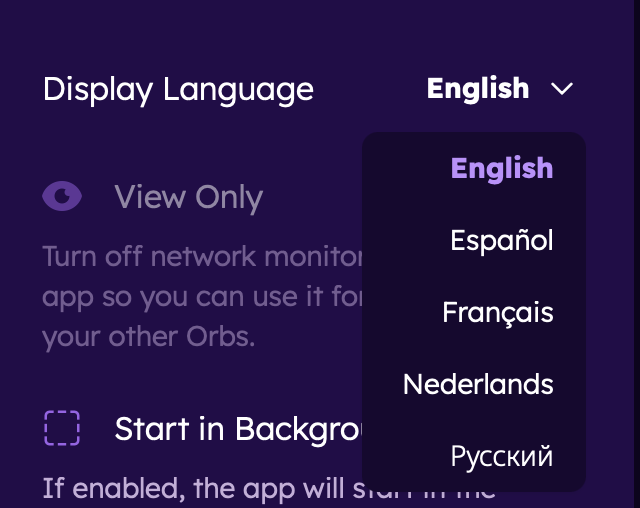

# View-Only Mode
This explains the View-Only Mode setting found within the App Settings menu.

## What is View-Only Mode?
View-Only Mode is a setting that disables the measurement functionality of the Orb app. When enabled, the app will not measure network connectivity via that app instance. This feature is helpful when only using the app to view other Orbs on your account.

## Enabling View-Only Mode

1. Navigate to the App Settings menu by tapping the gear icon in the top right corner of the app.
2. Toggle on the "View-Only Mode" setting.
3. When engaging View-only Mode, you will be asked if you want to unlink the device from your account. If you want to free up the space on your account when using view-only mode, choose to unlink the device. Otherwise, decline the prompt to keep this device linked to your account.

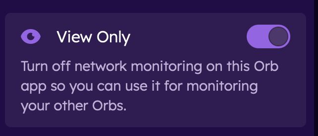

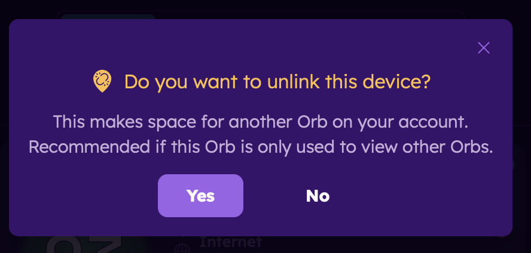

# Start in background (Desktop only)
This explains the Start in Background setting found within the App Settings menu on macOS and Windows.

## What is Start in background?
The Start in Background setting allows the Orb app to launch automatically in the background when you start your Mac. This is useful for users who want the app to run without needing to manually open it each time.

## Enabling Start in background
1. Navigate to the App Settings menu by tapping the gear icon in the top right corner of the app.
2. Toggle on the "Start in background" setting.

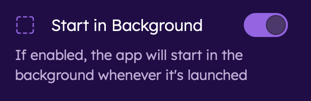

# Hide Dock Icon (macOS only)
This explains the Hide Dock Icon setting found within the App Settings menu on macOS.

## What is Hide Dock Icon?
The Hide Dock Icon setting allows you to remove the Orb app icon from the Dock on your Mac. This is useful for users who prefer a cleaner Dock appearance while still having the app running in the background.

## Enabling Hide Dock Icon

1. Navigate to the App Settings menu by tapping the gear icon in the top right corner of the app.
2. Toggle on the "Hide Dock Icon" setting.

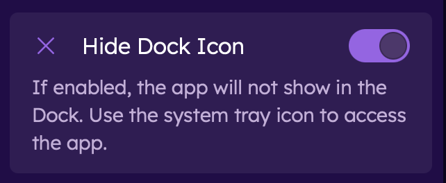

Note: use the system tray icon to access the app when the Dock icon is hidden.

# Launch App at Startup (Windows only)
This explains the Launch app at startup setting found within the App Settings menu on Windows.

## What is Launch App at Startup?
The Launch App at Startup setting allows the Orb app to launch automatically when you start your Windows computer. This is useful for users who want the app to run without needing to manually open it each time.

## Enabling Launch App at Startup
1. Navigate to the App Settings menu by tapping the gear icon in the top right corner of the app.
2. Toggle on the "Launch app at startup" setting.

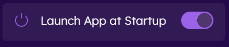

# Live Menu Bar/System Tray (Desktop only)
This explains the Live Menu Bar/System Tray setting found within the App Settings menu on macOS and Windows.

## What is Live Menu Bar?
The live menu bar (macOS) and System Tray (Windows) displays your current Orb Score, making it easy to keep an eye on your connectivity even when the Orb app is closed or out of view.

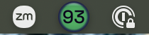

## Enabling Live Menu Bar/System Tray
1. Navigate to the App Settings menu by tapping the gear icon in the top right corner of the app.
2. Toggle on the "Live Menu Bar" or "Live System Tray" setting.

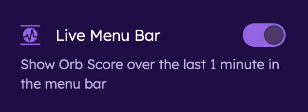

# Keep Awake/Sensor Mode (Mobile only)
This explains the Sensor Mode or "Keep Awake" setting found within the App Settings menu.

## What is Keep Awake/Sensor Mode?
Sensor Mode is an easy way to configure your Orb sensor to run continuously. Available on mobile devices, it is recommended for dedicated Orb sensors like a spare Android or spare iPhone.

## Engaging Keep Awake/Sensor Mode
1. Navigate to the App Settings menu by tapping the gear icon in the top right corner of the app.
2. Toggle on the "Keep Awake" setting.
3. Choose to dim your display by tapping "Dim Display" (optional).

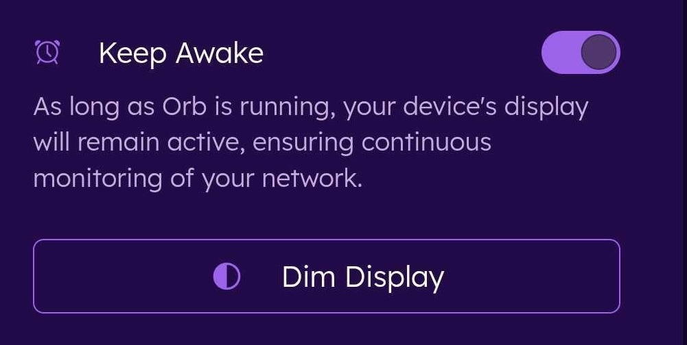

# Run in Background (Android only)
This explains the Run in Background setting found within the App Settings menu.

## What is Run in Background?
Available on Android only, Run in Background allows the app to continue monitoring when the app is in the background or closed. Note, the Android OS may deprioritize apps that are backgrounded or closed - this may impact your measurement results.

## Engaging Run in Background
1. Navigate to the App Settings menu by tapping the gear icon in the top right corner of the app.
2. Toggle on the "Run in Background" setting.

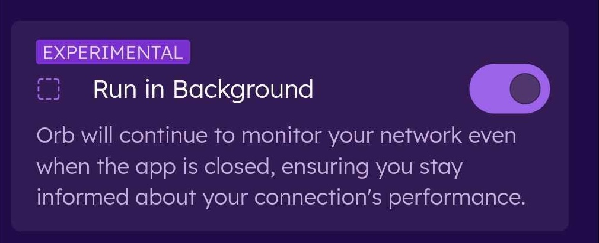

# Reduce Motion
This explains the Reduce Motion setting found within the App Settings menu.

## What is Reduce Motion?
This setting (off by default) enables/disables the responsiveness radar ring on the Orb Score.

## Enabling the Reduce Motion setting
1. Navigate to the App Settings menu by tapping the gear icon in the top right corner of the app.
2. Toggle on "Reduce Motion".

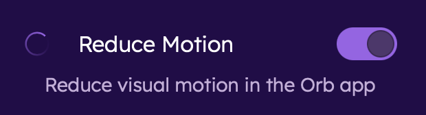

# Increase Contrast
This explains the Increase Contrast setting found within the App Settings Menu.

## What is Increase Contrast
This setting (on by default) increases the contrast in the Orb app for better readability and accessibility.

## Disabling the Increase Contrast setting
1. Navigate to the App Settings menu by tapping the gear icon in the top right corner of the app.
2. Togge off "Increase Contrast".

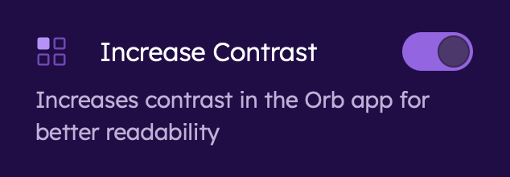

# Scan Hosts
This explains the Scan Hosts menu item found within the App Settings Menu.

## What is the Scan Hosts feature?
This allows users to scan your network for devices that may not have been automatically discovered. You can scan your network for devices by searching an IP address or by an Orb Name.

## Using the Scan Hosts feature
1. Navigate to the App Settings menu by tapping the gear icon in the top right corner of the app.
2. Navigate to the bottom of the menu.
3. Search for devices by entering a Hostname (Orb Device Name) or by IP address.
4. Select the device and click "Add" to link the Orb to your account.
5. To remove a device, tap the "Remove" button.

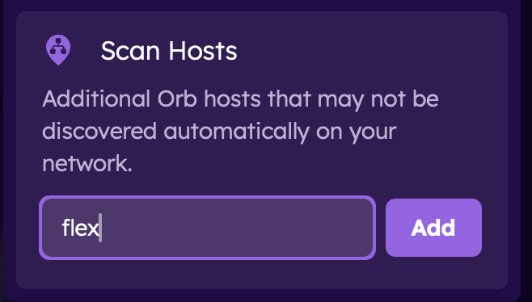

## Next Steps

Now that you've configured your Orb app settings, learn more about:

- [Using a spare iPhone as a dedicated sensor](/docs/setup-sensor/spare-iphone.md)
- [Using a spare Android as a dedicated sensor](/docs/setup-sensor/spare-android.md)
- [Notifications](/docs/orb-app/notifications.md)
- [Linking multiple sensors](/docs/orb-app/linking-orb-to-account.md)
