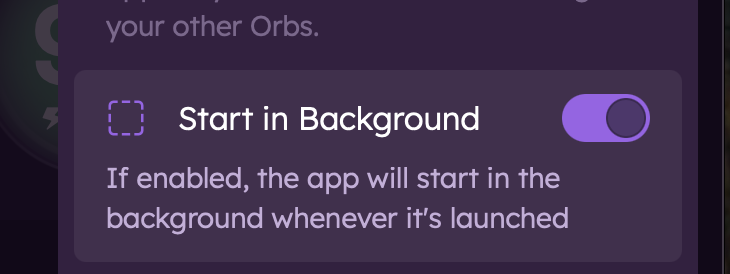

# Display Language
This explains the Display Language setting found within App Settings menu.

## What is Display Language?

The Display Language setting allows you to change the language of the Orb app interface. By default, the app uses the system language of your device.

## Changing Display Language

1. Navigate to the App Settings menu by tapping the gear icon in the top right corner of the app.
2. Tap on "Display Language".
3. Select your preferred language from the list.
4. The app will automatically update to reflect your chosen language.

# View-Only Mode
This explains the View-Only Mode setting found within the App Settings menu.

## What is View-Only Mode?
View-Only Mode is a setting that disables the measurement functionality of the Orb app. When enabled, the app will not measure network connectivity via that app instance. This feature is helpful when only using the app to view other Orbs on your account.

## Enabling View-Only Mode

1. Navigate to the App Settings menu by tapping the gear icon in the top right corner of the app.
2. Toggle on the "View-Only Mode" setting.

# Start in background (Desktop only)
This explains the Start in background setting found within the App Settings menu on macOS and Windows.

## What is Start in background?
The Start in background setting allows the Orb app to launch automatically in the background when you start your Mac. This is useful for users who want the app to run without needing to manually open it each time.

## Enabling Start in background
1. Navigate to the App Settings menu by tapping the gear icon in the top right corner of the app.
2. Toggle on the "Start in background" setting.

# Hide Dock Icon (macOS only)
This explains the Hide Dock Icon setting found within the App Settings menu on macOS.

## What is Hide Dock Icon?
The Hide Dock Icon setting allows you to remove the Orb app icon from the Dock on your Mac. This is useful for users who prefer a cleaner Dock appearance while still having the app running in the background.

## Enabling Hide Dock Icon

1. Navigate to the App Settings menu by tapping the gear icon in the top right corner of the app.
2. Toggle on the "Hide Dock Icon" setting.

Note: use the system tray icon to access the app when the Dock icon is hidden.

# Launch App at Startup (Windows only)
This explains the Launch app at startup setting found within the App Settings menu on Windows.

## What is Launch App at Startup?
The Launch app at startup setting allows the Orb app to launch automatically when you start your Windows computer. This is useful for users who want the app to run without needing to manually open it each time.

## Enabling Launch App at Startup
1. Navigate to the App Settings menu by tapping the gear icon in the top right corner of the app.
2. Toggle on the "Launch app at startup" setting.

# Sensor Mode (Mobile only)

This explains the Sensor Mode or "Keep Awake" setting found within the App Settings menu.

## What is Sensor Mode?

Sensor Mode is an easy way to configure your Orb sensor to run continuously. Available on mobile devices, it is recommended for dedicated Orb sensors like a spare Android or spare iPhone.

## Engaging Sensor Mode

1. Navigate to the App Settings menu by tapping the gear icon in the top right corner of the app.
2. Toggle on the "Keep Awake" setting.
3. Choose to dim your display by tapping "Dim Display" (optional).

## Next Steps

Now that you've configured your Orb app settings, learn more about:

- [Using a spare iPhone as a dedicated sensor](/docs/setup-sensor/spare-iphone.md)
- [Using a spare Android as a dedicated sensor](/docs/setup-sensor/spare-android.md)
- [Notifications](/docs/orb-app/notifications.md)
- [Linking multiple sensors](/docs/orb-app/linking-orb-to-account.md)
