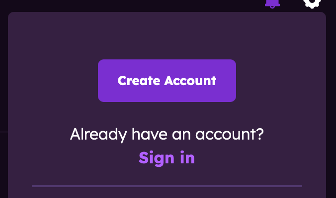
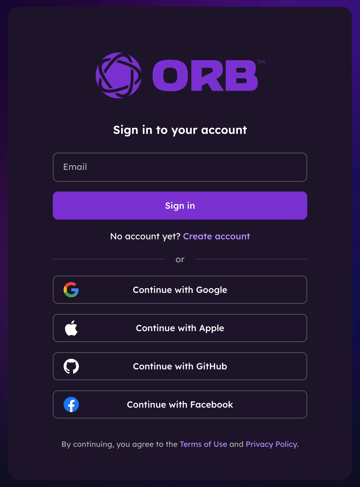
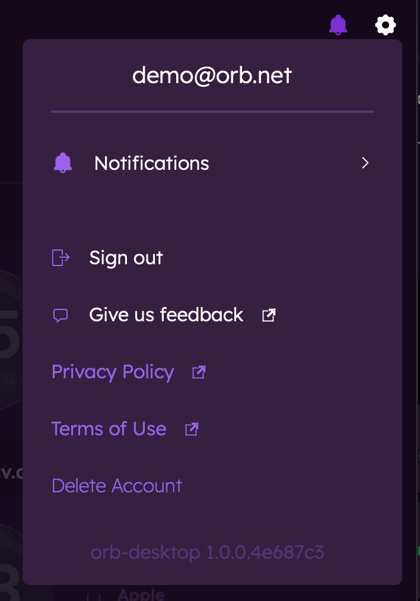

# Creating an Orb Account

This guide walks you through the process of creating an Orb account, which is required to save your network monitoring data and access it across multiple devices.

## Why Create an Account?

An Orb account provides several benefits:

- **Data Storage**: Your network performance history is saved in the cloud
- **Multiple Devices**: Monitor your network from various devices and locations
- **Cross-Platform Access**: Use the same account on iOS, Android, macOS, and Windows
- **Notifications**: Receive alerts about network issues even when you're not actively using the app
- **Personalized Insights**: Get recommendations based on your specific network patterns

## Account Creation Steps

### Method 1: During App Installation

1. Download and install the Orb app from Google Play Store, App Store, or from our website
2. Open the app and proceed through the onboarding steps
3. On the Orb Summary view, tap "Create Account"
4. Enter your email address or choose one of the other authentication methods
   - Google
   - Apple
   - Github
   - Facebook
5. Create a password if using email method
6. Follow the verification steps sent to your email

### Method 2: From the Website

1. Visit [Orb.net](https://orb.net/sign-in) in your web browser
2. Click "Sign In" in the top right corner, then select "Create Account"
   - If you already have an account, you can log in here
3. Enter your email address or choose one of the other authentication methods
   - Google
   - Apple
   - Github
   - Facebook
4. Create a password if using email method
5. Follow the verification steps sent to your email

## Required Information

To create your Orb account, you'll need to provide:

- **Authentication Method**: Choose between email/password or social login (Google, Apple, Github, Facebook) 
  **or**  
- **Email Address**: Used for account verification and communication
- **Password**: Create a secure password (minimum 8 characters)
- **Name** (optional): Your name for personalization

## Email Verification

After submitting your information:

1. Check your email for a verification message from Orb
2. Click the verification link in the email
3. You'll be redirected to confirm your account

If you don't receive the verification email within a few minutes:

- Check your spam/junk folder
- Ensure you entered your email address correctly
- Try requesting a new verification email through the app

## Account Settings

Once your account is created, you can customize your settings:

1. Open the Orb app
2. Navigate to Account Settings by tapping the gear icon in the top right corner
3. From here, you can:
   - Sign in and out of your account
   - Adjust notification preferences
   - Submit feedback or report bugs

## Adding Your First Sensor

After creating your account, the next step is to set up an Orb sensor:

1. In the Orb app, click on menu (...) of the Orb you would like to add to your account
2. Select "Link this Orb to my account"
3. Rename the device if desired (example: Home Macbook)

For more information on setting up sensors, see [Linking an Orb to your account](/docs/orb-app/linking-orb-to-account.md).

## Troubleshooting

### Can't Create an Account

If you're having trouble creating an account:

- Ensure you have a stable internet connection
- Try a different email address
- Check that your password meets the minimum requirements
- Update the app to the latest version

### Can't Log In

If you can't log in to your account:

- Verify you're using the correct email and password
- Reset your password if necessary
- Ensure your account has been verified via email
- Contact support@orb.net if issues persist

## Privacy and Data Usage

Orb respects your privacy. Your account information and network data are:

- Encrypted in transit and at rest
- Used only for providing the Orb service
- Never sold to third parties

For more details, please review our [Privacy Policy](/privacy-policy).

## Next Steps

Now that your account is set up, learn more about:

- [Linking an Orb to your account](/docs/orb-app/linking-orb-to-account.md)
- [Orb summary view](/docs/orb-app/orb-summary-view.md)
- [Orb scores & metrics](/docs/orb-app/orb-scores-metrics.md)
