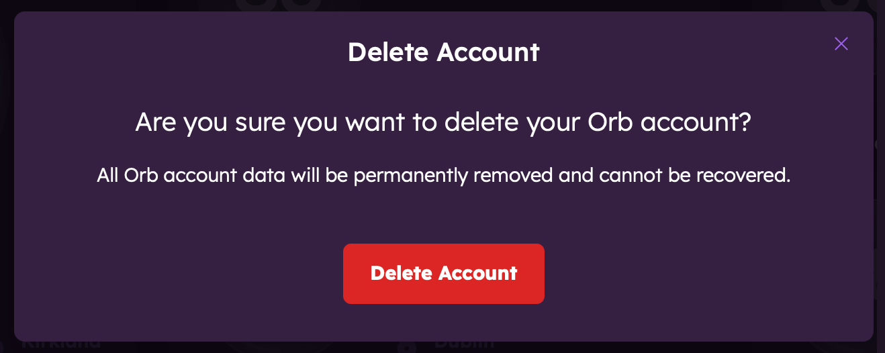

# Deleting an Orb Account

This guide explains how to permanently delete your Orb account and what happens to your data when you do so.

## Before You Delete

Before deleting your account, please consider:

- **Account deletion is permanent** and cannot be undone.
- All your **monitoring data will be lost**.
- Your **linked sensors will be reset** and will need to be set up again if you want to use them in the future.

## Alternative Options

If you're experiencing issues with Orb, you might consider these alternatives before deleting your account:

- **Unlink specific sensors** you no longer want to use.
- **Contact support** if you're having technical problems.
- **Update the app** to resolve potential bugs.

## Account Deletion Methods

### From the Orb App

Open the account settings menu in the Orb app and follow these steps:

1. Tap "Account".
2. Tap on "Delete Account".
3. Verify your identity via code sent to your email. 
   - If you don't receive the code, check your spam folder.
4. Read the confirmation message about data loss.
5. Tap "Delete Account" to proceed.

 

### From Orb.net Website

Visit the Delete Orb Account page on our website:

1. Go to [Delete Orb Account](https://orb.net/support/delete-account).
2. Sign in to your account.
3. Follow the prompts to confirm deletion.

## What Happens to Your Data

When you delete your Orb account:

- All personal information is permanently deleted from our systems.
- Your network monitoring data is permanently deleted.
- Your sensor configurations are reset.
- Your email address is removed from our marketing lists.
- Anonymized, aggregated data that doesn't identify you may be retained for service improvement.

In accordance with our [Privacy Policy](/privacy-policy), we may retain certain information in our backup systems for a limited period before it is completely purged.

## Reactivating After Deletion

If you change your mind:

- Once an account is deleted, it cannot be restored.
- You can create a new account with the same email address.
- Your previous data will not be recoverable.
- You'll need to set up your Orb sensors again.

## Need Help?

If you need assistance with account deletion or have questions before proceeding:

- Contact our support team at <support@orb.net>.
- Visit our [Support Center](/support).

## Feedback

We're sorry to see you go! If you're deleting your account due to an issue with our service, we'd appreciate your feedback to help us improve. You can share your thoughts during the deletion process or by emailing <support@orb.net>.
