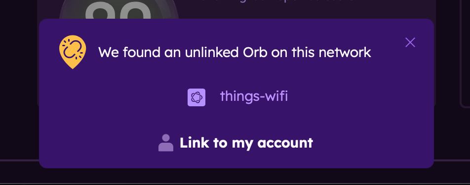
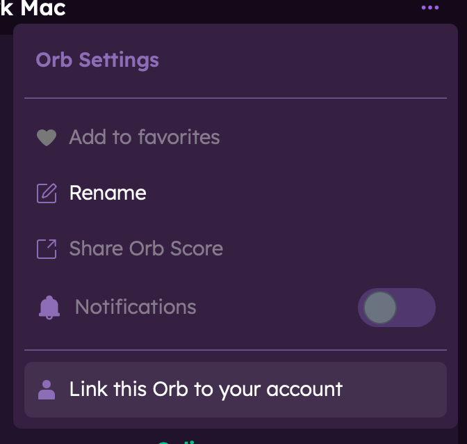
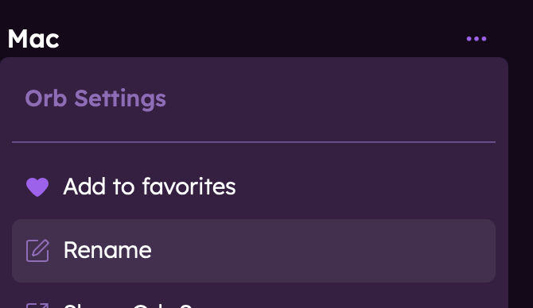
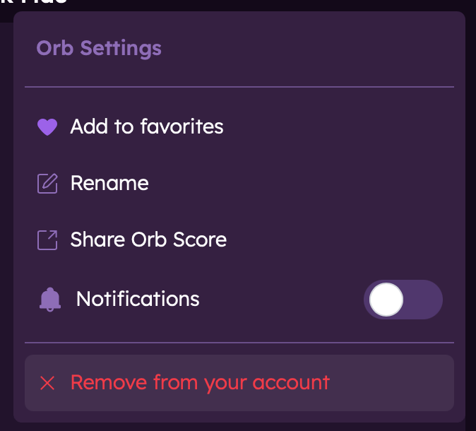

# Linking an Orb to Your Account

This guide explains how to link Orb sensors to your account, allowing you to monitor multiple devices or locations from all Orb app instances.

## What is an Orb Sensor?

An Orb sensor is any device running the Orb software that monitors network connectivity. This can be:

- Your smartphone or tablet with the Orb app installed
- Your computer running the Orb desktop application
- A dedicated device like a Raspberry Pi running the Orb agent
- A router with Orb monitoring capabilities

## Benefits of Linking Multiple Sensors

Linking multiple sensors to your account provides several advantages:

- Monitor different networks (home, office, vacation property)
- Compare wired vs. wireless performance
- Track network health in different parts of your home
- Have a dedicated 24/7 monitoring device while still using the mobile app

## Linking Methods

Orbs can be linked to your account via the device running Orb or remotely.

:::tip
If you are managing and deploying many Orbs, or have complex configuration needs, consider utilizing [Deployment Tokens](/docs/deploy-and-configure/deployment-tokens).
:::

### Orb on Your Phone, Desktop, or Tablet

If you have the Orb app installed on your phone, tablet, or desktop, you can link it to your account by signing in.

1. Install the Orb app on the new device
2. Open the app and tap "Sign In"
3. Enter your Orb account email and password
4. The device will automatically be added as a sensor to your account

### Orb on Another Device (e.g., Raspberry Pi)

#### Automatic Discovery (Recommended)

If your new Orb sensor is on the same local network as a device already signed in to your Orb account:

1. Install Orb on the new device
2. Start the app and wait for the automatic discovery process
3. On your already-linked device, you'll receive a notification about the new sensor
4. Tap "Link to my account" to connect the sensor



#### Manually Linking a Discovered Sensor

If you want to link an Orb sensor that was automatically discovered (listed under "Orbs on this network"):

1. In the Orb Summary, find the Orb sensor you would like to link (see "Orbs on this network")
2. Tap on the Orb settings menu (... near the sensor name)
3. Tap "Link this Orb to your account"  
   Note: this method will only work for headless/CLI devices (e.g., Raspberry Pi). To manually link a device running the Orb app, sign into your account from this device.



#### Linking a Sensor from the CLI

If the newly started Orb sensor is not automatically discovered, you can link it manually using the command line interface:

1. Open a terminal on the device
2. Run the `orb link` command  
   Note: this command needs to be run as the same user that runs the Orb Sensor.  
   You could use `su` to switch to that user before running the command, or you can use `sudo` to run the command as that user directly.  
   On most systems (Debian, Redhat, Alpine), this is typically the `orb` user. For OpenWRT variants, it is typically the `root` user.

   For example, if you are using Debian or Redhat, you can run:

   ```bash
   sudo -u orb orb link
   ```

3. The output of that command will include a short URL to link to your account
4. Copy that URL into a browser on any machine, and log in to your account at the prompt
5. That Orb will now show up in any app where you’re logged in

:::info
If utilizing containers, see the sections on linking with [Docker](/docs/setup-sensor/docker#device-on-a-different-network) and [Podman](/docs/setup-sensor/podman#step-3-link-your-new-orb-sensor).
:::

## Managing Linked Sensors

### Naming Your Orb Sensors

After linking a sensor, it's helpful to give it a descriptive name:

1. In the Orb app, go to the Orb settings menu (...)
2. Tap "Rename" and enter a descriptive name (e.g., "Living Room Pi", "Office Desktop", "iPhone")
3. Tap "Save"

<div style="margin-left: 2em;">
  
  
</div>

### Unlinking a Sensor

If you need to remove a sensor from your account:

1. In the Orb Summary, find the Orb sensor you would like to unlink
2. Tap on the Orb settings menu (...)
3. Tap "Remove from your account"



Note that unlinking a sensor will not delete historical data already collected from that sensor.

## Troubleshooting

### Sensor Not Discovered Automatically

If automatic discovery fails:

- Ensure both devices are on the same local network
- Check that your network allows device discovery (some corporate or public networks restrict this)
- Try the CLI linking method instead

## Next Steps

Now that you've linked your sensors, learn more about:

- [Orb summary view](/docs/orb-app/orb-summary-view.md)
- [Sensor Mode](/docs/orb-app/sensor-mode.md)
- [Notifications](/docs/orb-app/notifications.md)
