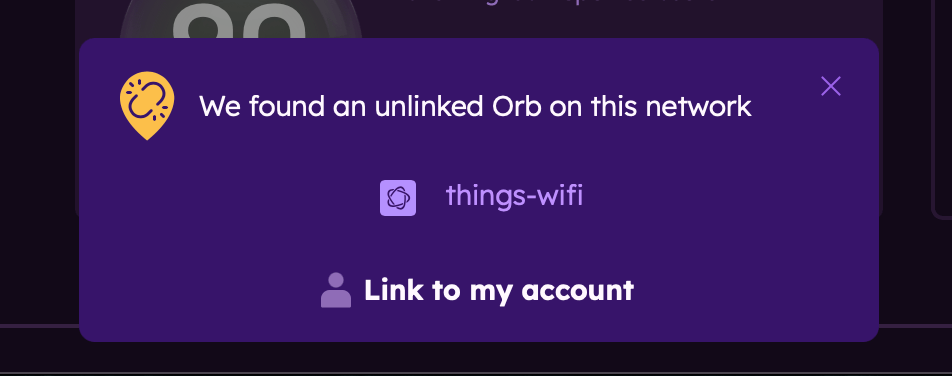
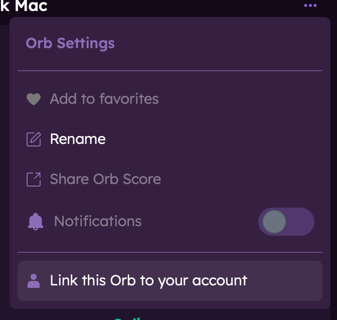
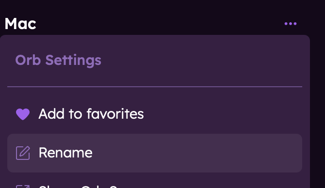
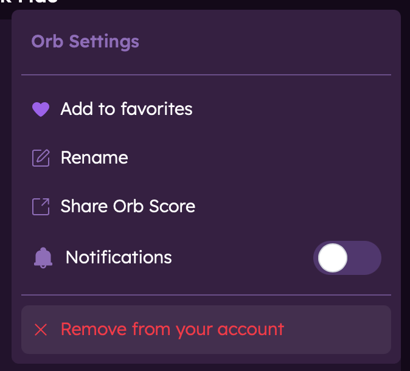

# Linking an Orb to Your Account

Linking an Orb sensor to your account (or your Orb Cloud Space) is what makes it visible from every Orb app you're signed in to, and what lets you manage its configuration centrally.

This guide covers every way to link an Orb. If you're not sure which to use:

- **One or two Orbs on your own home network** → [link from the Orb app on the same network](#link-from-the-orb-app-on-the-same-network).
- **Anything else — a remote site, a fleet, a device you won't have hands on** → [pre-configure a Deployment Token at install time](#pre-configure-a-deployment-token-at-install-time).

## What is an Orb sensor?

An Orb sensor is any device running the Orb software that monitors network connectivity. This can be:

- Your smartphone or tablet with the Orb app installed
- Your computer running the Orb desktop application
- A dedicated device like a Raspberry Pi running the Orb agent
- A router with Orb monitoring capabilities

Linking multiple sensors to one account lets you monitor different networks (home, office, vacation property), compare wired against wireless performance, track network health in different parts of a building, and keep a dedicated 24/7 monitoring device running while still using the mobile app.

## Signing in on a device running the Orb app

If you have the Orb app installed on your phone, tablet, or desktop, that device links itself when you sign in.

1. Install the Orb app on the new device
2. Open the app and tap "Sign In"
3. Enter your Orb account email and password
4. The device will automatically be added as a sensor to your account

Headless sensors — a Raspberry Pi, a router, a container — have no app to sign in to, so they use one of the methods below.

## Link from the Orb app on the same network

**Best for simple home networks.** If a new Orb sensor is on the same local network as a device already signed in to your Orb account, the app will find it for you.

1. Install Orb on the new device and let it start
2. Open the Orb app on your already-linked phone or computer, on the same network
3. You'll receive a notification about the newly discovered sensor
4. Tap "Link to my account" to connect it



This depends on mDNS/Bonjour (UDP port 5353) working between the two devices. Many corporate, guest, and segmented networks block it, and it won't cross subnets or VLANs at all — which is why it is only recommended for simple home networks.

## Pre-configure a Deployment Token at install time

**Best for everything else, and the primary path for deploying Orbs at scale.** Instead of linking the Orb after it starts, you give it a [Deployment Token](/docs/deploy-and-configure/deployment-tokens) before it starts. The Orb links itself to your Space on first run — no app, no LAN discovery, no shell on the device.

This also applies the token's Configuration and Tags at link time, so every Orb you deploy with a given token arrives already configured the same way, and can be reconfigured later from Orb Cloud.

In outline:

1. Copy a Deployment Token from the [Orchestration](https://cloud.orb.net/orchestration) section of Orb Cloud
2. Set `ORB_DEPLOYMENT_TOKEN` in the config file the Orb service reads on your platform — `/etc/default/orb` on most Linux systems, `/etc/config/orb` on OpenWrt, the `environment:` block for containers, the service registry key on Windows, an MDM profile on macOS
3. Install Orb and confirm the sensor appears in [Status](https://cloud.orb.net/status)

The exact file to edit for each platform, and the other options worth setting at the same time, are in **[Pre-configuring an Orb at install time](/docs/deploy-and-configure/preconfigure-at-install)**.

:::tip
Setting the variable in your shell is not enough — service managers don't inherit your shell environment. The pre-configuration guide covers where it actually needs to go on each platform.
:::

If you'd rather link an existing Orb with a token by hand, you can also paste a Deployment Token directly into the Orb app: tap the device menu (dots), select "Link to a Space", and enter the token. See [Using the apps](/docs/deploy-and-configure/deployment-tokens#using-the-apps).

## Alternate linking methods

These work, but are more error-prone than the two methods above and generally shouldn't be your first choice.

### Manually linking a discovered sensor

If a sensor was automatically discovered and is listed under "Orbs on this network" but wasn't linked:

1. In the Orb Summary, find the Orb sensor you would like to link (see "Orbs on this network")
2. Tap on the Orb settings menu (... near the sensor name)
3. Tap "Link this Orb to your account"



:::note
This method only works for headless/CLI devices (e.g. a Raspberry Pi). To link a device running the Orb app, sign into your account from that device instead.
:::

### Linking a sensor from the CLI

If the sensor isn't discovered and wasn't pre-configured, you can link it from a shell on the device. This requires access to the device and a browser session, so it does not scale well.

1. Open a terminal on the device
2. Run the `orb link` command as the same user that runs the Orb sensor.  
   Use `su` to switch to that user first, or `sudo` to run the command as that user directly. On most systems (Debian, Redhat, Alpine) this is the `orb` user; on OpenWrt variants it is typically `root`.

   For example, on Debian or Redhat:

   ```bash
   sudo -u orb orb link
   ```

3. The output of that command will include a short URL
4. Open that URL in a browser on any machine and log in to your account at the prompt
5. That Orb will now show up in any app where you're logged in

:::info
For containers, see the linking sections for [Docker](/docs/setup-sensor/docker#device-on-a-different-network) and [Podman](/docs/setup-sensor/podman#step-3-link-your-new-orb-sensor).
:::

### Guest Orb invitations

To link Orbs on devices you don't administer — guests on a campus, hotel, or venue network — see [Guest Orbs](/docs/deploy-and-configure/guest-orbs).

## Managing linked sensors

### Naming your Orb sensors

After linking a sensor, it's helpful to give it a descriptive name:

1. In the Orb app, go to the Orb settings menu (...)
2. Tap "Rename" and enter a descriptive name (e.g., "Living Room Pi", "Office Desktop", "iPhone")
3. Tap "Save"

<div style="margin-left: 2em;">
  
  
</div>

You can also name an Orb before it ever starts, using `ORB_DEVICE_NAME_OVERRIDE` — see [Setting other options at install time](/docs/deploy-and-configure/preconfigure-at-install#setting-other-options-at-install-time).

### Unlinking a sensor

If you need to remove a sensor from your account:

1. In the Orb Summary, find the Orb sensor you would like to unlink
2. Tap on the Orb settings menu (...)
3. Tap "Remove from your account"



Unlinking a sensor will not delete historical data already collected from that sensor.

An Orb can only belong to one Space at a time. If linking fails because the Orb is already linked elsewhere, unlink it here first.

## Troubleshooting

### Sensor not discovered automatically

If automatic discovery fails:

- Ensure both devices are on the same local network and subnet
- Check that your network allows device discovery — mDNS/Bonjour on UDP port 5353 is commonly blocked on corporate and guest networks
- Use [pre-configuration with a Deployment Token](/docs/deploy-and-configure/preconfigure-at-install) instead, which doesn't depend on discovery at all

### Pre-configured Orb didn't link

See [Troubleshooting](/docs/deploy-and-configure/preconfigure-at-install#troubleshooting) in the pre-configuration guide.

## Next steps

Now that you've linked your sensors, learn more about:

- [Pre-configuring an Orb at install time](/docs/deploy-and-configure/preconfigure-at-install.md)
- [Orb summary view](/docs/orb-app/orb-summary-view.md)
- [App Settings](/docs/orb-app/app-settings.md)
- [Notifications](/docs/orb-app/notifications.md)
