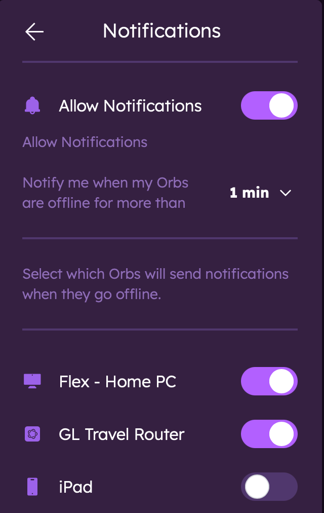
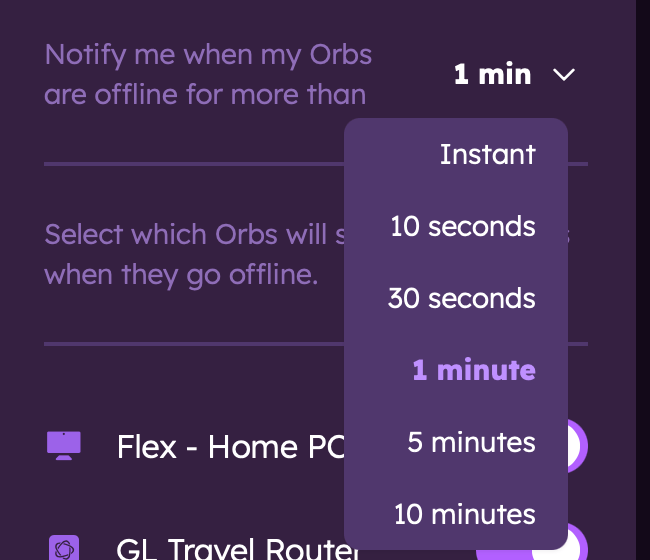

# Orb Notifications

This guide explains how to configure and customize notifications in the Orb app so you can stay informed about your network's performance and any issues that arise.

## Types of Notifications

Orb can send notifications to keep you informed about your network:

### Offline/Online Status Notifications

**Sensor Status**: Alerts about your Orb sensors going offline or coming back online.

## Notification Settings

### Accessing Notification Settings from Account Settings

1. Open the Orb app.
2. Go to Settings > Notifications.
3. You'll see a list of notifications available for your account.

   - Allow Notifications: Toggling this allows the device to receive notifications from your Orbs.
   - Orb list: All Orbs linked to your account appear below; specify which Orbs you would like to receive notifications from.

   

   Note: Receiving notifications from mobile devices may be too noisy as these Orbs will go online and offline frequently (when the app is closed or backgrounded). Exceptions include using a spare phone as a dedicated sensor or using the "keep awake" feature.
4. Set your preference for the sensitivity of your notifications by using the dropdown menu with the following options:
   - Instant: Receive notifications immediately when an Orb goes offline or comes back online.
   - 10 seconds: Default setting, receive notifications after 10 seconds of being offline.
   - 1 minute: Receive notifications after 1 minute of being offline.
   - 5 minutes: Receive notifications after 5 minutes of being offline.
   - 10 minutes: Receive notifications after 15 minutes of being offline.

   

### Accessing Notification Settings from Orb Settings Menu

1. Open the Orb app.
2. Go to the Orb settings menu (...).
3. Use the notification toggle to enable/disable notifications for that specific Orb.

## Troubleshooting

### Not Receiving Notifications

If you're not receiving expected notifications:

1. Check that notifications are enabled in the Orb app.
2. Verify your device's system notification settings for Orb.
3. Ensure your device has an active internet connection.
4. Check that Do Not Disturb mode isn't active.
5. Try restarting the app or your device.

## Next Steps

Now that you've configured your notifications, learn more about:

- [Sensor Mode](/docs/orb-app/sensor-mode.md)
- [Understanding Orb Scores](/docs/orb-app/orb-scores-metrics.md)
