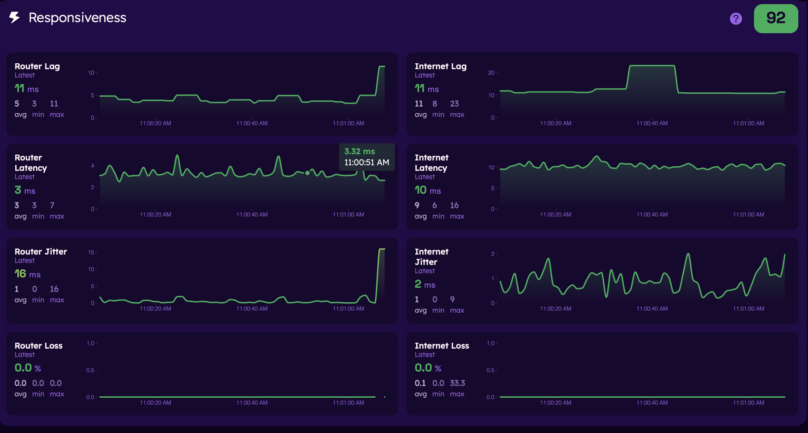
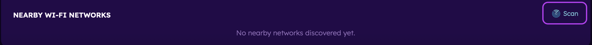
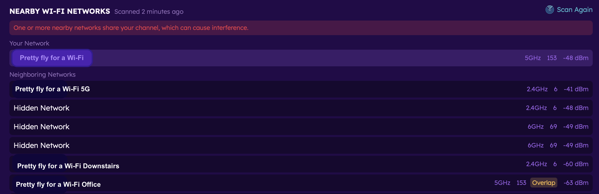
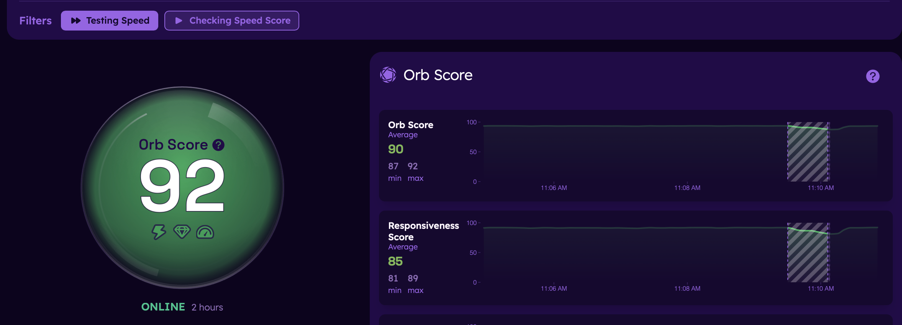

# The Orb App at a Glance

This guide provides a quick tour of the Orb app interface to help you get oriented and start using Orb effectively.

<iframe width="560" height="315" src="https://www.youtube.com/embed/OZ4fZ2LPjb4" title="YouTube video player" frameborder="0" allow="accelerometer; autoplay; clipboard-write; encrypted-media; gyroscope; picture-in-picture; web-share" referrerpolicy="strict-origin-when-cross-origin" allowfullscreen></iframe>
 

## Main Screens

The Orb app consists of two key screens that you'll use to monitor your network:

### Orb Summary

The Orb Summary is your home screen in the Orb app and provides an at-a-glance view of your network health.

Key elements:

- Orb Score representing your internet experience
- Orb Score component indicators (responsiveness, reliability, speed)
- Orb status (online/offline)
- Network connection information (WiFi, Ethernet, Cellular)
- Wi-Fi network name (if permissions are granted)
- Location information (if permissions are granted)
- Internet or Mobile Service Provider
- Account setting and notification menus
- Orb sensor setting menu
- Timeline selector for viewing different time periods
- Access to all Orb sensors linked to your account
- Orbs found on the network (not linked)

### Orb Detail (Simple)

Tapping on any Orb sensor card will launch the Orb detail screen, which provides in-depth information about that specific sensor.

Key elements:  
In addition to the information above, the detail screen includes:

- Detailed metrics across the following categories (expand cards to view):
  - Connection details
    - Wi-Fi Signal (Noise, Band, Channel, Signal-to-Noise, Transmit Rate)
    - BSSID, Mac Address, PHY Mode, Security
    - Operating System, Orb App Version, Orb Sensor Version, IP Address, Private IP, Network Endpoint
  - Responsiveness
    - Lag (ms) (best, worst, typical)
    - Latency (ms)
    - Jitter (ms)
    - Packet loss (%)
    - DNS resolve time (ms)
    - Time to first byte (ms)
  - Reliability
    - Responsiveness over time
    - % of time in the following states: responsive, laggy, unresponsive, inactive
    - Packet loss over time
  - Speed
    - Test speed (Full buffer download, upload throughput - Mbps)
    - Check score (10 MB content download, upload - Mbps)
- Improve Connection feature (when score is below 80)

### Orb Detail (Advanced)

Switch to **Advanced Detail view** using the view toggle in the upper-right corner of the Orb detail screen. Advanced view provides time-series charts and additional diagnostic information for troubleshooting changes in network performance.

Key elements:  

In addition to the information above, the advanced detail screen includes:

- **Orb Score**
  - Orb Score over time
  - Responsiveness Score over time
  - Reliability Score over time
  - Speed Score over time

- **Responsiveness**
  - Detailed charts for both router and internet performance, including:
    - Lag (ms)
    - Latency (ms)
    - Jitter (ms)
    - Packet loss (%)
  - Each chart includes summary values for the selected time range:
    - Average or latest value
    - Minimum
    - Maximum

- **Wi-Fi**
  - Detailed Wi-Fi charts and connection information, including:
    - Wi-Fi Signal
    - Noise
    - Transmit Rate
    - SSID
    - BSSID
    - Channel
    - Band
    - Channel Width
    - PHY Mode

- **Nearby Wi-Fi Networks**
  - Scan for nearby Wi-Fi networks directly from the detail screen
  - View neighboring networks and compare:
    - SSID
    - Band
    - Channel
    - Signal strength
  - Detect overlapping channel usage that may contribute to interference

- **Filters and chart highlights**
  - Use activity filters to highlight periods associated with:
    - Testing Speed
    - Checking Speed Score
    - Custom events/alerts based on rules
  - Highlighted regions on the charts make it easier to correlate score or responsiveness changes with Orb activity

### Settings Menu

The settings menu allows you to customize your Orb experience.

Important settings:

- App Settings
- Notification Settings
- Account Settings

### Notifications

- See all account notifications
- Filter by Orb(s) or event type(s)

## Next Steps

Now that you're familiar with the app interface, check out these guides to learn more:

- [Orb Summary View](/docs/orb-app/orb-summary-view.md) - Learn about the Orb Summary
- [Orb Detail View](/docs/orb-app/orb-detail-view.md) - Explore the detailed metrics available for each sensor
- [Orb Scores & Metrics](/docs/orb-app/orb-scores-metrics.md) - Understand how Orb measures your network
