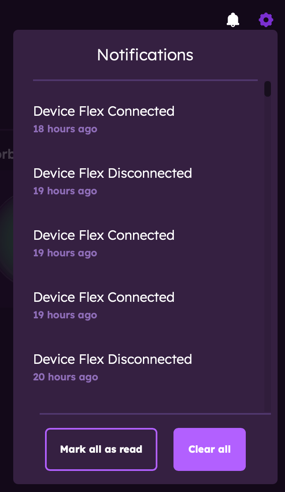

# The Orb App at a Glance

This guide provides a quick tour of the Orb app interface to help you get oriented and start using Orb effectively.

## Main Screens

The Orb app consists of two key screens that you'll use to monitor and manage your network:

### Orb Summary

The Orb Summary is your home screen in the Orb app and provides an at-a-glance view of your network health.

Key elements:

- Orb Score representing your internet experience
- Orb Score component indicators (responsiveness, reliability, speed)
- Orb status (online/offline)
- Network connection information (WiFi, Ethernet, Cellular)
- Wi-Fi network name (if permissions are granted)
- Location information (if permissions are granted)
- Internet or Mobile Service Provider
- Account setting and notification menus
- Orb sensor setting menu
- Timeline selector for viewing different time periods
- Access to all Orb sensors linked to your account
- Orbs found on the network

### Orb Detail

Tapping on any Orb sensor card will launch the Orb detail screen, which provides in-depth information about that specific sensor.

Key elements:  
In addition to the information above, the detail screen includes:

- Detailed metrics across the following categories (expand cards to view):
  - Responsiveness
    - Lag (ms) (best, worst, typical)
    - Latency (ms)
    - Jitter (ms)
    - Packet loss (%)
    - Typical web load time (ms)
  - Reliability
    - Responsiveness over time
    - Packet loss over time
  - Speed
    - Content download speed (Mbps)
    - Content upload speed (Mbps)
    - Peak download speed (Mbps)
    - Peak upload speed (Mbps)
- Status message tailored to your internet experience
- Improve Connection feature (when score is below 80)

### Account Settings

The account settings menu allows you to customize your Orb experience.

Important settings:

- Account management (signing in and out)
- Notification preferences
- Sensor configurations (keep awake)
- Submit feedback
- Privacy policy and terms of use

### Notifications

- See all account notifications
- Mark as read or clear all

## Next Steps

Now that you're familiar with the app interface, check out these guides to learn more:

- [Orb Summary View](/docs/orb-app/orb-summary-view.md) - Learn about the Orb Summary
- [Orb Detail View](/docs/orb-app/orb-detail-view.md) - Explore the detailed metrics available for each sensor
- [Orb Scores & Metrics](/docs/orb-app/orb-scores-metrics.md) - Understand how Orb measures your network
