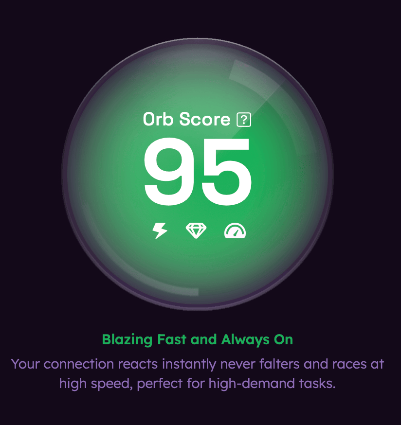
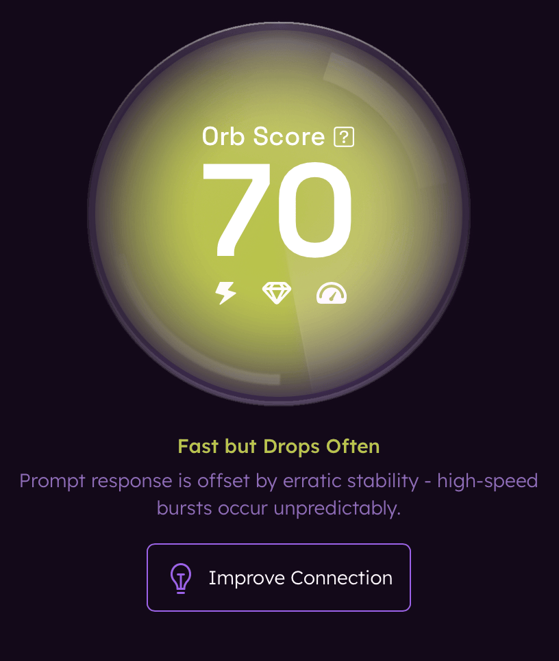
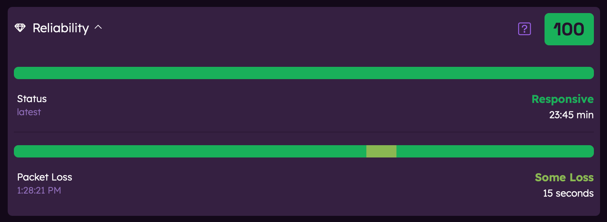

# Orb Detail View

The Orb detail view provides in-depth information about your network connectivity. This guide explains how to navigate and interpret the detailed metrics screens.

## Accessing the Detail View

You can access detailed metrics by tapping on any Orb card in the Orb Summary screen to open the detail view for that specific Orb.

## Common Elements

All detail views share certain common elements:

### Time Period Selector

At the top of each detail view, you'll find a time period selector that allows you to view data across different time periods, including:

- Last 1 minute
- Last 5 minutes
- Last 1 hour
- Last 24 hours

### Orb Score and Status Message

On the left, you'll see your overall Orb Score for the time period selected. You'll also find a status message describing the current state of your network connection.

There are indicators within the Orb Score that represent Responsiveness, Reliability, and Speed. When illuminated, these indicate which scores are contributing to the overall Orb Score.

### Improve Connection

When your score is below 80, an "Improve Connection" button will appear. Tapping this button will provide you with tailored recommendations to improve your internet experience.

## Responsiveness and Reliability Detail

The Responsiveness detail view focuses on your connection's lag, latency, and packet loss.

The Reliability detail view focuses on your connection's stability.

The detail view displays Responsiveness and Reliability scores for the selected time period. Each of these contributes to your overall Orb Score. Tap on each card to expand and view more detailed metrics.

Each category is represented by:

- A score
- Detailed metrics
- Graphical representation of the data, when available

## Speed Detail

The Speed detail view focuses on your connection's throughput.

### Content Download and Upload Speed Results

- Content download and upload speed measurements are performed on a regular cadence.
- These measurements are included in the speed score and Orb Score, when available.
- Content speed measurements can be initiated at any time by the user.

### Peak Download and Upload Speed Results

- Peak download and upload speed measurements can be initiated at any time by the user.
- These results are informational only and not included in your speed or Orb Score.

## Next Steps

To learn more about specific Orb metrics:

- [Understanding Speed metrics](/docs/orb-app/speed.md)
- [Understanding Reliability metrics](/docs/orb-app/reliability.md)
- [Understanding Responsiveness metrics](/docs/orb-app/responsiveness.md)
