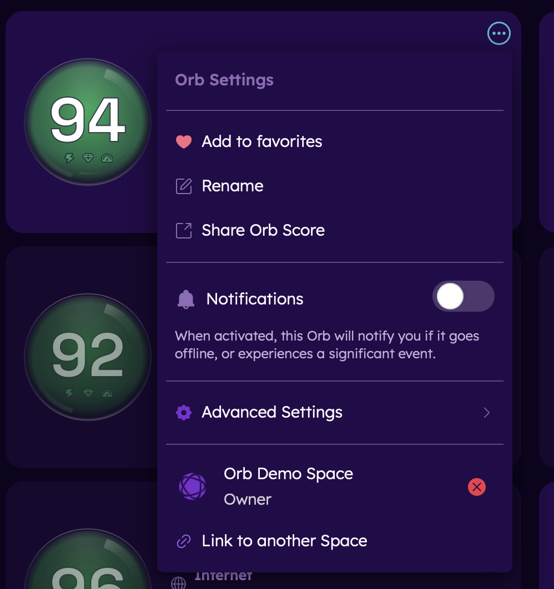
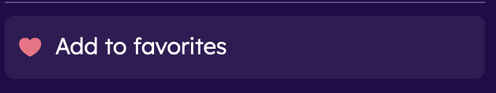
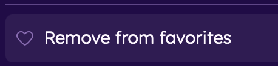
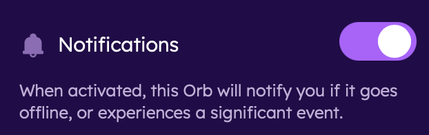
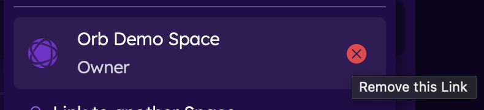
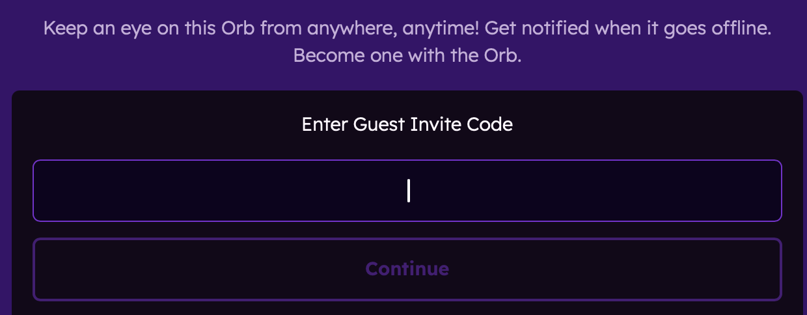
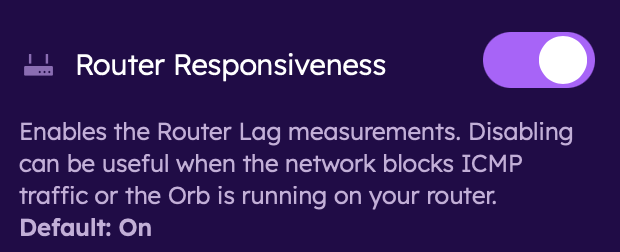
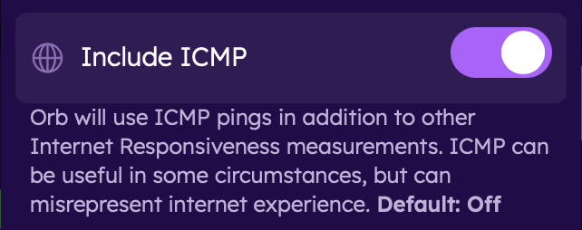
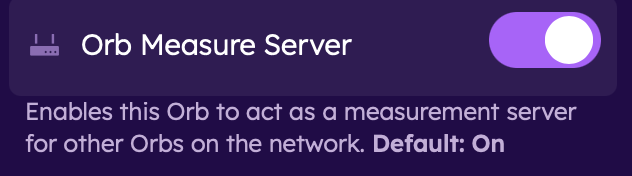
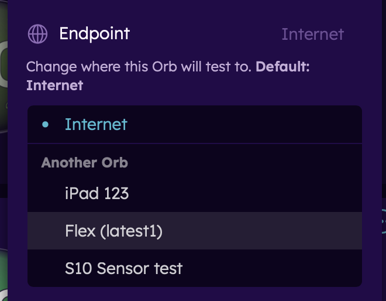

# Orb Setting Menu
To interact with the Orb settings menu, click or tap on the ... next to the Orb name in the summary view or in the top right-hand corner of the detail view.

## Add to favorites
Adding an Orb to favorites promotes this Orb in your summary view. 

- To add an Orb to favorites, open the menu and select "Add to favorites"
- To remove an Orb from favorites, open the menu and select "Remove from favorites"

## Rename
Renaming a device.

- to rename a device, select "Rename", type the new name, and click "Save"

## Share Orb Score
Generate a link to share your Orb Score and details.

## Notifications
To receive notifications from this Orb, toggle on the Notifications setting.

## Orb linking
Managing Orb account links.

- To remove an existing account link, click or tap on the red "x" next to the account.

- To link the Orb to another account via a guest Orb invite, click or tap on the "link to another account" option.
- Enter the Guest link code to proceed.

## Advanced Settings
Adjust advanced settings.

### Router Responsiveness
Enables the Router Lag measurements (on by default). Disabling can be useful when the network blocks ICMP traffic or the Orb is running on your router.

- To disable, toggle off the Router Responsiveness setting.

### Include ICMP
Includes ICMP pings (off by default). Enabling ICMP can be useful in some circumstances, but can misrepresent the internet experience.

- To enable, toggle on the Include ICMP setting.

###  Orb Measure Server
Enables the Orb to act as a measurement service for other Orbs on the network (on by default).

- To disable Orb Measure Server, toggle off.

### Endpoint
Change the measurement endpoint from the internet to another Orb on your network. This can be particularly useful when isolating network paths, such as testing the Wi-Fi on your network.

- To change the measurement endpoint, tap on the setting and select an Orb to test to.

## Next Steps

Now that you've configured your Orb settings, learn more about:

- [Using a spare iPhone as a dedicated sensor](/docs/setup-sensor/spare-iphone.md)
- [Using a spare Android as a dedicated sensor](/docs/setup-sensor/spare-android.md)
- [Notifications](/docs/orb-app/notifications.md)
- [Linking multiple sensors](/docs/orb-app/linking-orb-to-account.md)
