# Orb Summary View

The Orb summary view is the main dashboard of the app, providing a quick overview of network performance across your various devices with Orb installed. This guide explains how to interpret the information displayed and how to use this screen effectively.

## Common Elements

### Time Selector

At the top of the screen, you'll find a time selector that allows you to choose the time range for the data displayed. Options include:

- Now (snapshot of current network performance)
- Last 5 minutes
- Last 1 hour
- Last 24 hours

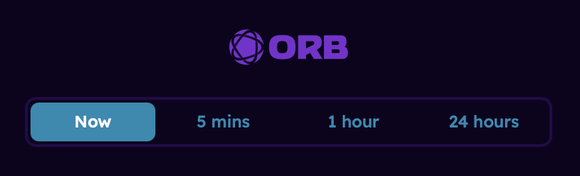

### Orb Scores, Network Information, and Status

All Orbs on the summary view display the Orb Score, status (online, offline), network name, connection information (WiFi, Wired, Cellular), and the Internet Service Provider (ISP) or Mobile Operator Network (MNO) information (if available).

## Orb Summary Layout

When you open the Orb app, the summary view is the first screen you'll see. It's divided into several key sections:

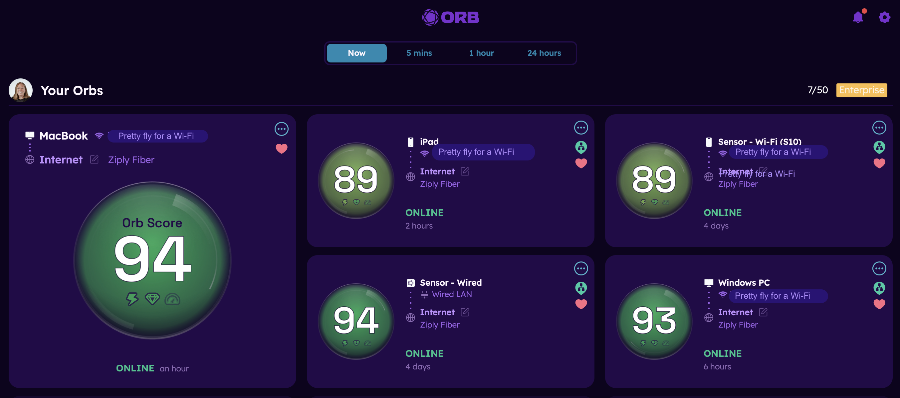

### This Orb

In the upper-left corner of the screen, you’ll see a section labeled "This Orb". It shows the Orb that’s installed on the device you’re currently using.

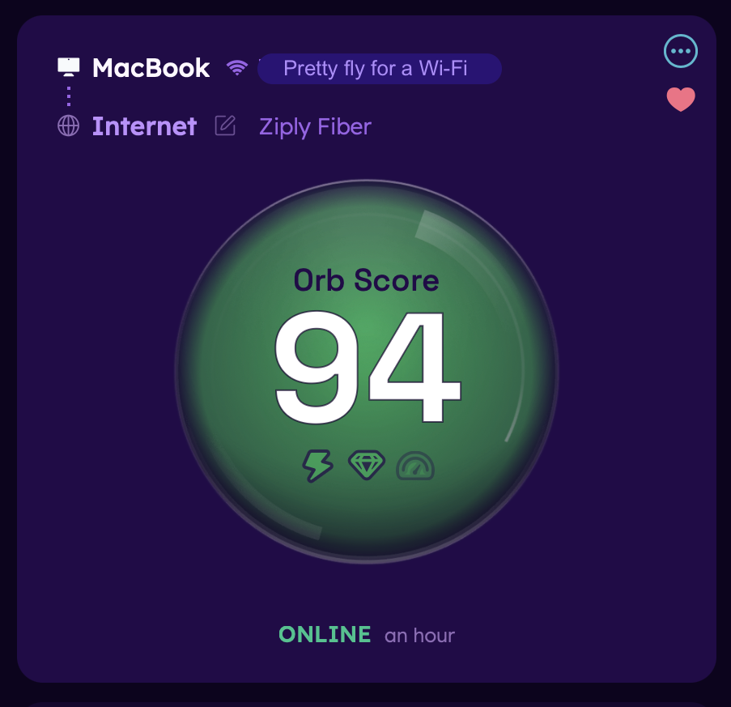

Some information may not be available if you haven't granted the app the necessary permissions.

Tap on this Orb to see more detailed information about this device and connection.

### Orbs Linked to Account

This section lists the Orbs linked to your account or Orb Space. You can tap on any Orb to view more detailed information about the device and connection.

To add an Orb to your Space, tap on the Orb menu button (...) in the top right corner of the Orb card and select "Link Orb to space." This will link the Orb to your account for easy access.

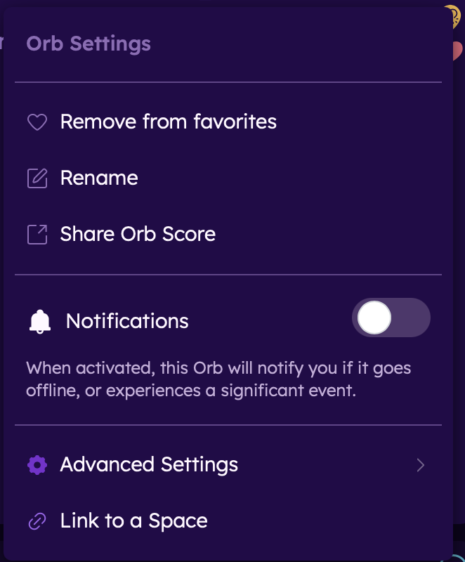

Follow the prompts to link to your current signed in account or by using a deployment token.

This section also includes the Orbs you've marked as favorites. These are Orbs that you frequently monitor or want quick access to.

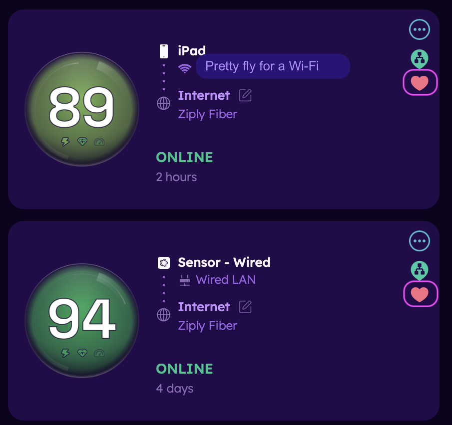

To add an Orb to your favorites, tap on the Orb menu button (...) in the top right corner of the Orb card and select "Add to favorites." This will add the Orb to top of your list for quick access.

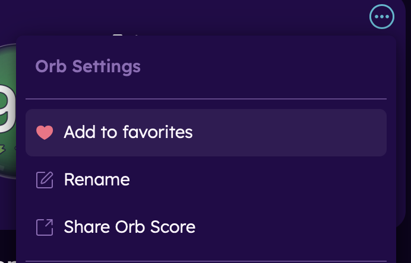

To remove an Orb to your favorites, tap on the Orb menu button (...) in the top right corner of the Orb card and select "Remove from favorites."

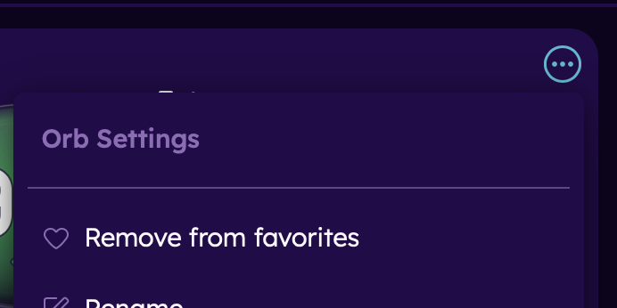

### Orbs on this network

This section displays Orbs found on the network but not linked to your account. You can tap on any Orb to view more detailed information about the device and connection. However, you will not be able to rename or initiate speed tests on these Orbs until they are linked to your space.

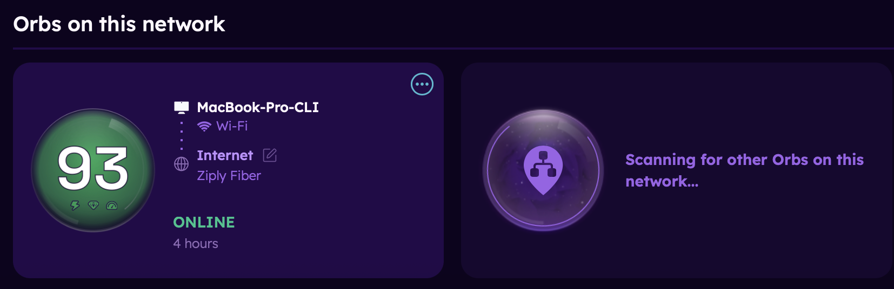

To claim an Orb, tap on the Orb menu button (...) in the top right corner of the Orb card and select "Link Orb to space" and follow the prompts as shown above.

## Notifications

Tap on the notifications bell to see any alerts from your Orbs. You can use the dropdowns at the top to filter to specific Orbs or events.

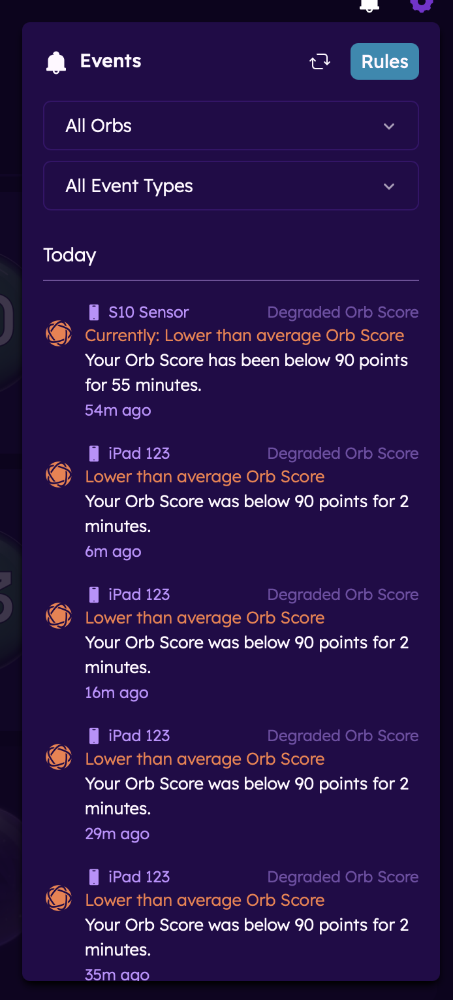

To learn more about setting up notifications, see the [Notifications](/docs/orb-app/notifications.md) guide.

## Orb Icons

The icons in the summary view indicate warnings for your Orbs

Orb not linked: indicates that an Orb is not linked to an account
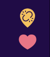

Orb on current network: if an Orb is on the same network as the current one

## Settings

Tap on the gear icon in the top right corner to access your app, notifications, and account settings. Here, you can access your anotification preferences, sign in and out of your account, reset your account password, delete account, change your app settings, and provide feedback or submit bug reports.

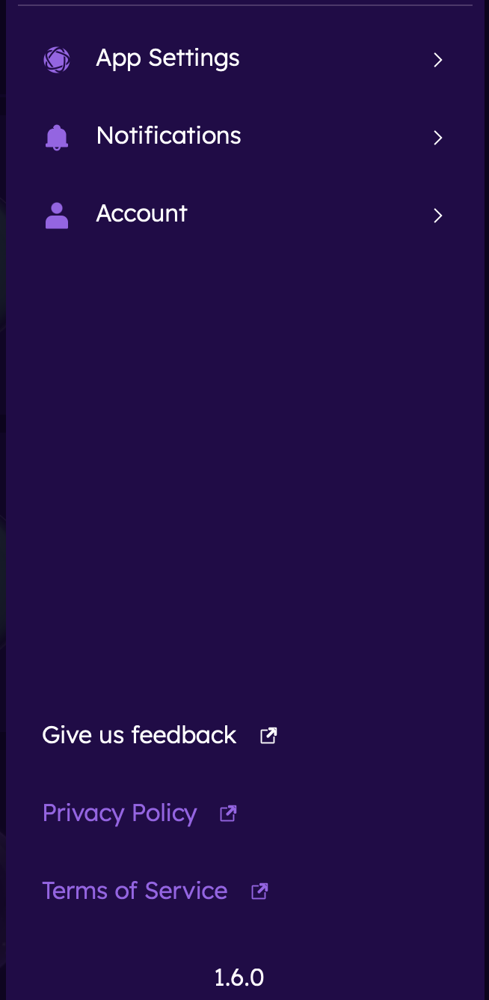

## Next Steps

To learn more about specific aspects of the Orb app:

- [Orb App at a Glance](/docs/orb-app/orb-app-at-a-glance.md) - Overview of the app's main features and functionality
- [Orb detail view](/docs/orb-app/orb-detail-view.md) - Explore the detailed metrics screens
- [Orb settings](/docs/orb-app/orb-settings.md) - Learn about different Orb settings
- [App settings](/docs/orb-app/app-settings.md) - Learn about different app settings
- [Understanding Orb scores](/docs/orb-app/orb-scores-metrics.md) - Learn about Orb Scores
- [Notification settings](/docs/orb-app/notifications.md) - Customize how Orb alerts you to issues
