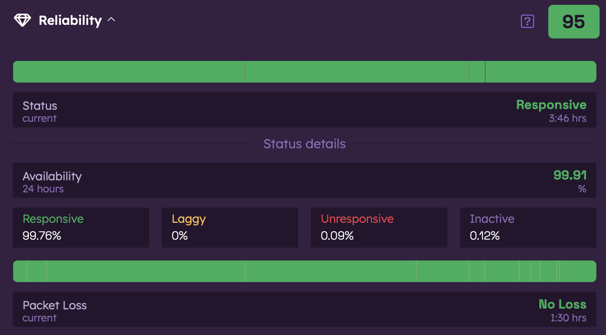

# Understanding Reliability Metrics

Reliability is one of the three key components of your Orb Score, measuring how consistently your connection works without interruptions. This guide explains how Orb measures reliability, what the metrics mean, and how to interpret your reliability performance.

For app versions 1.2.0 and later, Reliability now only affects your overall Orb Score during true outages or disruptions, giving a more precise reflection of your experience.

## What Reliability Measures

Orb measures reliability across two main aspects of your connection's stability:

### Responsiveness over Time

How responsive, consistent, and robust your connection is over time.

### Packet Loss

The percentage of data packets that are lost or delayed during transmission. High packet loss or significantly delayed packets will impact lag due to packet resubmission.

## How Orb Measures Reliability

Orb uses several methods to measure your network reliability:

### Continuous Monitoring

- **Heartbeat Tests**: Regular small data exchanges to verify connectivity
- **Connection Tracking**: Monitoring when your connection drops and recovers
- **Duration Tracking**: Measuring how long outages last

### Quality Assessments

- **Packet Loss Tests**: Measuring the percentage of data that doesn't reach its destination
- **Error Rate Analysis**: Identifying corrupted data that needs to be retransmitted
- **Connection Resets**: Counting unexpected disconnections

## Interpreting Your Reliability Metrics

### Reliability Score

The Reliability Score (0-100) is a simplified representation of your connection's stability. Higher scores indicate fewer disconnections and more consistent performance.

### Reliability Timelines

The reliability status timeline in the Orb app shows:

- **Responsive Time**: When your connection was working normally
- **Outage Events**: When your connection dropped completely
- **Laggy Periods**: When your connection was laggy

The packet loss timeline shows periods of packet loss.

Absences of data are shown without color, indicating that your device was not active during that window. Learn more about continuous monitoring in the [Set up sensor](/docs/setup-sensor) guide.

### Status Details

You'll see detailed information about your connection's reliability, including:

- **Availability**: % of time your connection was available
- **Responsive**: % of time your connection was responsive
- **Laggy**: % of time your connection was laggy
- **Unresponsive**: % of time your connection was completely unresponsive
- **Inactive**: % of time the Orb service was inactive

## Factors Affecting Reliability

Your internet reliability can be affected by various factors:

### ISP and Infrastructure Issues

- Maintenance on your ISP's network
- Oversubscription during peak hours
- Weather-related disruptions to physical infrastructure
- Regional outages

### Home Network Factors

- WiFi interference from other devices or networks
- Router overheating or firmware issues
- Signal obstructions (walls, floors, large metal objects)
- Power fluctuations affecting equipment

### Connection Type Factors

- Wireless connections are generally less reliable than wired
- Mobile connections vary based on signal strength and tower congestion
- Satellite connections can be affected by weather conditions and antenna placement

## Improving Your Reliability

If your reliability metrics show room for improvement, consider these actions:

### Quick Fixes

- Restart your router and modem
- Move your WiFi router to a central location
- Reduce interference from other electronic devices
- Update your router's firmware

### Long-term Solutions

- Switch to a wired connection for critical devices
- Install a mesh WiFi system to improve coverage
- Consider a more reliable ISP or connection type
- Add a backup internet connection for critical needs

## Related Guides

To learn more about Orb measurements:

- [Orb Scores and Metrics](/docs/orb-app/orb-scores-metrics.md)
- [Understanding Speed Metrics](/docs/orb-app/speed.md)
- [Understanding Responsiveness Metrics](/docs/orb-app/responsiveness.md)
