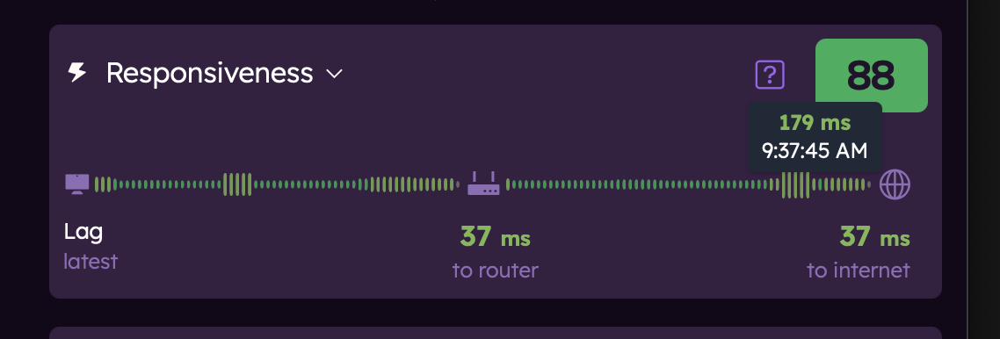

# Understanding Responsiveness

Responsiveness is one of the three key components of your Orb Score, measuring how quickly your network responds to requests. This guide explains how Orb measures responsiveness, what the metrics mean, and how to interpret your responsiveness performance.

## What Responsiveness Measures

Responsiveness metrics measure several aspects of your connection's ability to respond quickly and smoothly to requests.

### Lag

The amount of time it takes to get an applicable response from an internet service, reported in milliseconds (ms). Lag is reported with best, worst, and typical values. Lower lag indicates a more responsive connection.

### Latency

The delay measured when sending and receiving packets, reported in milliseconds (ms). Lower latency indicates a more responsive connection.

### Jitter

The variation in latency over time, reported in milliseconds (ms). High jitter can cause inconsistent performance, especially in real-time applications like gaming or video conferencing.

### Packet Loss

The percentage of data packets that are lost or delayed during transmission, reported as a percentage (%). High packet loss or significantly delayed packets will impact lag due to packet resubmission.

### Web Load (Typical)

The time it takes to load a typical web page, reported in milliseconds (ms). This metric gives you an idea of how quickly your connection can handle everyday tasks. This metric is informational only.

## Interpreting Your Responsiveness Metrics

### Responsiveness Score

The Responsiveness Score (0-100) is a simplified representation of your connection's lag, which includes latency, jitter, and packet loss. Higher scores indicate lower lag and better responsiveness.

### Responsiveness Timeline

The responsiveness timeline in the Orb app shows lag from your device to the router and from the router to the internet when the device is connected to WiFi. When connected to a cellular network, the timeline shows lag from your device to the internet.

The size and color of the bars indicate the lag during that responsiveness check. A short dark green bar indicates low lag, while a tall red bar indicates high lag.

Hovering over (desktop) or tapping (mobile) a bar will show the lag time in milliseconds (ms) and the time of the measurement.

### Responsiveness Ring

The responsiveness ring moves in real-time, showing the rate of responsiveness for your network connection. The faster the ring moves, the more responsive your connection is. This is displayed on both the Orb summary and detail screens.

## Factors Affecting Responsiveness

Your internet responsiveness can be affected by various factors:

### ISP and Infrastructure Issues

- Maintenance on your ISP's network
- Oversubscription during peak hours
- Weather-related disruptions to physical infrastructure
- Regional outages

### Home Network Factors

- WiFi interference from other devices or networks
- Router overheating or firmware issues
- Signal obstructions (walls, floors, large metal objects)
- Power fluctuations affecting equipment

### Connection Type Factors

- Wireless connections are generally less reliable than wired
- Mobile connections vary based on signal strength and tower congestion
- Satellite connections can be affected by weather conditions and antenna placement

## Improving Your Responsiveness

If your responsiveness metrics show room for improvement, consider these actions:

### Quick Fixes

- Restart your router and modem
- Move your WiFi router to a central location
- Reduce interference from other electronic devices
- Update your router's firmware

### Long-term Solutions

- Switch to a wired connection for critical devices
- Install a mesh WiFi system to improve coverage
- Consider a more reliable ISP or connection type
- Add a backup internet connection for critical needs

## Related Guides

To learn more about Orb measurements:

- [Orb Scores and Metrics](/docs/orb-app/orb-scores-metrics.md)
- [Understanding Speed Metrics](/docs/orb-app/speed.md)
- [Understanding Reliability Metrics](/docs/orb-app/reliability.md)
