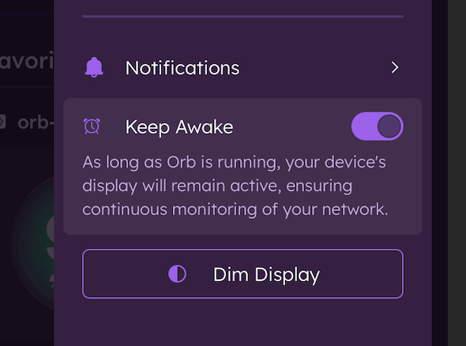

# Sensor Mode

This guide explains the Sensor Mode or "Keep Awake" setting found within the account settings menu.

## What is Sensor Mode?

Sensor Mode is an easy way to configure your Orb sensor to run continuously. Available on mobile devices, it is recommended for dedicated Orb sensors like a spare Android or spare iPhone.

## Engaging Sensor Mode

1. Navigate to the Settings menu by tapping the gear icon in the top right corner of the app.
2. Toggle on the "Keep Awake" setting.
3. Choose to dim your display by tapping "Dim Display" (optional).

## Next Steps

Now that you've configured your sensor mode, learn more about:

- [Using a spare iPhone as a dedicated sensor](/docs/setup-sensor/spare-iphone.md)
- [Using a spare Android as a dedicated sensor](/docs/setup-sensor/spare-android.md)
- [Notifications](/docs/orb-app/notifications.md)
- [Linking multiple sensors](/docs/orb-app/linking-orb-to-account.md)
