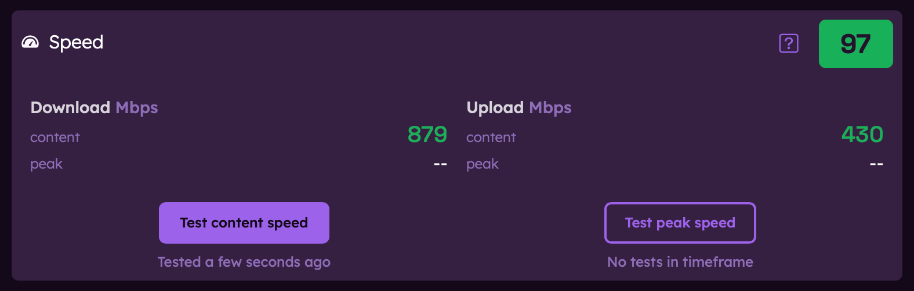

# Understanding Speed Metrics

Speed is one of the three key components of your Orb Score, measuring how quickly data can be transferred to and from your device. This guide explains how Orb measures speed, what the numbers mean, and how to interpret your speed metrics.

## Speed Measurements

Speed measures how quickly data can be transferred to and from a devices. It includes:

- **Content Download Speed**: How quickly you can receive data, reported in Mbps
- **Content Upload Speed**: How quickly you can send data, reported in Mbps

Orb's primary speed measurements and important for activities like streaming videos, downloading files, video conferencing, and other relevant day-to-day activities. Content speed tests are performed by downloading and uploading a small amount of data (10 MB file) to and from your device.

While peak speed measurements are available and can be initiated by the user at any time, they are informational only and not included in the Orb Score. Peak speed tests are performed by fully flooding your connection with data to measure the maximum speed your device can achieve.

The Orb Score is based on content speed measurements only, which are performed on a regular cadence.

### Speed Measurement Cadence

- **Content Speed Measurements**: Performed on a regular cadence (at app launch and every hour)
- **Peak Speed Measurements**: Can be initiated by the user at any time

### Download Speed

Download speed measures how quickly your device can receive data from the internet, reported in Mbps.

Download speed affects:

- Streaming video quality
- How quickly web pages load
- Download times for files and apps
- Video call quality (incoming video)

### Upload Speed

Upload speed measures how quickly your device can send data to the internet, also measured in Mbps.

Upload speed affects:

- Video call quality (outgoing video)
- Time to upload files to cloud storage
- Social media post uploads (photos and videos)
- Online gaming performance

### Speed Score

The Speed Score (0-100) is a simplified representation of your content speed performance. Higher scores indicate faster content download and upload speeds.

## Factors Affecting Speed

Your internet speed can be affected by many factors:

### ISP and Plan Limitations

- Your maximum speed is limited by your internet plan
- ISP congestion during peak hours can reduce speeds
- Some ISPs throttle specific types of traffic

### Home Network Factors

- WiFi signal strength and interference
- Router capabilities and configuration
- Number of connected devices
- Distance from your router

### Device Limitations

- Older devices may have slower WiFi capabilities
- Processing power can limit throughput
- Background applications consuming bandwidth

## Improving Your Speed

If your speed metrics show room for improvement, consider these actions:

### Quick Fixes

- Restart your router and modem
- Move closer to your WiFi router
- Reduce the number of active devices on your network
- Close bandwidth-intensive applications

### Long-term Solutions

- Upgrade to a better internet plan
- Install a mesh WiFi system for better coverage
- Use wired Ethernet connections for important devices
- Update or replace older networking equipment

## Related Guides

To learn more about improving your network performance:

- [Orb Scores and Metrics](/docs/orb-app/orb-scores-metrics.md)
- [Understanding Reliability metrics](/docs/orb-app/reliability.md)
- [Understanding Responsiveness metrics](/docs/orb-app/responsiveness.md)
