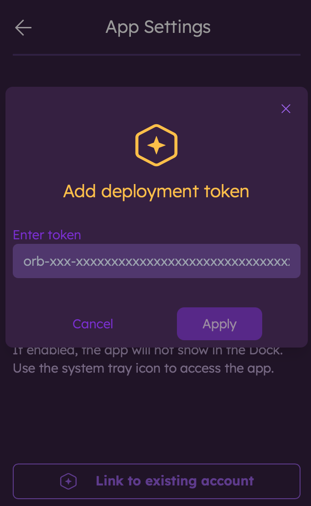

# Orb Cloud

Orb is an internet experience platform that uses continuous data collection from run-anywhere sensors (Orbs) to deliver comprehensive insight into any device’s connectivity. It focuses on three key pillars: Responsiveness, Reliability, and Speed. These pillars form the basis of a 0-100 Orb Score that can be easily understood by any internet user. The Orb Score—along with its component scores and the underlying metrics—is stored on-device for local or remote access, available in Orb Cloud, or streamable to your own data platform.

Orb Cloud, accessible at [https://cloud.orb.net](https://cloud.orb.net), allows you to

* View the [Status](/docs/orb-cloud/status) of your Orbs and manage them
* [Orchestrate](/docs/deploy-and-configure) your Orbs with advanced deployment and configuration options
* Invite [Users](/docs/orb-cloud/manage-users) to your shared Space
* View [Analytics](/docs/orb-cloud/analytics) for individual Orbs or at scale (optional)

:::info
To use the latest Orb Cloud features, Orb app and sensor versions 1.3 and above are required.
:::

## Free plan quickstart

1. Create a free account at [https://cloud.orb.net](https://cloud.orb.net)
2. [Link](/docs/orb-app/linking-orb-to-account) an Orb to your Space
3. Confirm the Orb is visible in [https://cloud.orb.net/status](https://cloud.orb.net/status)

You're done! As a next step, you can [Configure](/docs/deploy-and-configure/configuration) your Orb or set up [Local Analytics](/docs/deploy-and-configure/local-analytics) to create your personal internet experience dashboard.

## Plus and Business quickstart

1. Visit [https://plans.orb.net/plans-pricing](https://plans.orb.net/plans-pricing), select a plan, and start a trial.
2. Link an Orb to your Space using the Deployment Token generated at onboarding by opening an Orb app, tapping or clicking the settings cog, selecting "App Settings", and selecting "Link to existing account". Paste in your Deployment Token and hit "Apply". See ["Using Tokens for Deployment"](/docs/deploy-and-configure/deployment-tokens#using-tokens-for-deployment) for more details and additional options.

3. Confirm the Orb is visible in [https://cloud.orb.net/status](https://cloud.orb.net/status)
4. After a few minutes, visit [https://cloud.orb.net/analytics](https://cloud.orb.net/analytics) to see your data.

You're done! As a next step, you can add more Users to your Space or set up [MDM](/docs/deploy-and-configure/mdm).
