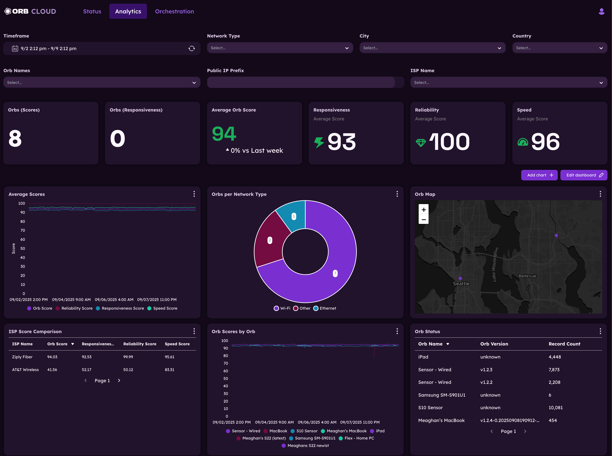
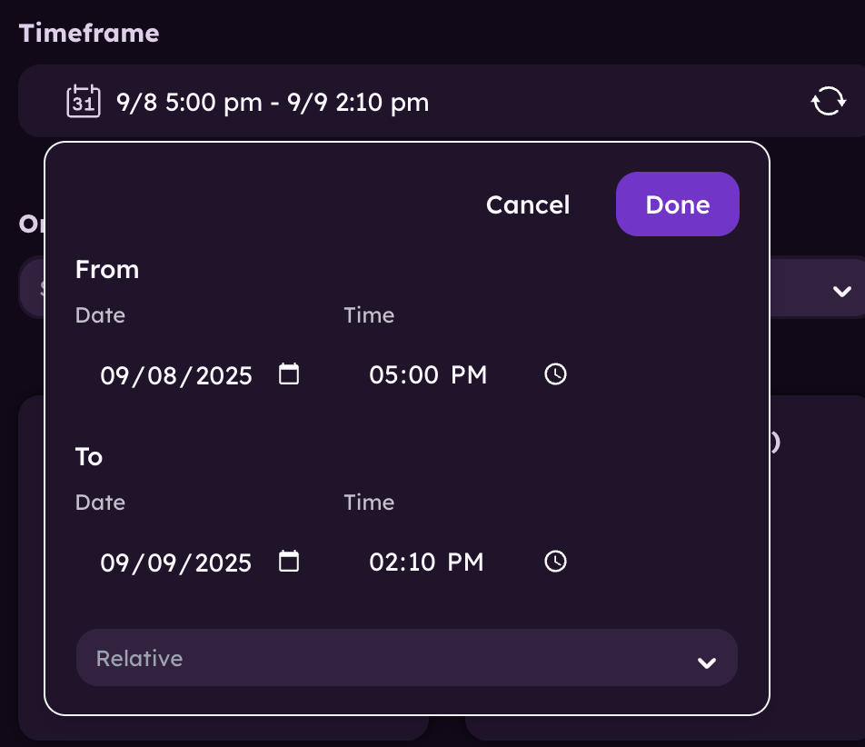
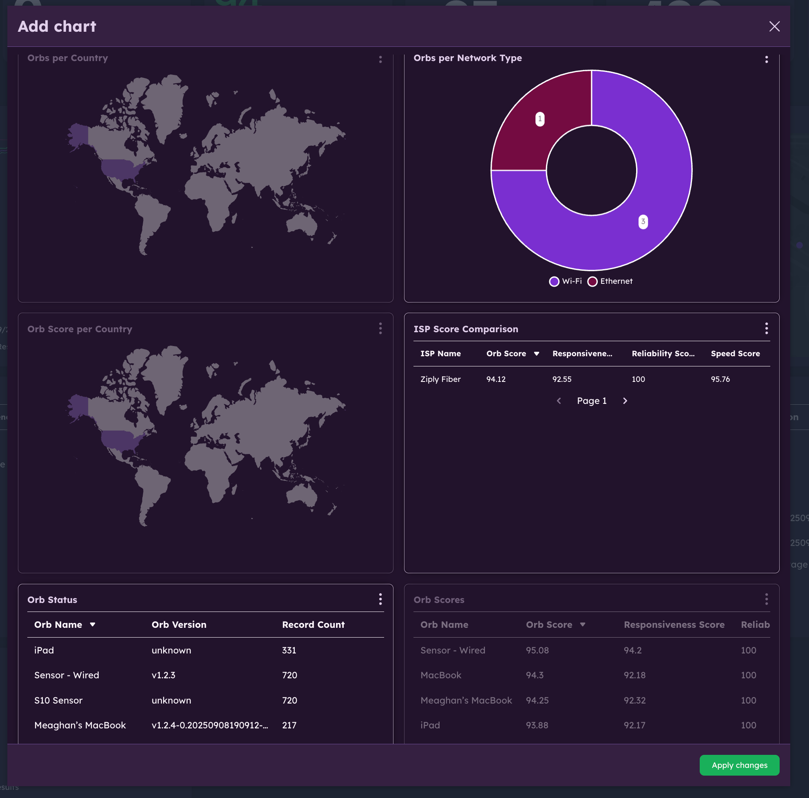
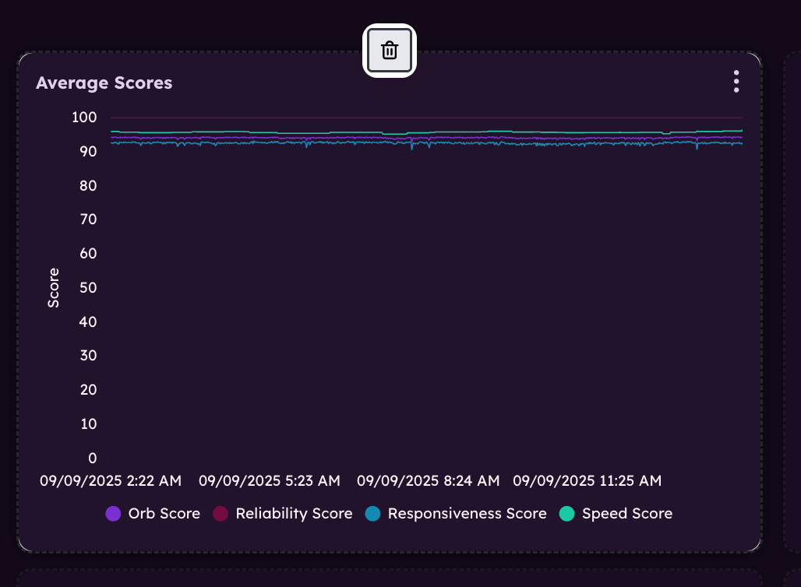
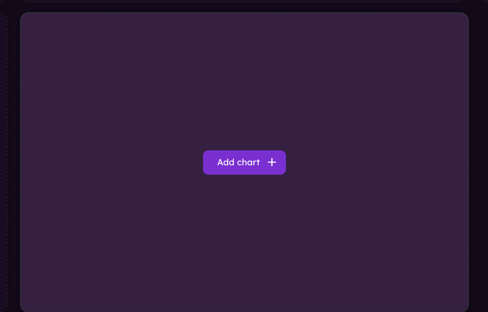

# Analytics

This guide will help you get started with using the Orb Cloud dashboard to analyze your network performance. The Analytics module provides detailed insights into your internet, including Orb Scores, sub-scores, and historical data analysis.

:::note
If you do not see data for an Orb, ensure the Orb is running app or sensor version 1.3 and above and is [properly configured for Orb Cloud Analytics](/docs/deploy-and-configure/datasets-configuration#orb-cloud).
:::

## Changing the timeframe

Use the time and date selector at the top of the Analytics page to change the timeframe for the data displayed. You can use exact dates and times or select timeframes from the "relative" dropdown menu (5 minutes, 1 hour, 1 day, 7 days, etc.).

## Filtering the data

Use the filter options at the top of the Analytics page to filter the data displayed. You can filter by:
- **Network type**: Filter data by network type (e.g., Wifi, Ethernet, Cellular).
- **City**: Filter data by city.
- **Country**: Filter data by country.
- **Orb Name**: Filter data by Orb name(s).
- **Public IP Prefix**: Filter data by IP address prefix.
- **ISP Name**: Filter data by ISP name.

## Add chart

To add a new chart to the dashboard, click the "Add Chart" button in the top right corner. This will open a dialog box where you can select the charts you wish to add or remove. Once your selection is made, click "Apply changes" to add the chart to your dashboard.

## Edit dashboard

To edit your dashboard, click the "Edit Dashboard" button in the top right corner as seen above. This will allow you to rearrange, add, or remove charts from your dashboard.

Simply drag and drop charts to rearrange them, hover on a chart and click the trash can button to remove it, or click the "Add Chart" button to add a new chart.

Once your changes are made, click "Done" to save your dashboard.

Learn more about [Managing users](/docs/orb-cloud/manage-users). 
Learn more about [Orb Status](/docs/orb-cloud/status). 
Learn more about [Orb Deployment & Configuration](/docs/deploy-and-configure).
