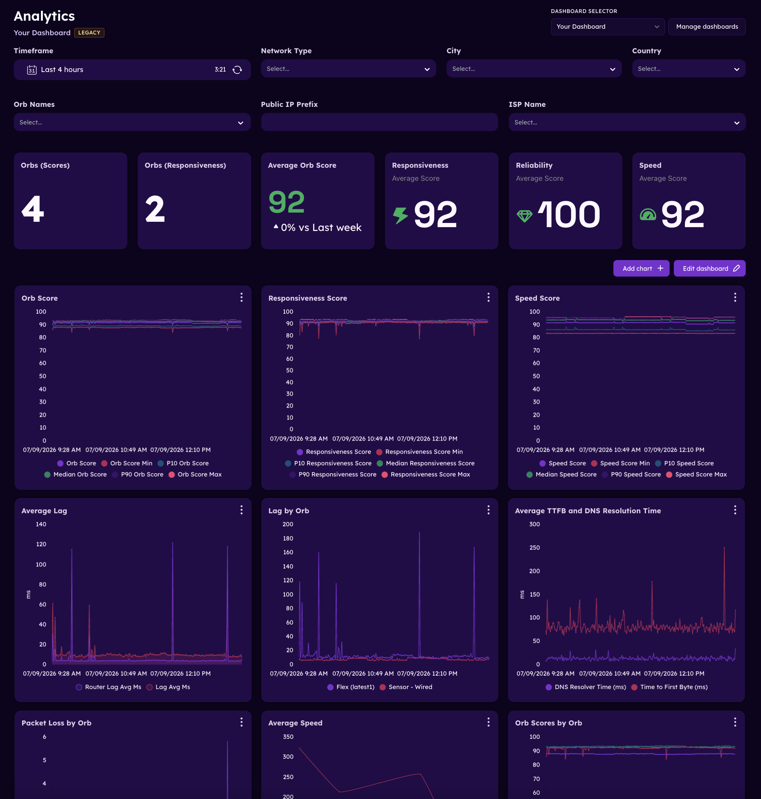
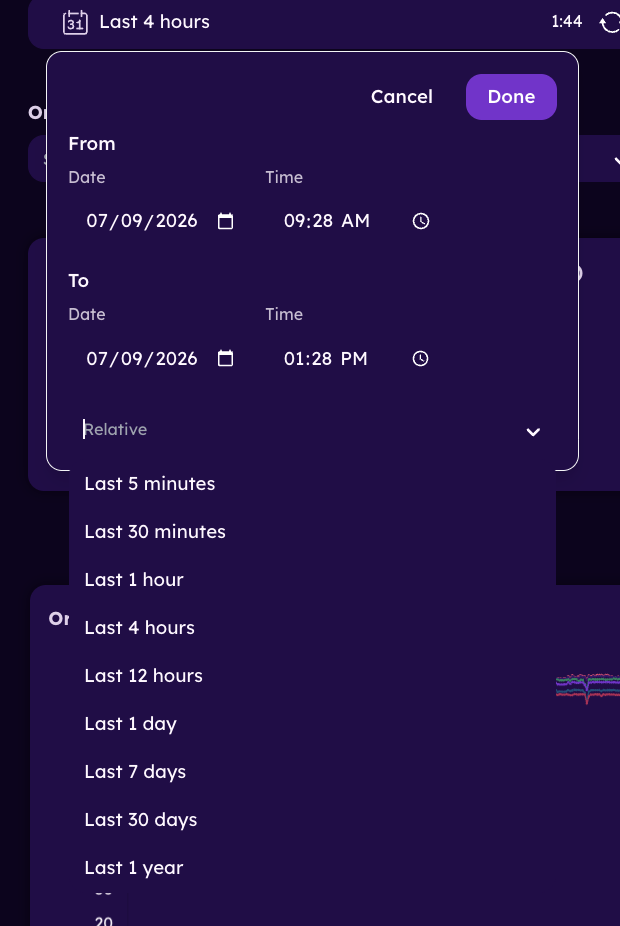
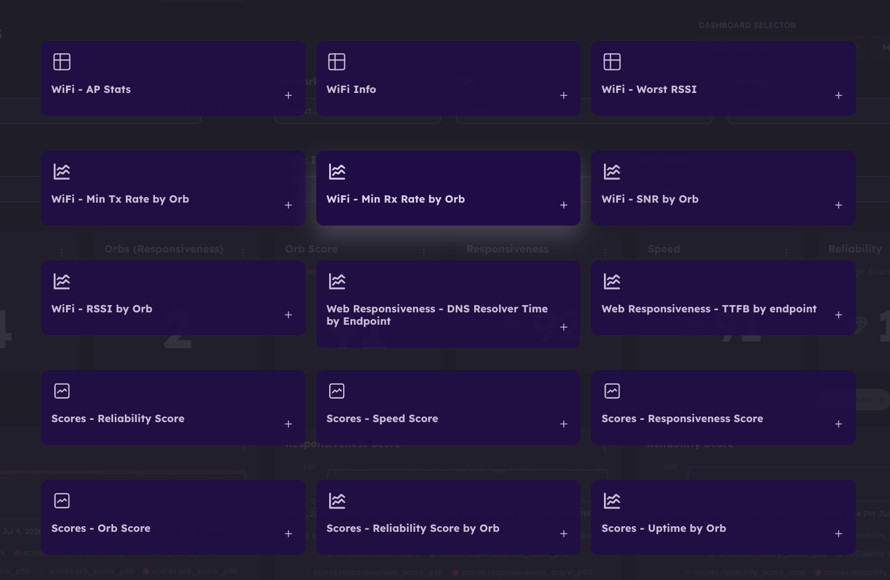
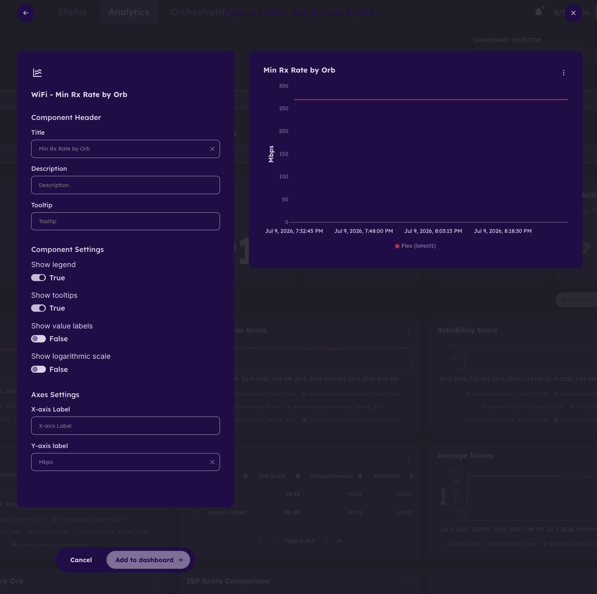
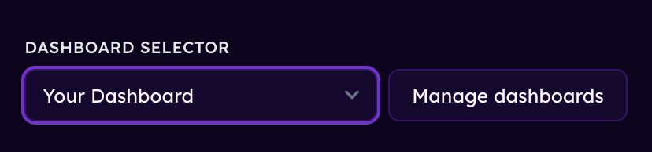
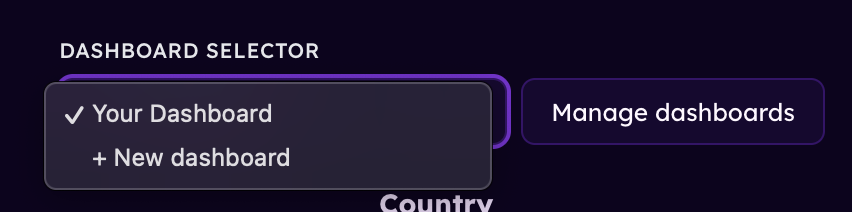
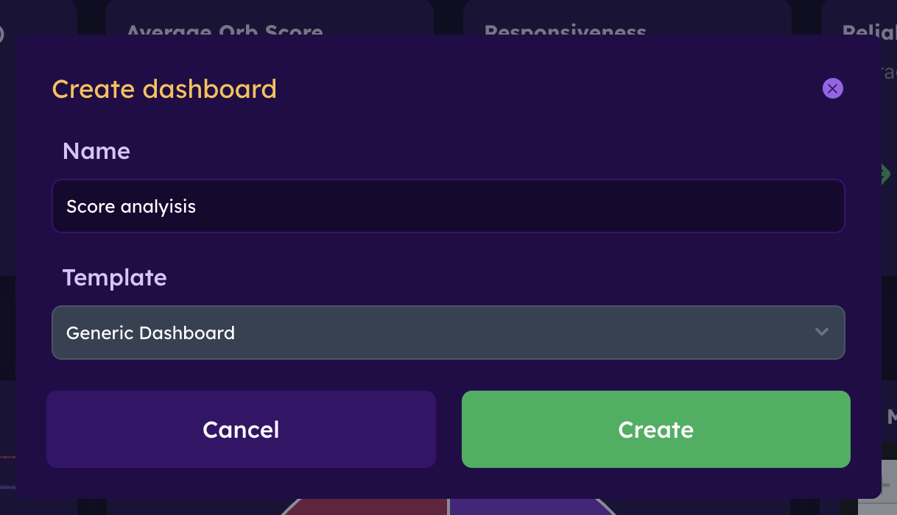
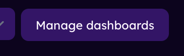
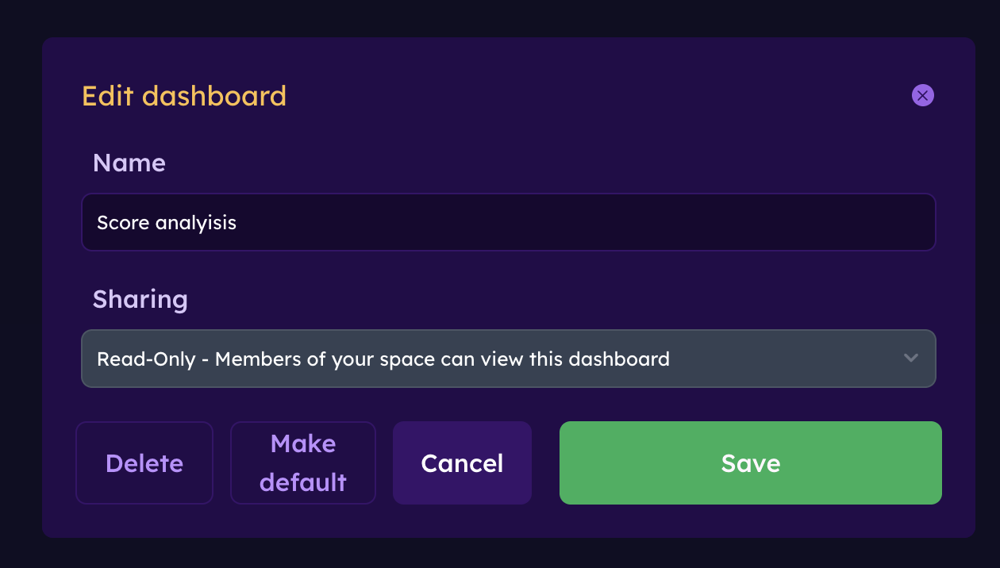
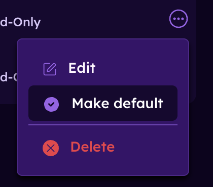

# Analytics

This guide will help you get started with using the Orb Cloud dashboard to analyze your network performance. The Analytics module provides detailed insights into your internet, including Orb Scores, sub-scores, and historical data analysis.

:::note
If you do not see data for an Orb, ensure the Orb is running app or sensor version 1.3 and above and is [properly configured for Orb Cloud Analytics](/docs/deploy-and-configure/datasets-configuration#orb-cloud).
:::

## Changing the timeframe

Use the time and date selector at the top of the Analytics page to change the timeframe for the data displayed. You can use exact dates and times or select timeframes from the "relative" dropdown menu (5 minutes, 1 hour, 1 day, 7 days, etc.).

## Filtering the data

Use the filter options at the top of the Analytics page to filter the data displayed. You can filter by:
- **Network type**: Filter data by network type (e.g., Wifi, Ethernet, Cellular).
- **City**: Filter data by city.
- **Country**: Filter data by country.
- **Orb Name**: Filter data by Orb name(s).
- **Public IP Prefix**: Filter data by IP address prefix.
- **ISP Name**: Filter data by ISP name.

## Adding charts to a dashboard

You can customize each dashboard by adding charts from the chart picker. Each dashboard has its own saved chart layout, so different dashboards can be configured for different teams, workflows, or analysis needs.

To add a chart:

1. Go to "Analytics" in the top navigation.
2. Select the dashboard you want to customize.
3. Click "Add chart".
4. Browse the available chart options.
5. Click on the chart you want to add.
6. Configure the chart settings.
7. Click "Add to dashboard".
8. Click "Done" to save your dashboard changes.

The chart picker includes available Analytics components such as score charts, Wi-Fi charts, web responsiveness charts, and tables. Available charts may vary depending on your Orb data and enabled features.

### Configuring a chart

When adding or editing a chart, you can update the chart title, description, tooltip, display settings, and axis labels.

Available chart settings may include:

- **Title**: The name shown at the top of the chart.
- **Description**: Optional supporting text for the chart.
- **Tooltip**: Optional helper text for users viewing the chart.
- **Show legend**: Show or hide the chart legend.
- **Show tooltips**: Show or hide hover tooltips.
- **Show value labels**: Show or hide values directly on the chart.
- **Show logarithmic scale**: Use a logarithmic scale for the chart.
- **X-axis label**: Customize the label shown on the X-axis.
- **Y-axis label**: Customize the label shown on the Y-axis.

After configuring the chart, click **Add to dashboard** to place it on the current dashboard.

## Edit, rearrange, or delete an existing chart

You can update charts that have already been added to a dashboard, rearrange the dashboard layout, or remove charts you no longer need.

To edit an existing chart:

1. Go to "Analytics".
2. Select the dashboard you want to update.
3. Click "Edit dashboard".
4. Open the chart menu on the chart you want to update.
5. Update the chart title, description, tooltip, display settings, or axis labels.
6. Click "Done" to save your dashboard changes.

To rearrange charts:

1. Click "Edit dashboard".
2. Drag and drop charts into the desired position.
3. Click "Done" to save the updated layout.

To delete a chart:

1. Click "Edit dashboard".
2. Hover over the chart you want to remove.
3. Click the delete icon.
4. Click "Done" to save your dashboard changes.

Changes are saved to the selected dashboard only.

## Additional dashboard views

Customizable dashboards let you create different Analytics views for different workflows, teams, or use cases. For example, you may want one dashboard for Orb Score trends, another for responsiveness analysis, and another for a specific team, customer, or location.

Each dashboard can have its own chart layout and can be kept private or shared with other users in your Orb Space.

### Select a dashboard

Use the **Dashboard selector** at the top of the Analytics page to switch between available dashboards.

1. Open Orb Cloud.
2. Go to Analytics.
3. Select the dropdown under Dashboard selector.
4. Choose the dashboard you want to view.

Your selected dashboard will load with its saved charts, layout, filters, and configuration.

### Creating additional dashboards

To create a new dashboard:

1. Open Analytics.
2. Click the Dashboard selector dropdown.
3. Select "+ New dashboard".

You can also create a dashboard from the dashboard management view:

1. Click Manage dashboards.
2. Select New dashboard.
3. Enter a dashboard name.
4. Choose a dashboard template.
5. Click Create.

The new dashboard will be added to your available dashboards.

### Manage dashboards

Use **Manage dashboards** to open, rename, share, make default, or delete dashboards.

1. Open Analytics.
2. Click "Manage dashboards".
3. Find the dashboard you want to manage.
4. Click "Open" to view the dashboard, or "Edit" to update its settings.

From the edit menu, you can update the dashboard name, change sharing settings, make the dashboard your default, or delete the dashboard.

### Rename a dashboard

To rename a dashboard:

1. Click "Manage dashboards".
2. Click ..., then "Edit" on the dashboard you want to rename.
3. Update the "Name" field.
4. Click "Save".

### Share a dashboard

Dashboards can be shared with other users in your Orb Space. Sharing a dashboard allows other users to view the same dashboard configuration.

To share a dashboard:

1. Click "Manage dashboards".
2. Click ..., then "Edit" on the dashboard you want to share.
3. Open the "Sharing" dropdown.
4. Choose the access level you want to allow.
5. Click "Save".

Available sharing options may include:

- **Private**: Only you can view the dashboard.
- **Read-only**: Members of your space can view the dashboard, but cannot make changes.
- **Editable**: Members of your space can view and edit the dashboard.

### Allow edit access

If you want other users in your space to help maintain a dashboard, set the dashboard sharing option to an editable access level.

Users with edit access can update the dashboard configuration, including adding, removing, and rearranging charts. Use editable access for shared team dashboards where multiple users are responsible for maintaining the view.

### Make a dashboard the default

A default dashboard opens automatically when you visit Analytics.

To make a dashboard your default:

1. Click "Manage dashboards".
2. Click ... on the dashboard you want to use by default.
3. Click "Make default".

### Delete a dashboard

To delete a dashboard:

1. Click "Manage dashboards".
2. Click ... on the dashboard you want to delete.
3. Click "Delete".
4. Confirm the deletion.

Deleting a dashboard removes the saved dashboard configuration. It does not delete Orb data or Analytics data.

Learn more about [Managing users](/docs/orb-cloud/manage-users). 
Learn more about [Orb Status](/docs/orb-cloud/status). 
Learn more about [Orb Deployment & Configuration](/docs/deploy-and-configure).
