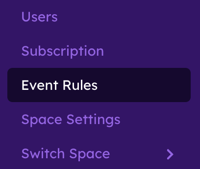
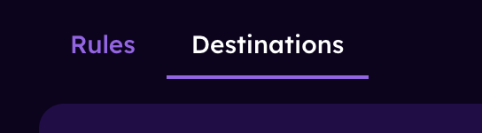

# Advanced Events & Alerts

This guide explains how to set up rules and alert destinations in Orb Cloud to stay informed about your network's performance and issues.

Available for all users, create rules and get alerted for changes in connectivity or performance including:

- Status changes: monitor for online/offline staus changes
- Score changes: monitor for changes to Orb, Responsiveness, Reliability, and Speed Scores
- Location changes: monitor for changes to country, country code, state, city, or ISP name
- Network changes: monitor for changes to pubic IP address, Wi-Fi network, BSSID, connection type, local IP address, or MAC address
- Bandwidth changes: monitor for changes to download and upload speeds

## Accessing Event Rules & Destinations in Orb Cloud

1. Open Orb Cloud
2. Go to Settings > Event Rules.

 

## Creating and Managing Alert Rules

1. Click/tap on "Create Rule" in the top, left-hand corner
 

2. Name the rule (tip: use a name that is descriptive)
3. Select the Orbs or Group of Orbs to which the rule applies
4. Choose the field that the rule will be based on.
5. Select the "period" or time threshold that will drive the alert. Options include: instant, 1 min, 2 min, 5 min, 10 min, 15 min, 30 min, 1 hr, 2 hr, 6 hr, 12 hr, 24 hr. Note: `instant` might be very noisy.
6. Select a Static Value (such as a Score below 80 or Download Speed below 100 Mbps) or Anomaly Detection (Orb will select a band based on the field and performance of your network experience).
7. Select your preferred Sensitivty Level (Low, Medium, High, Custom)
8. Select "Create Rule"

 

### Advanced Rule Settings
Under advanced settings, users can:
- Set the "Compare Against" field for determining the delta in current performance to previous performance. 
- Set the cooldown to minimize repeat alerts. 
- Select which destinations an alert should be sent to.

## Creating and Managing Rule Alert Desinations

1. Navigate to the "Destinations" tab

2.  Click/tap "Add Destination"

3. Name the destination
4. Select the type of destination
   - Space users: choose all or select users in your Orb space to receive alerts
   - Email: select a specific email address to send alerts to (example: orbalerts@company.com)
   - Webhook: send your alerts to a tool, dashboard, website, or more
   - Slack: Send your alerts to a Slack channel
   - Microsoft Teams: send your alerts to a Teams channel
5. Enter the destination or select users to receive alerts

### Advanced settings in Destinations
Format your webhook to include custom headers and values.

## Troubleshooting

### Not Receiving Notifications

If you're not receiving expected notifications:

1. Check that notifications are enabled in the Orb app or Orb Cloud.
2. Verify your device's system notification settings for Orb.
3. Ensure your device has an active internet connection.
4. Check that Do Not Disturb mode isn't active.
5. Try restarting the app or your device.

## Next Steps

Now that you've configured your notifications, learn more about:

- [App Settings](/docs/orb-app/app-settings.md)
- [Understanding Orb Scores](/docs/orb-app/orb-scores-metrics.md)
