# Events & Alerts

Orb Cloud Events & Alerts helps you monitor changes in connectivity and network experience, review events across your Orbs, and notify the right people or systems when an issue occurs.

Use Events & Alerts to:

- Review a timeline of events across your space
- Filter events by Orb, event type, or rule
- Create rules that identify important changes
- Send alerts to space users, email addresses, webhooks, Slack, or Microsoft Teams
- Create reusable filters for targeting groups of Orbs

## Access Events & Alerts

To open Events & Alerts:

1. Open Orb Cloud.
2. Open the account menu in the upper-right corner.
3. Select "Events".

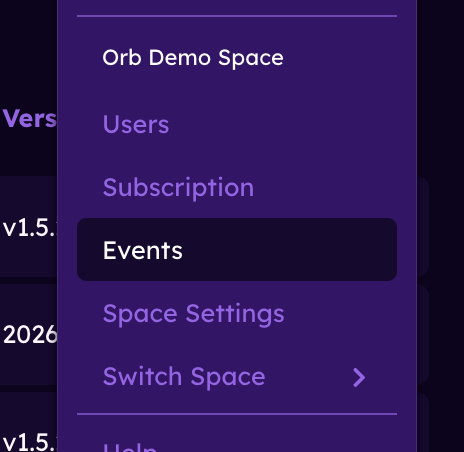

The Events & Alerts area contains four tabs:

- **Events**: Review the event timeline.
- **Rules**: Create and manage event rules.
- **Destinations**: Choose where alerts are sent.
- **Filters**: Create reusable groups of Orbs based on selected criteria.

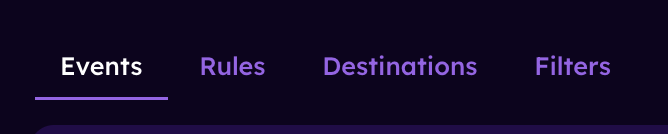

## Review events

The **Events** tab displays a timeline of events generated across your Orb space. Events are grouped by time, making it easier to review recent changes and identify recurring issues.

Each event includes information such as:

- The affected Orb
- The event type
- A summary of what changed
- When the event occurred
- The rule that generated the event, when applicable

Events may identify changes in:

- Connection status
- Orb Score
- Responsiveness
- Reliability
- Speed
- Location
- Network information

### Filter the event timeline

Use the menus at the top of the event timeline to narrow the events shown.

You can filter by:

- **Orb**: View events from all Orbs or a selected Orb.
- **Event type**: View events related to connection, scores, location, network information, or another supported field.
- **Rule**: View all events or only events generated by a selected rule.

Filters can be combined. For example, you can view Responsiveness events for a specific Orb that were generated by a particular rule.

## Create and manage event rules

Event rules define the conditions Orb Cloud should monitor. When a rule's conditions are met, Orb Cloud creates an event and can send an alert to the selected destinations.

To create a rule:

1. Open the "Rules" tab.
2. Select "Create Rule".
3. Enter a descriptive name for the rule.
4. Select the rule's target.
5. Choose the field to monitor.
6. Select the period for which the condition must remain true.
7. Choose either a static threshold or anomaly detection.
8. Configure the condition.
9. Select one or more destinations.
10. Select "Create Rule".

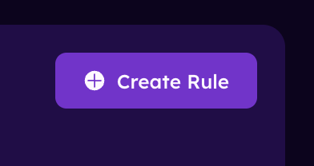

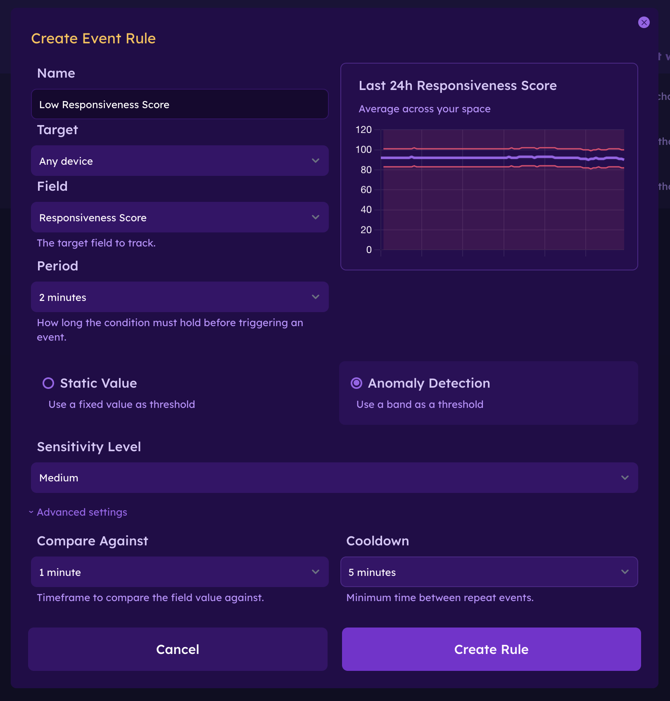

### Choose a target

The target determines which Orbs the rule applies to.

Depending on your space configuration, you can apply a rule to:

- Any device
- A specific Orb
- A group of Orbs defined by a filter

Using a filter lets a single rule apply dynamically to Orbs that share selected criteria.

### Choose a field

Rules can monitor supported connectivity and network-experience fields, including:

- Connection status
- Orb Score
- Responsiveness Score
- Reliability Score
- Speed Score
- Location information
- Network information
- Download or upload speed

The available conditions and settings may change depending on the selected field.

### Choose a period

The period determines how long the condition must remain true before Orb Cloud creates an event.

Available periods may include:

- Instant
- 1 minute
- 2 minutes
- 5 minutes
- 10 minutes
- 15 minutes
- 30 minutes
- 1 hour
- 2 hours
- 6 hours
- 12 hours
- 24 hours

::: INFO
An **Instant** rule can react quickly, but it may create more events when a value changes briefly. Use a longer period when you only want to identify sustained conditions.
:::

### Use a static value

Select **Static Value** to compare the monitored field against a fixed threshold.

For example, you can create an event when:

- Orb Score is lower than 80
- Responsiveness Score is lower than 70
- Download speed is lower than 100 Mbps
- An Orb changes to an offline status

Choose the comparison condition and enter the threshold value.

Available comparisons may include:

- Greater than
- Greater than or equal to
- Less than
- Less than or equal to

### Use anomaly detection

Select **Anomaly Detection** to identify when a value moves outside its expected range.

Instead of comparing the field against a fixed threshold, Orb Cloud evaluates the value relative to previous performance. This can help identify unusual behavior even when the appropriate static threshold differs between Orbs or networks.

### Advanced rule settings

Expand **Advanced settings** to configure how the rule evaluates values and controls repeat events.

#### Compare Against

**Compare Against** determines the historical timeframe used when comparing current and previous performance.

#### Cooldown

**Cooldown** sets the minimum amount of time between repeat events from the same rule.

Use a longer cooldown to avoid receiving repeated alerts while a condition remains active or occurs frequently.

#### Destinations

Select the destinations that should receive an alert when the rule creates an event.

A rule can create events without sending an external notification. To send alerts, create at least one destination and select it in the rule.

### Manage existing rules

The **Rules** tab displays the rules configured for the current space.

From this page, you can:

- See whether a rule is active
- Review its target and monitored field
- Review its alert condition
- Open the rule menu to edit or delete it
- Enable or disable a rule
- Create additional rules

Disabling a rule stops it from creating new events without deleting its configuration.

## Create and manage destinations

Destinations determine where alerts are sent when an event rule is triggered.

To create a destination:

1. Open the "Destinations" tab.
2. Select "Create Destination".
3. Enter a descriptive name.
4. Select the destination type.
5. Enter or select the required destination details.
6. Select "Create Destination".

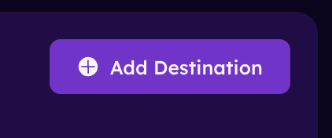

### Space users

Use **Space Users** to notify users who belong to the current Orb space.

You can send alerts to:

- All users in the space
- Selected users only

When selecting individual users, choose at least one user before creating the destination.

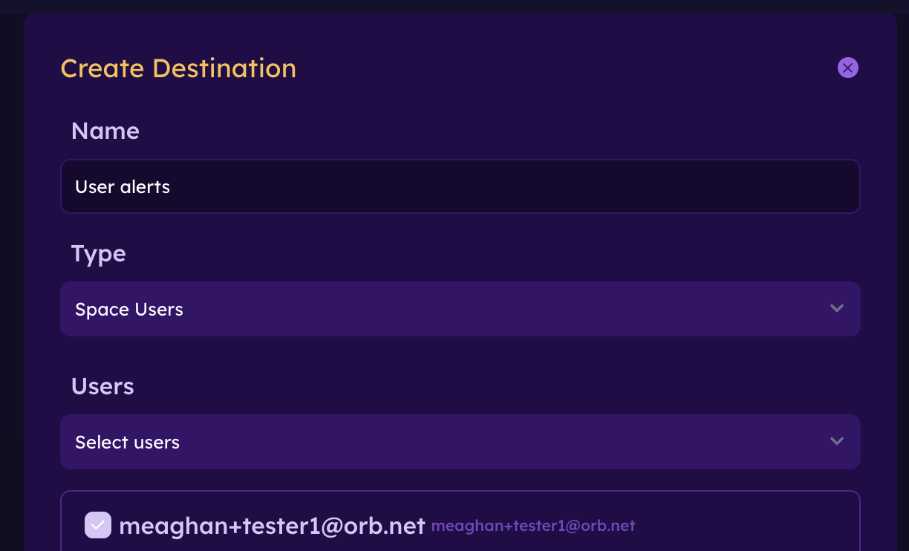

### Email

Use **Email** to send alerts to a specified email address.

This can be useful for:

- A shared operations inbox
- A help desk
- An external team member
- An alert-processing service

### Webhook

Use **Webhook** to send event information to another application or service.

Webhooks can be used to integrate Orb alerts with:

- Incident-management systems
- Automation platforms
- Internal dashboards
- Custom applications
- Other monitoring workflows

Enter the destination URL and any required configuration.

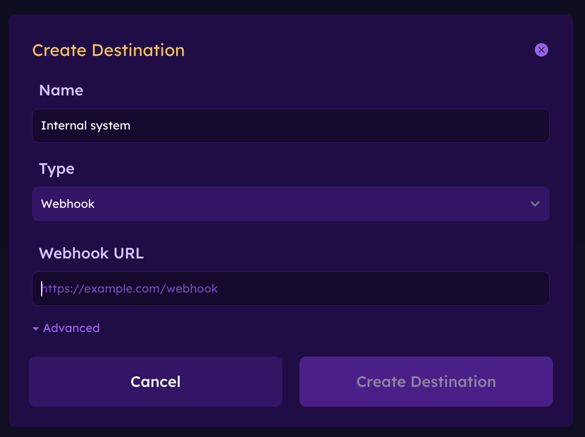

#### Webhook advanced settings

Advanced webhook settings allow you to include custom headers and values required by the receiving service.

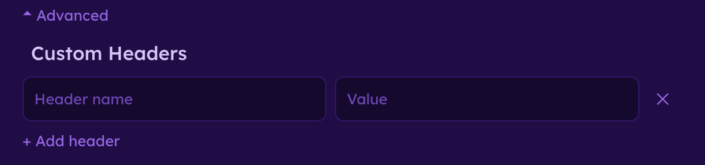

### Slack

Use **Slack** to send alerts to a Slack destination, such as an operations or support channel.

Follow the prompts in Orb Cloud to connect and configure the destination.

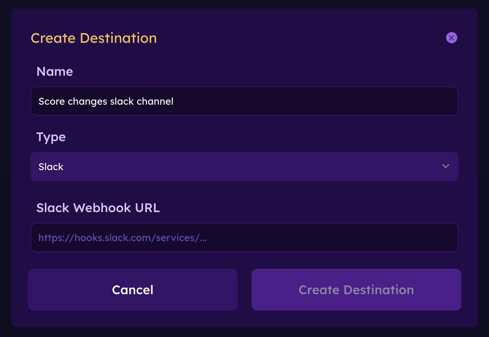

### Microsoft Teams

Use **Microsoft Teams** to send alerts to a Teams channel or workflow.

Follow the prompts in Orb Cloud to configure the destination.

### Manage existing destinations

From the **Destinations** tab, you can review and manage the destinations available to the current space.

Changes to a destination affect rules that use that destination.

## Create and manage filters

Filters create reusable groups of Orbs based on selected attributes. They can be used to target rules without selecting each Orb individually.

For example, you might create filters for:

- Orbs at a particular location
- Orbs connected to a specific network
- Orbs running a selected operating system
- Orbs with a particular tag
- Orbs with a selected status or score condition

### Create a filter

To create a filter:

1. Open the **Filters** tab.
2. Select **Create Filter**.
3. Enter a descriptive name.
4. Expand a criterion.
5. Configure the required values.
6. Add any additional criteria.
7. Select **Create Filter**.

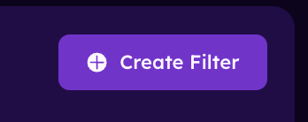

Available criteria include:

- Orb Score
- Orb Name
- Status
- Location
- Network
- Operating System
- Tags

A filter may contain multiple criteria. Only Orbs matching the configured criteria are included.

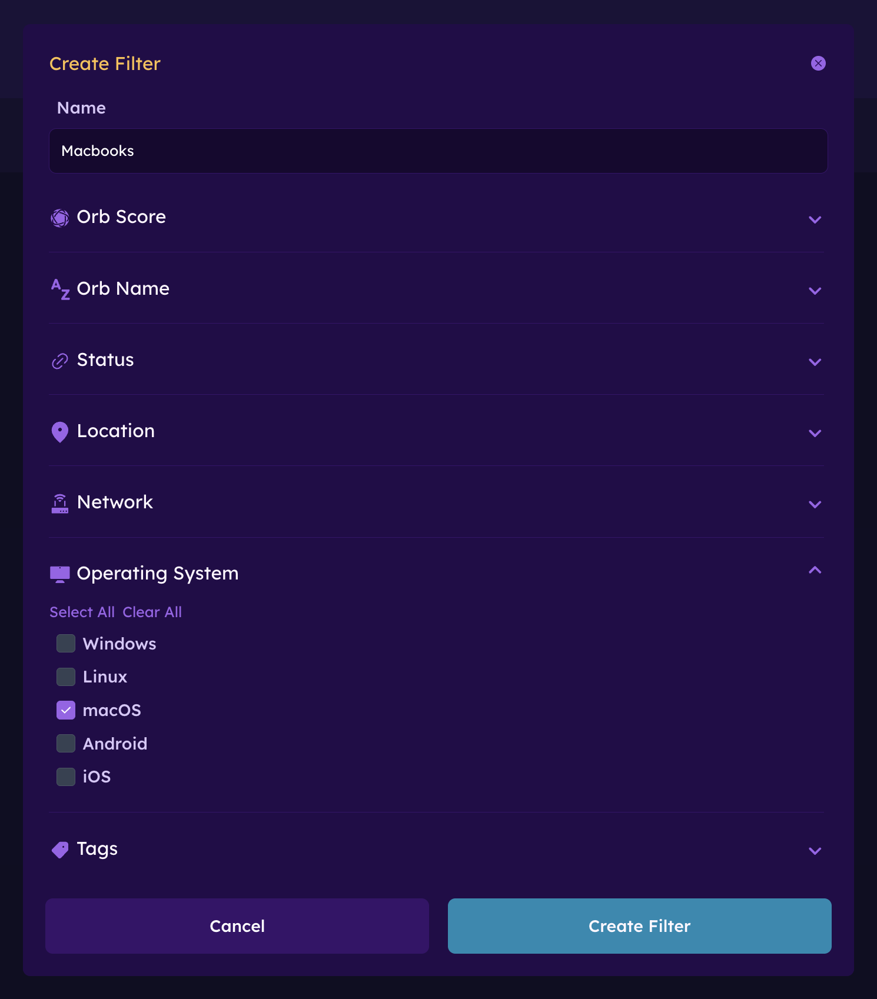

### Use a filter in a rule

After creating a filter:

1. Open the "Rules" tab.
2. Create a new rule or edit an existing rule.
3. Select the filter as the rule's target.
4. Complete the remaining rule settings.
5. Save the rule.

When the Orbs matching the filter change, the rule's target group updates automatically.

### Manage existing filters

The **Filters** tab displays each filter and its criteria.

From this page, you can:

- Review the criteria used by a filter
- Edit a filter
- Delete a filter
- Create additional filters

Before deleting a filter, review whether it is being used by any active event rules.

## Troubleshooting

### A rule is not creating events

If a rule is not creating expected events:

1. Confirm that the rule is enabled.
2. Verify that the correct Orb or filter is selected as the target.
3. Review the selected field, condition, and threshold.
4. Check whether the condition remained true for the configured period.
5. Review the cooldown setting.
6. Confirm that the targeted Orbs are online and reporting data.

### Events appear, but alerts are not received

If an event appears in the timeline but no alert is received:

1. Confirm that a destination is selected in the rule.
2. Verify the destination's configuration.
3. Confirm that the selected space users or email addresses are correct.
4. Check spam or filtered email folders.
5. Verify the Slack, Microsoft Teams, or webhook connection.
6. Review the receiving service for errors or rejected requests.

### A filter does not include the expected Orbs

If an Orb is missing from a filter:

1. Review each criterion configured in the filter.
2. Confirm that the Orb's current attributes match those criteria.
3. Check the Orb's name, status, location, network, operating system, and tags.
4. Edit the filter if its criteria are too restrictive.

## Next steps

Learn more about:

- [Orb Cloud Analytics](/docs/orb-cloud/analytics)
- [Orb scores and metrics](/docs/orb-app/orb-scores-metrics)
- [Managing users](/docs/orb-cloud/manage-users)
- [Orb settings](/docs/orb-app/orb-settings)
