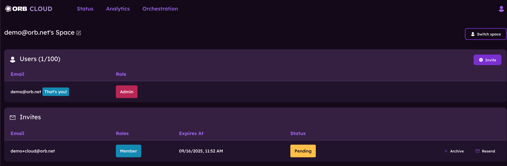

# Manage users

This guide will help you get started with managing your Orb space and users. To access the user management page, tap on the profile icon in the top right corner of the Orb Cloud dashboard and select "Manage users" from the dropdown menu.

## Switch spaces

If you are part of multiple Orb spaces, you can switch between them by clicking "Switch space" in the top right corner of the Manage users page. This will open a dropdown menu where you can select the space you want to manage.

## Editing space name

To edit the name of your Orb space, click on the pencil icon next to the current space name at the top of the Manage users page. This will allow you to enter a new name for your space. Once you've entered the new name, click "Save" to update it.

## Invite new users to your space

Tapping on the "Invite" button will open a dialog box where you can enter the email address of the user you want to invite. You can also select their role (Admin, Member) from the dropdown menu. Once you've entered the email and selected the role, tap "Invite" to send the invitation.

Once the invite is sent, a record will appear in the "Invites" section of the Manage users page. You can resend the invite or archive it if needed. 

Once an invite is accepted, the user will appear in the "Users" section of the Manage users page.

## Editing or removing existing users

To edit a user's role or remove them from your space, use the "Remove" or "Edit" buttons next to each user in the "Members" section to manage existing users.

Learn more about [Orb Status](/docs/orb-cloud/status). 
Learn more about [Orb Analytics](/docs/orb-cloud/analytics). 
Learn more about [Orb Deployment & Configuration](/docs/deploy-and-configure).
