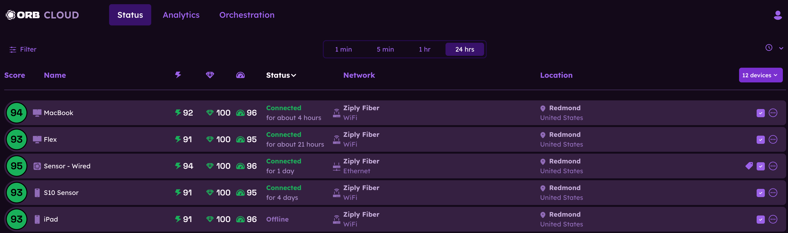
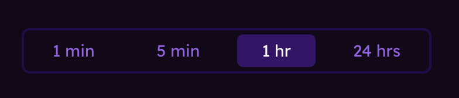
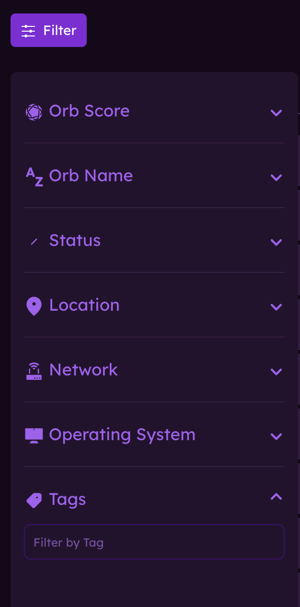
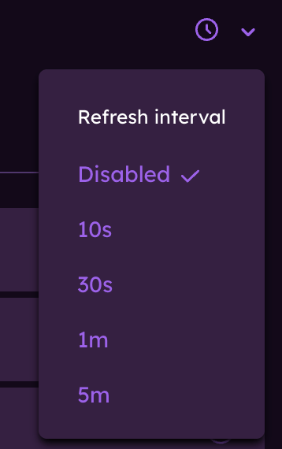
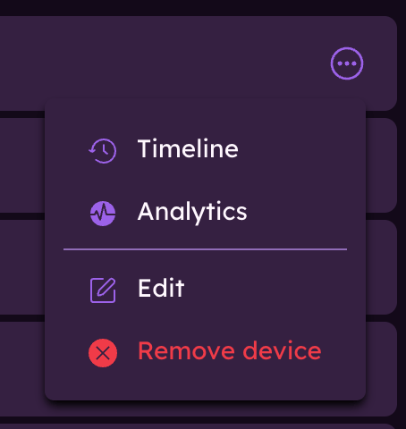

# Status

This guide will help you get started with using the Orb Cloud dashboard to view the status of your Orbs. The Status module is the heart of the Orb Cloud dashboard, providing a comprehensive overview of all Orbs linked to your account.

## Changing the timeframe

To view Orb data for the last 1 minute, 5 minutes, 1 hour, or 24 hours, use the timeframe selector at the top of the Orbs page.

## Sorting Orbs

Tapping on the following column headers will sort the Orbs list by that column:
- **Score**: Sorts Orbs by their Orb Score, from highest to lowest or from lowest to highest.
- **Name**: Sorts Orbs alphabetically A-Z or Z-A by name.
- **Responsiveness, Reliability, Speed**: Sorts Orbs by performance category score, from highest to lowest or from lowest to highest.
- **Status**: Sorts Orbs by their current status (Connected, Offline, Connecting).

## Filtering Orbs

Tapping on any of the following filter options will filter the Orbs list:
- **Connected**: Filters Orbs that are currently connected.
- **Offline**: Filters Orbs that are currently offline.
- **Connecting**: Filters Orbs that are currently connecting.
- **ISP**: Filters Orbs connected to a specific Internet Service Provider (ISP). 
- **Network Type**: Filters Orbs connected via a specific network type (e.g., WiFi, Wired LAN, Cellular).
- **Location**: Filters Orbs located in a specific area.
- **Device Type**: Filters Orbs of a OS type (e.g., Android, iOS, Windows, macOS, Linux).

Alternatively, you can tap on the filter icon in the top left corner to open the filter menu. Here, you can select multiple filters to apply to the Orbs list.

- **Orb Score**: Filter Orbs by their Orb Score, selecting a range from 0 to 100.
- **Orb Name**: Filter Orbs by their name, using a search bar to enter keywords.
- **Status**: Filter Orbs by their current status (Connected, Offline)
- **Location**: Filter Orbs by their location, using the search bar to enter a specific city or state. Use the dropdown to select a country.
- **Network**: Filter Orbs by their network type (e.g., Wifi, Ethernet, Cellular, etc.) or use the search bar to enter a specific ISP name.
- **Operating System**: Filter Orbs by their operating system type (e.g., Android, iOS, Windows, macOS, Linux).
- **Tag**: Filter Orbs by tags assigned to them, using the search bar to enter specific tags.

Once your filters are set, tap the "Apply Filters" button to update the Orbs list. You can clear all filters by clearing the filter options at the top of the Orbs list.

## Refresh interval

Tap on the clock icon to change your refresh interval. You can choose from the following options:
- **Disabled**
- **10 seconds**
- **30 seconds**
- **1 minute**
- **5 minutes**

## Orb menu and options

Click on the three dots icon on the right side of any Orb listed to open the Orb menu. Here, you can access the following:
- **Timeline**: Opens a detailed timeline view of the Orb's status over time.
- **Analytics**: Opens the analytics view for the Orb, showing Orb and sub-scores over the time selected. More advanced analytics are available in our paid subscription plans.
- **Edit**: Allows you to edit the name, add or remove tags, and change the Orb's configuration.
- **Remove device**: Permanently removes the Orb from your account.

Learn more about [Managing users](/docs/orb-cloud/manage-users). 
Learn more about [Orb Analytics](/docs/orb-cloud/analytics). 
Learn more about [Orb Deployment & Configuration](/docs/deploy-and-configure).
