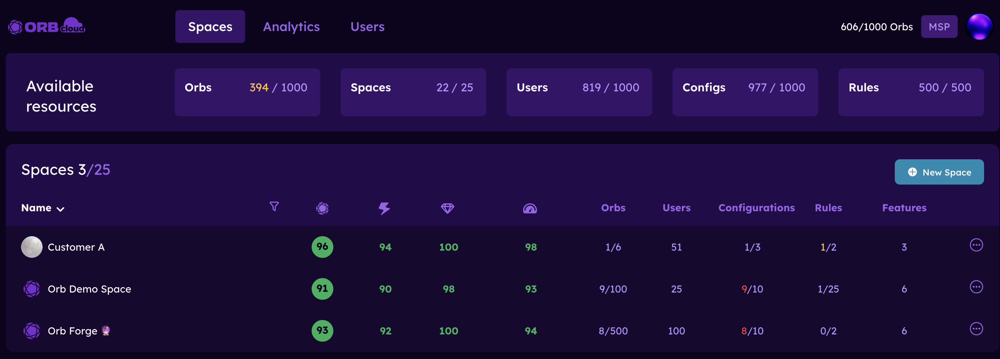
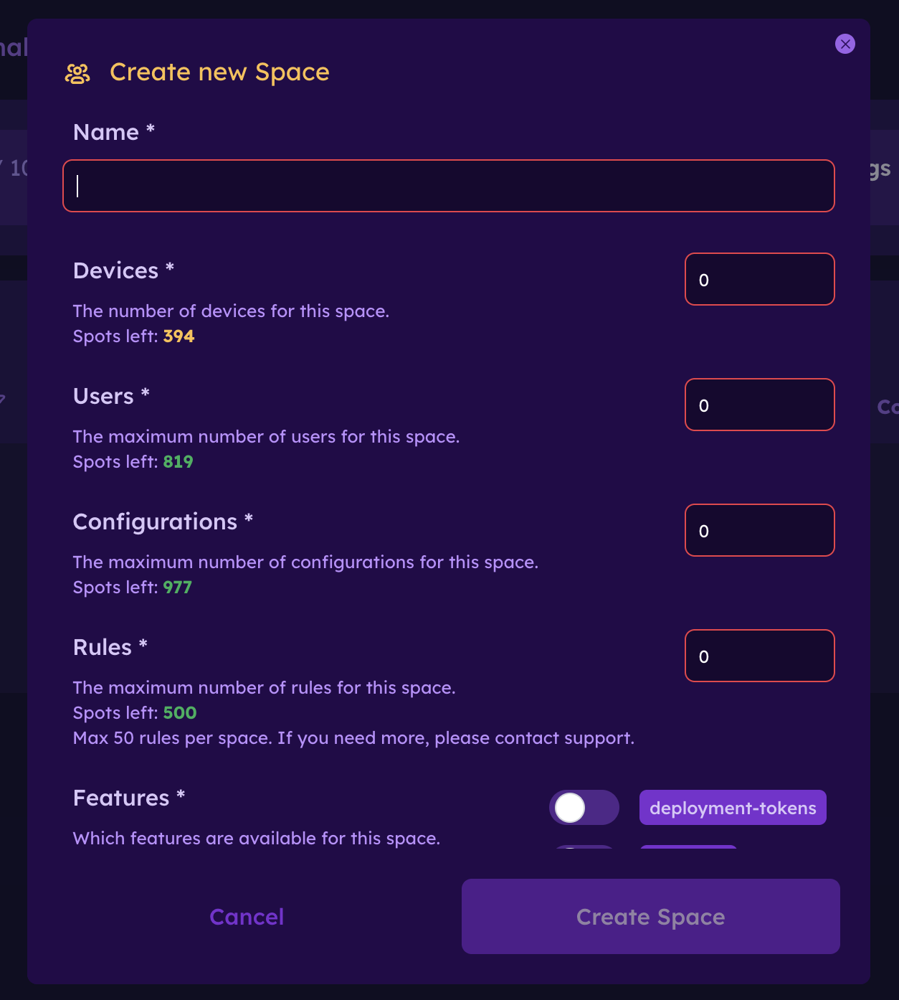

# Subspace Management

Subspace Management allows organizations to divide their Orb Cloud environment into multiple spaces for easier management, access control, analytics, alerting, and resource allocation.

This is especially useful for Managed Service Providers (MSPs), distributed IT teams, and larger organizations that want to organize Orbs by customer, building, team, region, department, or site.

::: info
Subspace Management is available for organizations that need multi-tenant management, delegated access, or space-level resource controls.

Interested in subspaces? Reach out to [Orb](https://orb.net/contact) to start a conversation.
:::

## Overview

Subspaces provide a multi-tenant management layer inside Orb Cloud. Each space can have its own Orbs, users, configurations, rules, alerts, and enabled features.

For example, an MSP may create one space for each customer. A school district may create one space for each campus. A company may create spaces for different offices, buildings, departments, or operational teams.

Subspace Management allows administrators to:

1. Create and manage multiple spaces.
2. Assign users to one or more spaces.
3. Limit user access to only the spaces they need.
4. Allocate Orb, user, configuration, and rule limits per space.
5. Enable or disable features per space.
6. Create rules and alerts scoped to a specific space.
7. View analytics and status information by space.

## Common use cases

Subspaces can be used in several ways depending on how your organization manages Orbs.

### MSP customer management

MSPs can create a separate space for each customer. This helps keep customer data, users, configurations, and alerts separated while still allowing the MSP to manage everything from a shared Orb Cloud environment.

### Multi-site organizations

Organizations with multiple buildings, offices, stores, schools, or clinics can create a space for each location. This makes it easier to compare performance, assign local admins, and manage site-specific alerting.

### Team or department isolation

Larger organizations can create spaces for different teams or departments. Each team can manage its own Orbs and users without needing access to the entire organization.

### Configuration and feature control

Admins can use spaces to control which features, configurations, and event rules are available to different groups of Orbs.

## Accessing Subspace Management

To access Subspace Management:

1. Sign in to Orb Cloud.
2. Select "Spaces" from the top navigation.
3. Review the available resources summary at the top of the page.
4. Use the spaces table to view, create, edit, or manage existing spaces.

The Spaces page includes a summary of available resources, including Orbs, Spaces, Users, Configurations, and Rules.

The spaces table shows each space, current score information, allocated Orbs, users, configurations, rules, and enabled features.

## Creating a space

To create a new space:

1. Go to Orb Cloud.
2. Select "Spaces" from the top navigation.
3. Click "New Space".
4. Enter a **Name** for the space.
5. Set the maximum number of **Devices** allowed for the space.
6. Set the maximum number of **Users** allowed for the space.
7. Set the maximum number of **Configurations** allowed for the space.
8. Set the maximum number of **Rules** allowed for the space.
9. Select which **Features** should be available for the space.
10. Click "Create Space".

The available resource counters show how many spots are left for each resource type. For example, if your overarching space has 394 Orb spots left, the new space can only be allocated up to that remaining amount.

Note: Space limits are allocated from the resources available to the overarching space. If there are no remaining spots for a resource type, you must adjust another space or contact Orb support before allocating more.

## Adding users to a space

Users can be granted access to one space or multiple spaces.

To add an existing user to a space:

1. Go to Orb Cloud.
2. Select "Spaces".
3. Navigate to the space you want to manage.
4. Open the profile menu in the top right corner.
5. Select "Users".
4. Click "Invite".
5. Enter the user’s email address.
6. Select the appropriate role.
7. Send the invitation.

Once added, the user will only see and manage the spaces they have access to, unless they also have access to the overarching space or additional subspaces.

## Creating users in the managing space

To add users to the managing or overarching space:

1. Go to Orb Cloud/Spaces.
2. Open the profile menu in the top right corner.
3. Select "Users".
4. Click "Invite".
5. Enter the user’s email address.
6. Select the appropriate role.
7. Send the invitation.

After the user accepts the invitation, they will have access to the managing space and all sub-spaces.

Note: users with access to the managing space may have broader visibility than users assigned only to specific subspaces. Review user roles carefully before granting access.

## Editing a space

To edit an existing space:

1. Go to Orb Cloud.
2. Select "Spaces".
3. Find the space you want to update.
4. Open the options menu for that space (... menu).
5. Select "Edit".
6. Update the space name, limits, features, or other settings.
7. Save your changes.

Editing a space can be used to increase or decrease allocated resources, change which features are enabled, or update the space name.

Warning: reducing limits may affect your ability to add more Orbs, users, configurations, or rules to that space. If a space is already using more resources than the new limit allows, you may need to remove resources before the lower limit can be applied.

## Managing space limits

Each space can have its own limits for:

1. Orbs or devices
2. Users
3. Configurations
4. Rules

These limits help administrators control how resources are distributed across teams, customers, or sites.

For example, an MSP may allocate:

1. 100 Orbs to Customer A
2. 50 Orbs to Customer B
3. 10 users to each customer space
4. A specific number of configurations and rules based on the customer’s plan or service tier

Limits can be adjusted as customer needs change.

## Enabling features for a space

When creating or editing a space, admins can choose which features are available for that space.

Available features may include options such as:

1. Deployment tokens
2. Analytics

To enable or disable features:

1. Open the space create or edit dialog.
2. Scroll to "Features".
3. Toggle the desired features on or off.
4. Save the space.

Feature availability may depend on your Orb Cloud plan and the features enabled for the overarching/managing space.

## Adding rules for a space

Rules allow you to create event logic or alerts scoped to a specific space.

To add a rule for a space:

1. Go to Orb Cloud.
2. Select the space you want to manage.
3. Navigate to "Rules" in the space menu.
4. Create a new rule.
5. Define the conditions for the rule.
6. Choose who should be notified.
7. Save the rule.

Rules created for a subspace apply only to that space. This allows different teams, customers, or sites to have their own alerting logic.

For example:

1. An MSP can configure customer-specific alerts for each customer space.
2. A school district can create different alert rules for each campus.
3. An enterprise team can send site-specific alerts to local IT owners.

Tip: Use space-level rules to reduce notification noise. Instead of sending every alert to every admin, route alerts to the users responsible for that specific space.

## Viewing and analyzing spaces

The Spaces page provides a high-level view of all spaces you can access.

From the spaces table, you can review:

1. Space name
2. Orb Score
3. Responsiveness
4. Reliability
5. Speed
6. Orb allocation and usage
7. User count
8. Configuration usage
9. Rule usage
10. Enabled features

This makes it easier to compare performance across customers, buildings, departments, or teams.

To analyze a specific space:

1. Go to Orb Cloud/Spaces.
2. Select the space you want to review.
3. Open the relevant analytics, status, configuration, or rules view.
4. Review the Orbs and data scoped to that space.

## Best practices

### Create spaces around operational ownership

Use spaces to match how your team actually manages networks. For MSPs, this usually means one space per customer. For enterprises, this may mean one space per building, office, or department.

### Keep access narrow by default

Only grant users access to the spaces they need. This keeps customer data, internal teams, and operational areas separated.

### Use clear naming

Choose names that make spaces easy to identify, such as:

1. Customer name
2. Building name
3. Region or location
4. Department
5. Environment type

Examples:

1. `Customer A - Production`
2. `Seattle Office`
3. `District 12 - High School`
4. `Retail - Store 104`

### Allocate limits intentionally

Set resource limits based on expected usage. For MSPs, this can help align each customer space with their contract or service tier.

### Configure rules per space

Use space-specific rules so alerts go to the right people. This is especially helpful when different customers, sites, or teams have different response owners.

## Next Steps

Now that you've configured your subspaces, learn more about:

- [Events & Alerts](/docs/orb-cloud/events-alerts.md)
- [Analytics](/docs/orb-cloudp/analytics.md)
- [Deployment & Configuration](/docs/deploy-and-configure/README.md)
