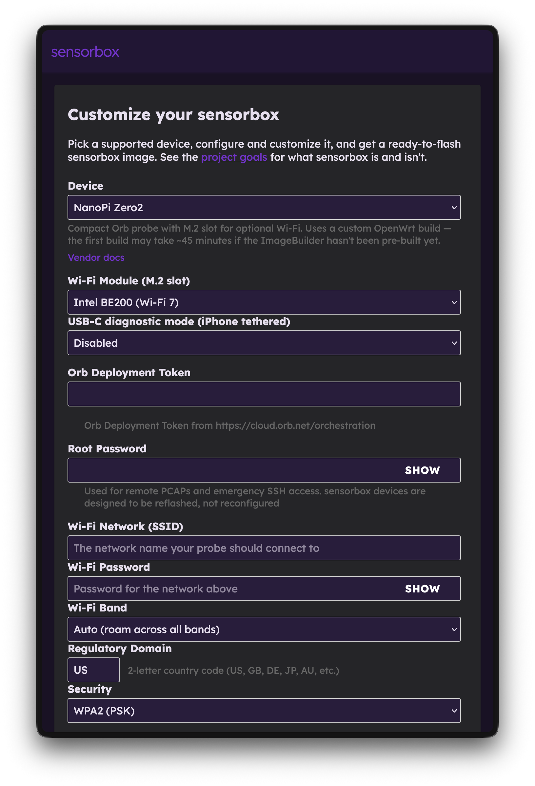

# Sensorbox

Sensorbox is a self-hosted system for building OpenWrt-based Orb sensor images. You run a small web app locally, pick a supported device, provide your Wi-Fi credentials, and customize your install. The result is an SD-card (or eMMC) image that boots into a dedicated, always-on Orb sensor — ready to continuously monitor your network experience.



:::note
Sensorbox is currently in **beta**.
:::

## What you'll need

- A supported single-board computer or router (see the [NanoPi Zero2 hardware build](/docs/sensorbox/nanopi-zero2.md) for a worked example).
- A computer to run Sensorbox and flash the resulting image. The setup below is written for macOS and Linux.
- [Podman](https://podman.io/) and `podman-compose`. Sensorbox runs on Podman because ASU's build worker spawns one container per build via the Podman API — Docker is not a tested drop-in substitute.
- An SD card (or eMMC) and a way to flash it: [Raspberry Pi Imager](https://www.raspberrypi.com/software/), [balenaEtcher](https://etcher.balena.io/), or `dd`.

## Step 1: Clone the repository

Sensorbox uses git submodules, so clone recursively:

```bash
git clone --recurse-submodules git@github.com:orbforge/sensorbox.git
```

If you already cloned without `--recurse-submodules`:

```bash
git submodule update --init
```

## Step 2: Install Podman

### macOS

1. Install Podman and the compose wrapper:

   ```bash
   brew install podman podman-compose
   ```

   An optional GUI is available with `brew install --cask podman-desktop`.

2. Initialize and start the Podman VM. The resource bumps matter — ASU's ImageBuilder runs will run out of memory or disk on the defaults:

   ```bash
   podman machine init --cpus 4 --memory 8192 --disk-size 100
   podman machine start
   podman info   # sanity check
   ```

   :::note
   `--disk-size 100` is a VM ceiling, not preallocated storage. ASU upstream recommends 50 GB minimum, and caches grow over time.
   :::

3. After reboots or Podman upgrades, restart the VM:

   ```bash
   podman machine start
   ```

### Linux

Install `podman` and `podman-compose` from your distribution, then enable the user socket so the ASU worker can reach it:

```bash
systemctl --user enable --now podman.socket
```

No VM is needed — Podman runs natively.

### Windows

Not yet validated. Podman Desktop supports Windows via WSL2; expect a flow similar to macOS.

## Step 3: Configure

Copy the example environment file:

```bash
cp .env.example .env
```

Edit two values in `.env`:

- **`PUBLIC_PATH`** — set to the absolute path of the `public` directory inside your clone, for example `/Users/<you>/<path-to>/sensorbox/public` on macOS or `/home/<you>/<path-to>/sensorbox/public` on Linux. Then create the subdirectories it expects:

  ```bash
  mkdir -p "$PUBLIC_PATH"/{store,logs}
  ```

- **`CONTAINER_SOCKET_PATH`** — run the command below and paste the result (dropping the `unix://` prefix):

  ```bash
  podman info --format '{{.Host.RemoteSocket.Path}}'
  ```

Leave everything else at its default.

## Step 4: Run the stack

From the repository root:

```bash
podman-compose up -d
```

Open <http://localhost:8080/> in your browser, select your device, and configure your install. The first run pulls the ASU image and builds the `openwrt-builder` image, which takes a few minutes. Subsequent runs are fast.

:::note
Devices that aren't in the latest stable OpenWrt release have to be compiled from source, which can take a while for the initial build — around 35 minutes on an M1 MacBook Pro. After that, builds are fast.
:::

When the build finishes, the download section provides flashing instructions specific to your device. You can flash the image with Raspberry Pi Imager, balenaEtcher, or `dd`. On macOS, there is a helper script at `scripts/flash-sd.sh`.

Tear the stack down when you're done:

```bash
podman-compose down
```

## Recipes

Sensorbox uses YAML "recipes" to power the web-based configurator, inject settings, install packages, and create scripts. See the recipes README in the repository for details on writing your own.

## Hardware builds

- [NanoPi Zero2](/docs/sensorbox/nanopi-zero2.md) — a small, low-cost dedicated sensor with optional eMMC storage and Wi-Fi 7.
