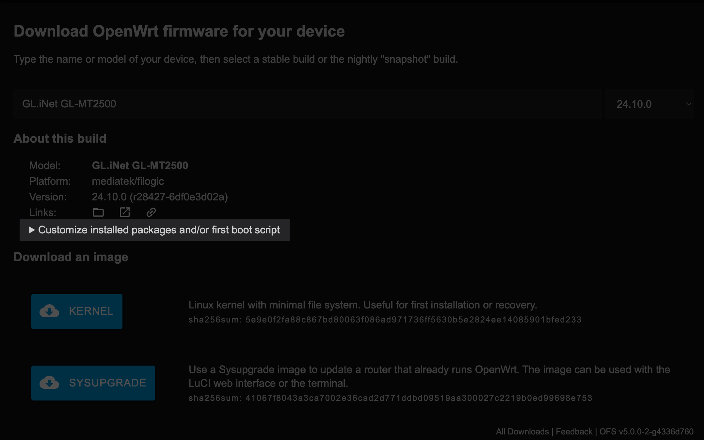
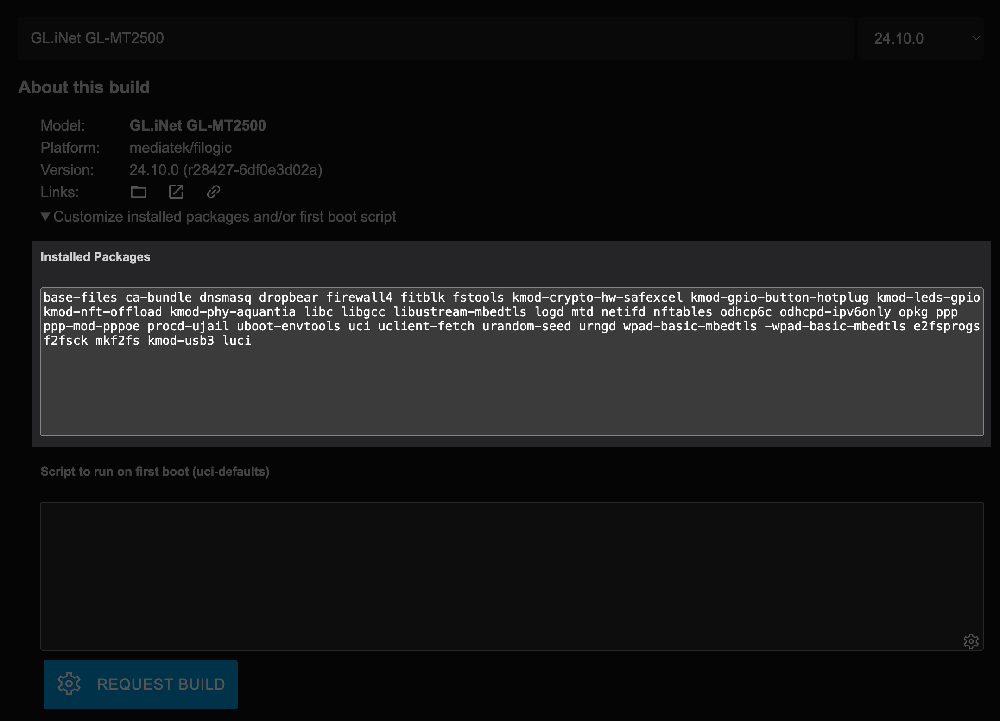
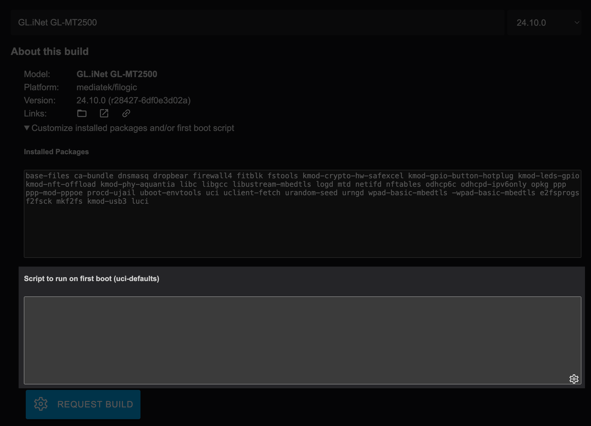
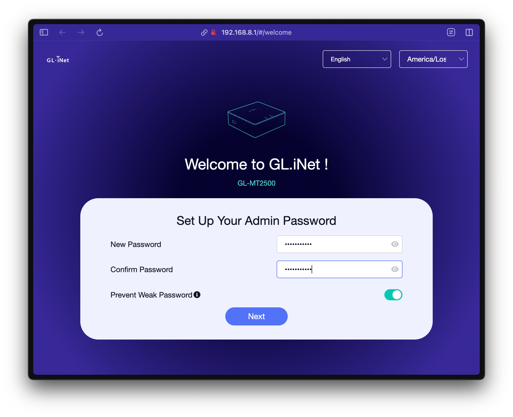
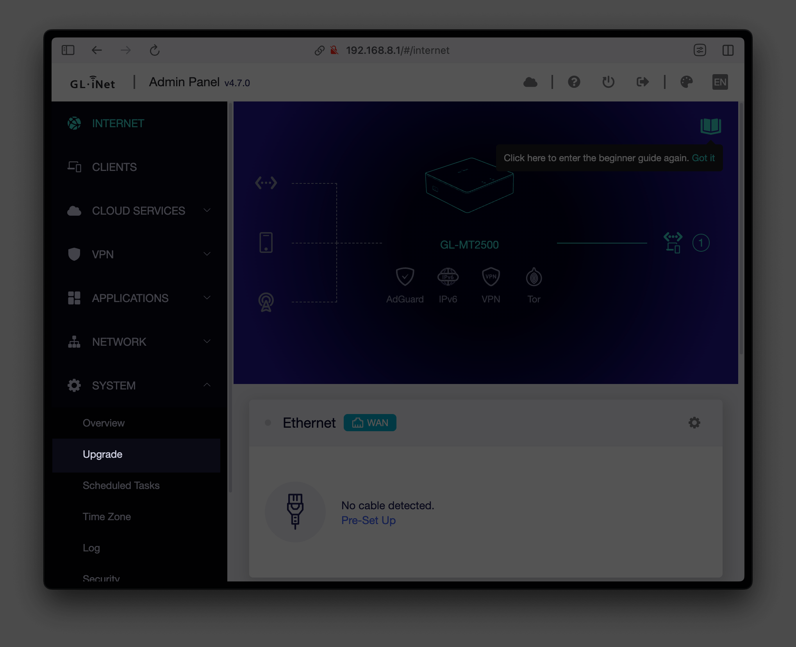
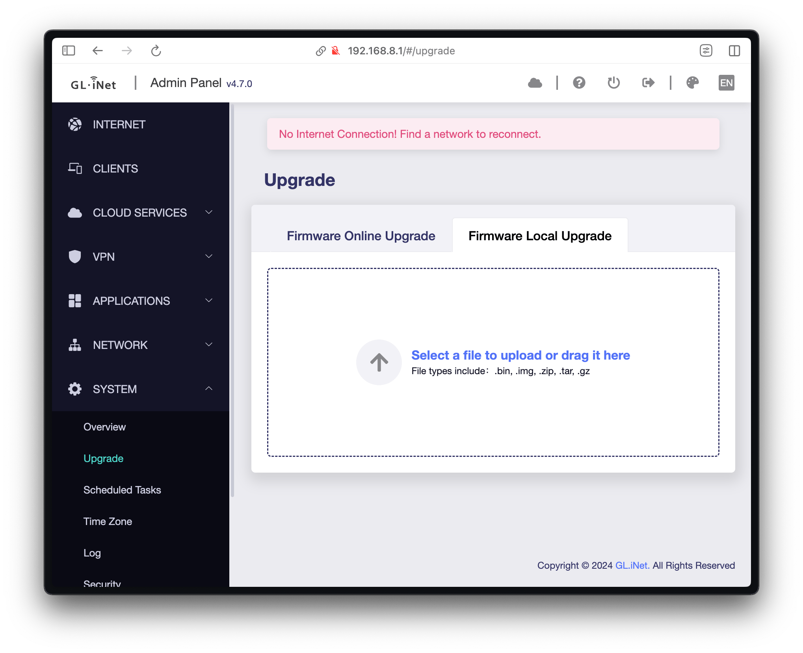
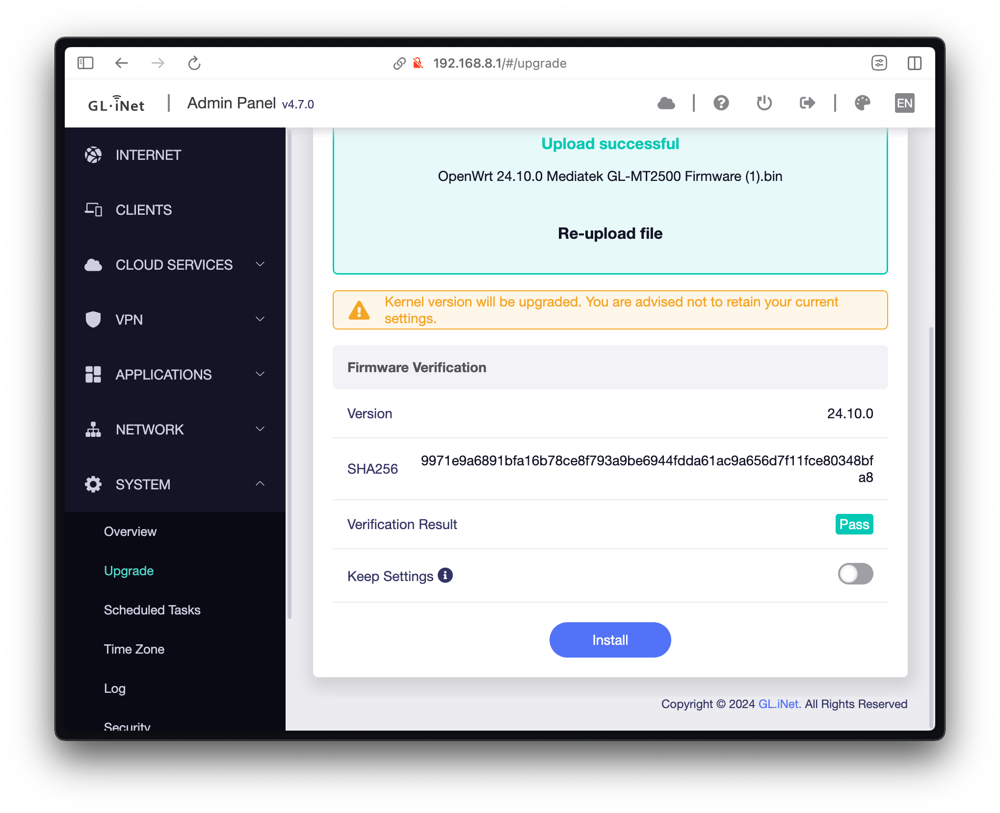
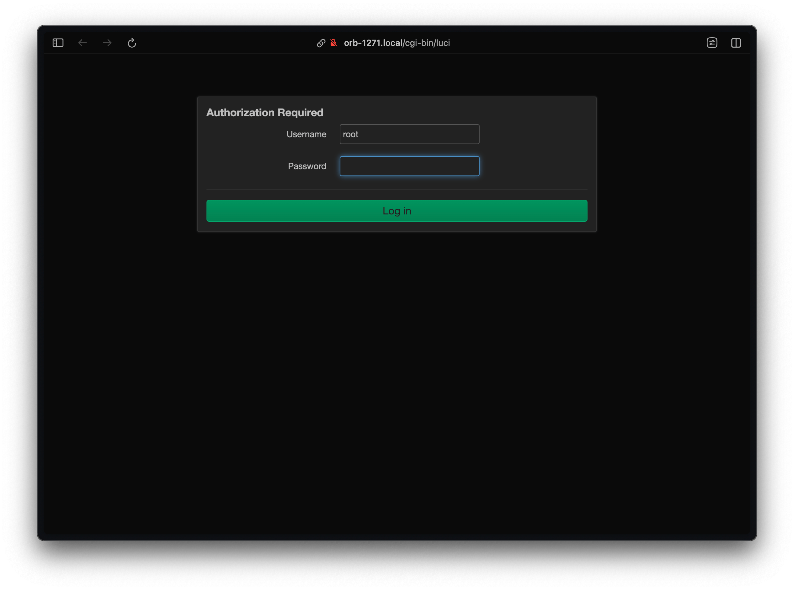
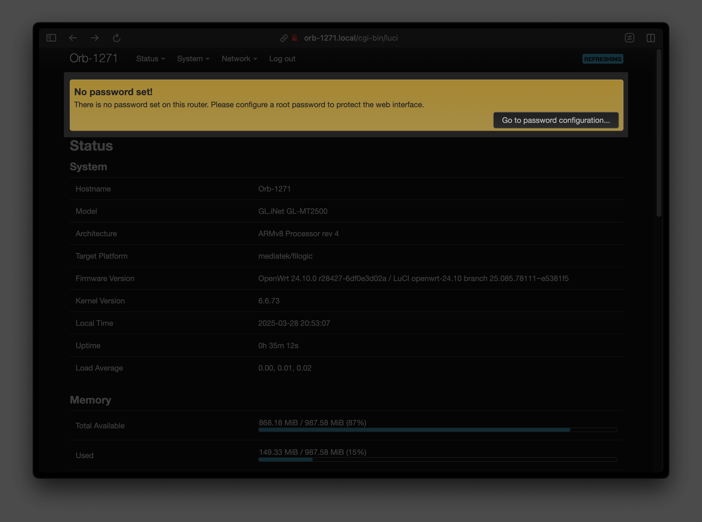

# Converting a GL.iNet Brume 2 into a Standalone Orb

## Introduction

The GL.iNet [Brume 2](https://www.gl-inet.com/products/gl-mt2500/) (GL-MT2500 and GL-MT2500A) is a VPN Gateway - essentially a well-equipped tiny computer that's perfect for running as a standalone Orb device!

This guide will walk you through flashing a new firmware image with Orb pre-installed, which will allow you to plug the Brume 2 into an open ethernet port on your router, a network switch, or a mesh unit to continuously monitor your network. If you already have a Brume 2 set up as a VPN Gateway, router, or Pi Hole and wish to retain the stock firmware, a separate guide for that option is coming soon.

## Equipment Needed

Before you begin, make sure you have:

- GL.iNet Brume 2 (model GL-MT2500 or GL-MT2500A)
- 2 ethernet cables (note: the Brume 2 comes with one)
- An open ethernet port on your home router or network switch
- A personal computer with an ethernet port (or with a USB ethernet adapter)
- Power supply for the Brume 2 (included with the device)

## Step 1: Create your OpenWRT Image

The Brume 2 ships with the OpenWRT operating system, which is pre-configured with many features to act as a router, VPN gateway, and more. For this guide, we'll create a new OpenWRT image that installs the Orb sensor and configures the device to connect to your network as a monitoring device.

1. Visit the [OpenWRT Firmware Selector](https://firmware-selector.openwrt.org/?version=24.10.0&target=mediatek%2Ffilogic&id=glinet_gl-mt2500) for the Brume 2 GL-MT2500
2. Click "Customize installed packages and/or first boot script" to expand the customization options



3. In the "Installed Packages" text box, replace the contents with the following code exactly as shown:

```
base-files ca-bundle dropbear firewall4 fitblk fstools kmod-crypto-hw-safexcel kmod-gpio-button-hotplug kmod-leds-gpio kmod-nft-offload kmod-phy-aquantia libc libgcc libustream-mbedtls logd mtd netifd nftables odhcp6c odhcpd-ipv6only opkg ppp ppp-mod-pppoe procd-ujail uboot-envtools uci uclient-fetch urandom-seed urngd wpad-basic-mbedtls -wpad-basic-mbedtls e2fsprogs f2fsck mkf2fs kmod-usb3 luci avahi-daemon chrony
```



4. In the "Script to run on first boot (uci-defaults)" text box, paste in the following code exactly as shown:

```bash
#!/bin/sh

ARCHITECTURE=$(opkg info busybox | grep "Architecture" | awk '{print $2}')
URL="https://pkgs.orb.net/stable/openwrt/$ARCHITECTURE"
KEY_URL="https://pkgs.orb.net/stable/openwrt/key.pub"
KEY_PATH="/etc/opkg/keys/744a82bfef3c5690"
ORB_BINARY="/usr/bin/orb"

# Set hostname
RAND_NUM=$(echo $((RANDOM % 10000)))
uci set system.@system[0].hostname="Orb-$RAND_NUM"
uci commit system

# Create bridge interface for LAN and WAN
uci set network.lan.device='br-lan'
uci set network.lan.proto='dhcp'

# Configure bridge device
uci set network.@device[0]=device
uci set network.@device[0].name='br-lan'
uci set network.@device[0].type='bridge'
uci set network.@device[0].ports='eth0 eth1'
uci commit network

# Disable WAN interface
uci delete network.wan
uci delete network.wan6
uci commit network

# Restart network to apply changes
/etc/init.d/network restart
/etc/init.d/sysntpd restart

mkdir /overlay/orb
mkdir /.config
ln -s /overlay/orb /.config/orb

echo "src/gz orb_packages $URL"  | tee -a /etc/opkg/customfeeds.conf

# Create orb-setup service
cat << EOF > /etc/init.d/orb-setup
#!/bin/sh /etc/rc.common
START=99
BOOT=99

start() {
	logger -t "orb-setup" "Starting orb setup..."

	(
		while [ ! -f "$ORB_BINARY" ]; do
			logger -t "orb-setup" "Checking for orb binary..."

			while [ ! -f "$KEY_PATH" ]; do
				logger -t "orb-setup" "Key file not found, attempting to download..."

				# Try to download the key, suppress output
				if wget -q -O "$KEY_PATH" "$KEY_URL"; then
					logger -t "orb-setup" "Key downloaded successfully!"
				else
					logger -t "orb-setup" "Download failed, retrying in 10 seconds..."
					sleep 10
					continue
				fi
			done

			/bin/opkg update | logger -t "orb-setup"
			/bin/opkg install orb | logger -t "orb-setup"

			# If the orb binary is still not found, wait for 10 seconds and check again
			logger -t "orb-setup" "orb binary not found, checking again in 10 seconds..."
			sleep 10
		done

		logger -t "orb-setup" "orb binary found. Proceeding..."
		/usr/bin/orb-update install
		logger -t "orb-setup" "Installation successful, disabling script."
		/etc/init.d/orb-setup disable

	) &
}
EOF

chmod +x /etc/init.d/orb-setup
/etc/init.d/orb-setup enable
/etc/init.d/orb-setup start
```



5. Click the "REQUEST BUILD" button
6. Wait for the build process to complete. Once a green box with "Build successful" appears, click the "SYSUPGRADE" button
7. Download the .bin file to your computer. Remember where you saved it as you'll need it in Step 3

## Step 2: Connect the Brume 2 to your network and computer

Now we'll set up the physical connections for your Brume 2:

1. Identify the ports on your Brume 2. The device has two ethernet ports labeled "WAN" and "LAN"
2. Plug one ethernet cable into an open port on your home network router or switch
3. Connect the other end of this cable to the **WAN** port on the Brume 2
4. Plug a second ethernet cable into your computer's ethernet port (or USB ethernet adapter)
5. Connect the other end of this cable to the **LAN** port on the Brume 2
6. Connect the USB-C power adapter (included with your Brume 2) to the device
7. Plug the power adapter into a wall outlet or power strip
8. Wait for the light on the Brume 2 to stabilize (stop blinking rapidly), which indicates it's ready
9. On your computer, open a web browser and visit [http://192.168.8.1](http://192.168.8.1)

## Step 3: Flash the image

Now we'll install the custom OpenWRT image with Orb pre-installed:

1. When you visit http://192.168.8.1, the Brume 2 will display its setup page and prompt you to set a password
2. Create a password as instructed and proceed to the main dashboard



3. Dismiss the "Select Network Mode" prompt by clicking "Exit"


4. In the navigation menu to the left, expand "SYSTEM" and then click "Upgrade"



5. Click the "Firmware Local Upgrade" tab and then drag the .bin file you downloaded in Step 1 into the box



6. Ensure that the "Keep Settings" toggle remains in the "off" state. Click the "Install" button



7. You'll see a progress indicator - **DO NOT disconnect power during this process**
8. The device will automatically reboot when the upgrade is complete
9. Once the lights on the Brume 2 stop flashing and stabilize, unplug the ethernet cable from the LAN port (the one connected to your computer)
10. Open the Orb app on your phone or personal computer. Your new Orb should be automatically detected and ready to link to your account!

## Step 4: Set a root password

Now we'll set a root password for your new device for security purposes:

1. The new Orb in the Orb app will have a name in the format of "Orb-1234" (where 1234 is a random number)
2. To access the device's admin interface, open a web browser and visit http://orb-1234.local, replacing "1234" with the actual number shown in your Orb app
3. Click the "Log in" button without setting a password



4. You'll be prompted to set a root password for the device - this is important for security. Click "Go to password configuration..."



5. Create a strong password that you'll remember
6. Optionally, you can also change the hostname under System > System if you prefer a more personalized name to revisit the OpenWRT configuration page

Congratulations! You now have a standalone Orb device monitoring your network.

## Troubleshooting

### My device is unresponsive

Should you make a mistake and are no longer able to access your device, GL.iNet provides an excellent guide, including a video walkthrough, to [Debrick Your Router Using Uboot](https://docs.gl-inet.com/router/en/3/tutorials/debrick/).
