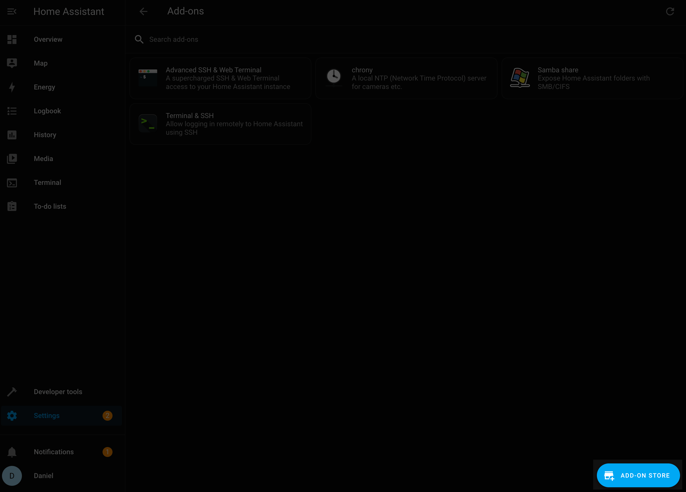
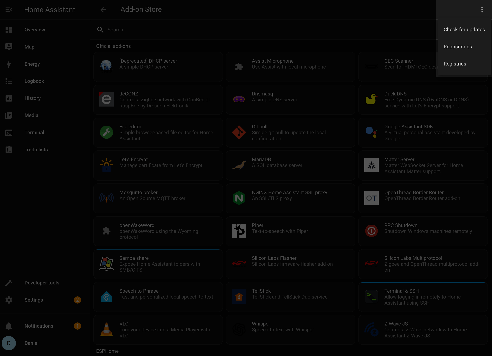
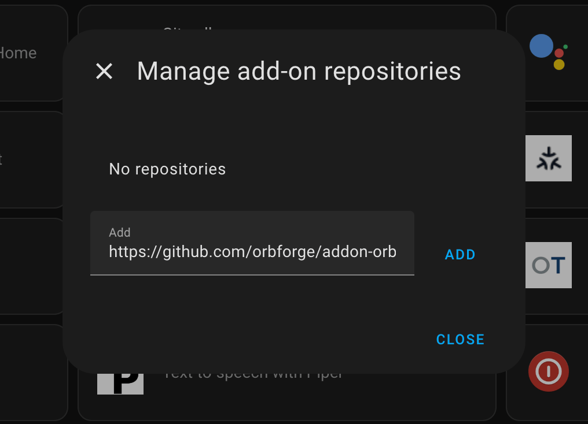
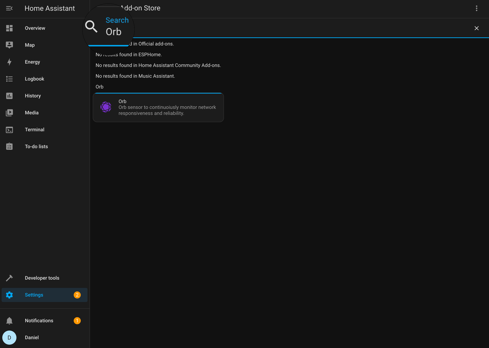
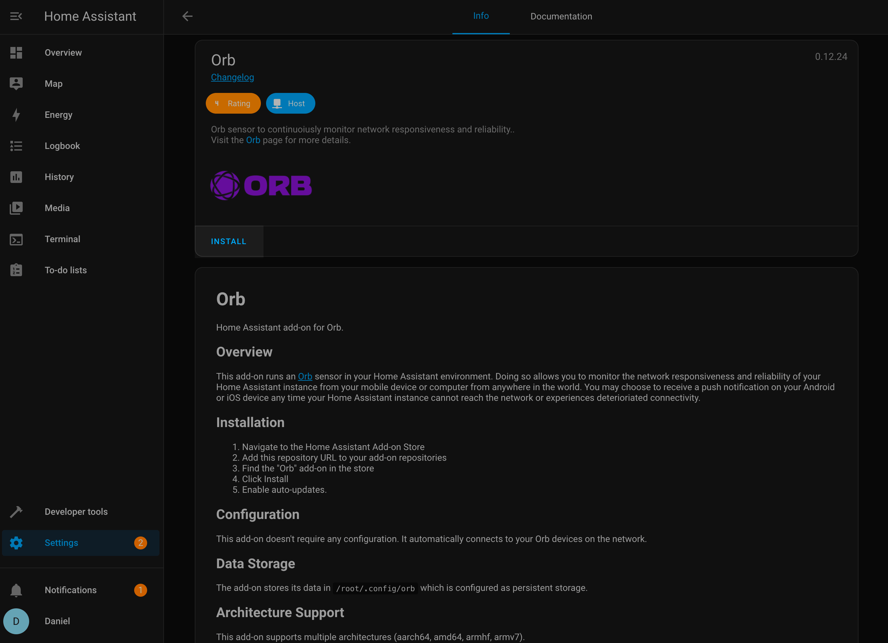
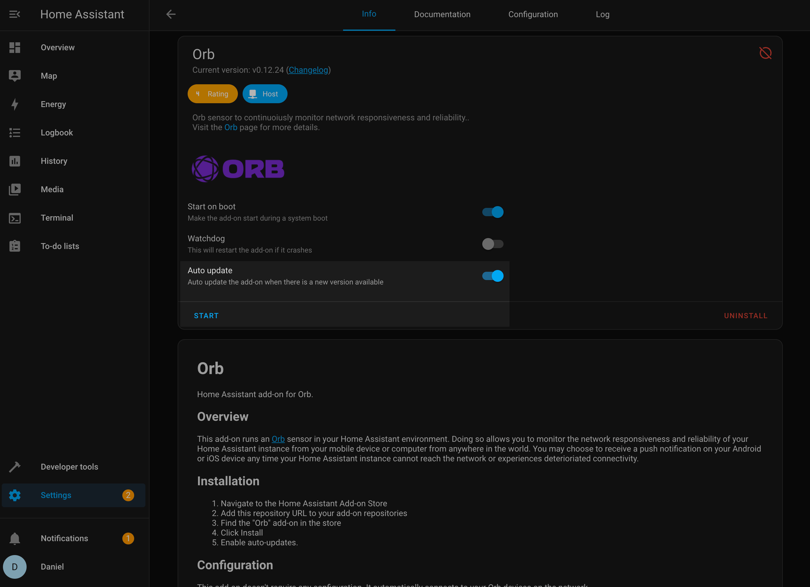

# Install Orb on Home Assistant

## Introduction

This guide will walk you through the process of setting up the Orb sensor as an add-on in your Home Assistant environment. The Orb add-on allows you to monitor the network responsiveness and reliability of your Home Assistant instance from anywhere in the world using your mobile device or computer.

With the Orb sensor running in Home Assistant, you can:

- Monitor your Home Assistant's network connectivity and performance
- Track network reliability and responsiveness over time
- Receive push notifications on your Android or iOS device when your Home Assistant instance experiences connectivity issues

## Prerequisites

Before you begin, make sure you have:

- A running Home Assistant instance with the Supervisor (Home Assistant OS, Supervised installation)
- Access to the Home Assistant dashboard
- The Orb app installed on your mobile device or computer (see [Install Orb](/docs/install-orb))
- Administrator access to your Home Assistant instance

## Step 1: Add the Orb Repository to Home Assistant

First, we need to add the Orb repository to your Home Assistant add-on store:

1. Open your Home Assistant dashboard
2. Navigate to **Settings** > **Add-ons** > **Add-on Store**



3. Click the menu icon (⋮) in the top-right corner
4. Select **Repositories**



5. Add the following URL to your repositories:
   ```
   https://github.com/orbforge/addon-orb
   ```



6. Click **Add**

## Step 2: Install the Orb Add-on

Now that you've added the repository, you can install the Orb add-on:

1. In the Add-on Store, type "orb" in the search bar or scroll to find the Orb add-on



2. Click on the "Orb" add-on
3. Click the **Install** button



4. Wait for the installation to complete (this may take a few minutes depending on your internet connection)

## Step 3: Configure and Start the Orb Add-on

After installation, you'll need to configure and start the add-on:

1. Once installation completes, toggle on **Start on boot** to ensure the add-on starts automatically when Home Assistant restarts
2. Toggle on **Auto update** to keep the add-on up to date with the latest features and security patches



3. Click the **Start** button to launch the Orb sensor
4. Wait a moment for the add-on to initialize

## Step 4: Link Your Orb to Your Account

The final step is to link your new Orb sensor to your account:

1. Open the Orb app on your mobile device or computer
2. Your new Orb sensor should be automatically detected on your local network
3. Follow the in-app prompts to link the sensor to your Orb account
4. Once linked, your Home Assistant Orb will appear in your Orb dashboard

## Troubleshooting

### Orb Add-on Not Appearing in the Store

If you cannot find the Orb add-on after adding the repository:

- Refresh your browser page
- Verify that you entered the repository URL correctly
- Check if your Home Assistant instance has internet access

### Orb Sensor Not Being Detected by the App

If your Orb sensor is not automatically detected by the app:

- Ensure that your mobile device or computer is on the same network as your Home Assistant instance
- Check that the add-on is running in Home Assistant
- Restart the add-on and try again
- Verify that there are no firewall rules blocking the discovery process

### Connectivity Issues

If your Orb sensor is reporting connectivity issues:

- Check your Home Assistant's internet connection
- Verify that your router is properly configured
- Ensure that your Home Assistant instance has proper DNS settings

For additional help, check the [GitHub repository](https://github.com/orbforge/addon-orb) for the latest updates and known issues.
