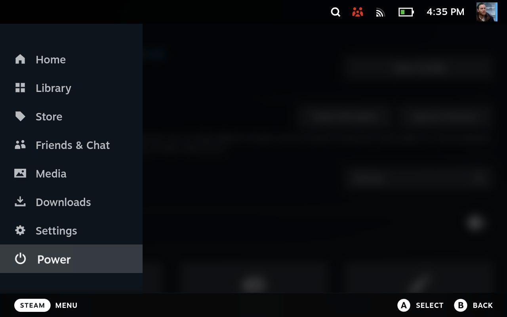
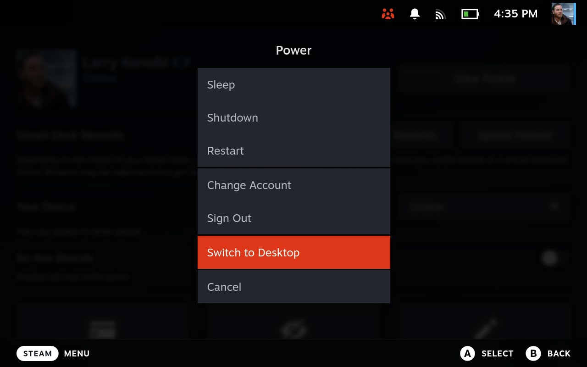
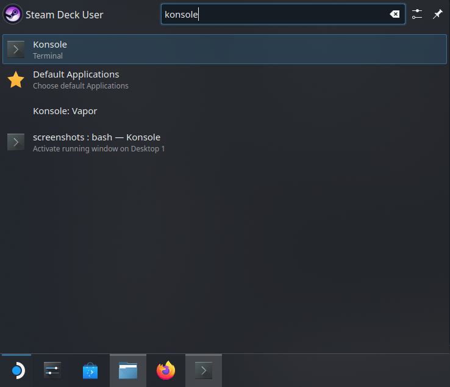
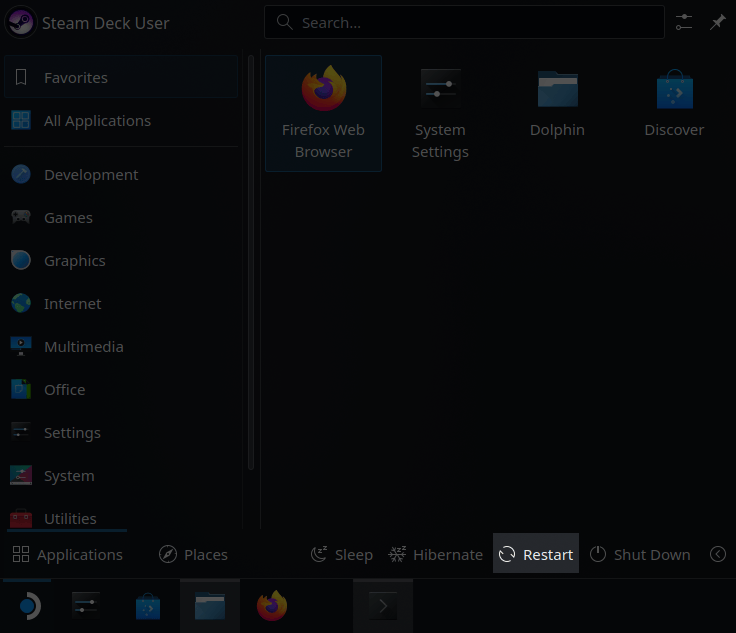

# Install Orb on Steam Deck

## Introduction

This guide walks you through installing the Orb sensor on your Steam Deck. This will allow you to monitor your Steam Deck's connectivity to the network from another device, even while you're playing or downloading a game!

## Step 1: Enter Desktop Mode

In order to install Orb on your Steam Deck, we'll need access to a terminal via Desktop Mode. If you already have access to a terminal via Decky, skip ahead to Step 2.

1. Press the STEAM button below the trackpad on the left side of the device.  
2. Select the "Power" option



3. Select "Switch to Desktop"



## Step 2: Install Orb

The device will now enter Desktop Mode. Once completed, we will need to open a terminal to enter a simple command.

1. Tap the Steam Deck icon in the lower-left-hand corner of the screen.

2. Press the STEAM button and X button at the same time to bring up the on-screen keyboard (or plug in a keyboard into the USB-C port).

3. Type "Konsole". You should see an app called "Konsole" selected.



4. Press the "Enter" key on the keyboard.

5. A terminal is now open. Enter the following command into the terminal exactly as shown and then press the "Enter" key on the keyboard:

```bash
curl -fsSL https://orb.net/docs/scripts/steam-deck/setup.sh | sh
```

You should see some text appear, ending in

```
🎉 Orb is installed and running as a sensor!
```

6. Open the Orb app on another device connected to the same network, and it will automatically be discovered. You will be prompted to link the Orb to your account.

Success!

## Step 3: Return to Gaming Mode

1. Tap the Steam Deck icon in the lower-left-hand corner of the screen.

2. Tap "Restart".



Your Steam Deck will now continuously run the Orb sensor, even after a reboot!
