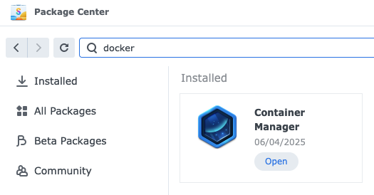
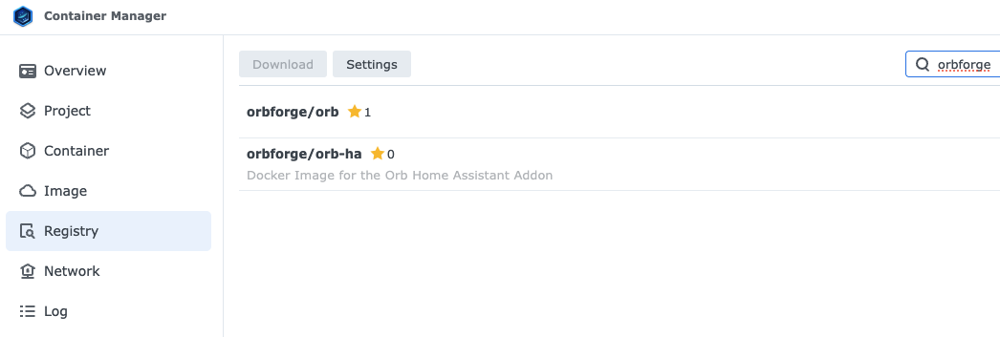
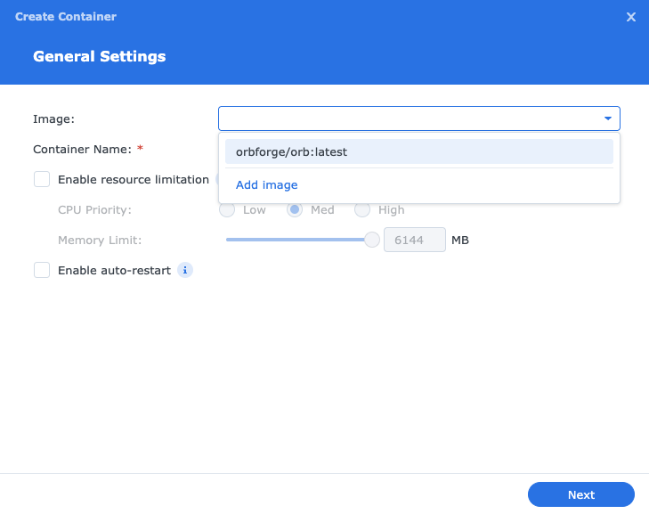
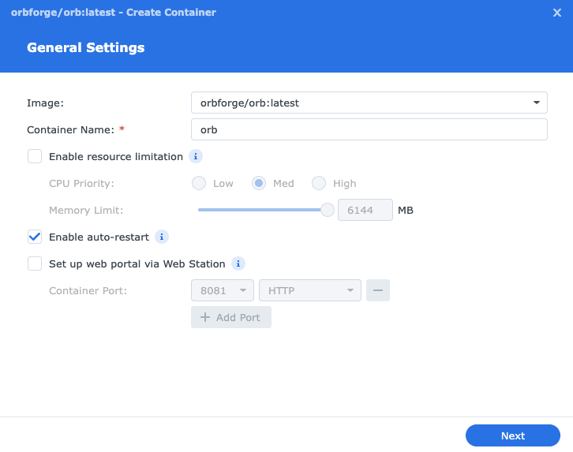
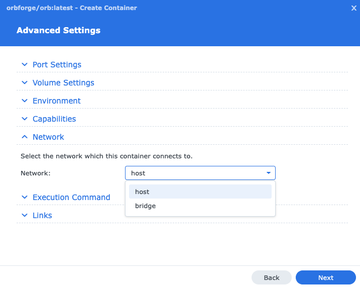

# Install Orb on Synology NAS

## Introduction

This guide will walk you through setting up the Orb sensor on your Synology NAS using Container Manager (previously known as Docker). The Orb sensor allows you to monitor your NAS's network connectivity and performance from anywhere in the world.

With the Orb sensor running on your Synology NAS, you can:

- Monitor your NAS's network connectivity and performance
- Track network reliability and responsiveness over time
- Receive push notifications when your NAS experiences connectivity issues

## Prerequisites

Before you begin, make sure you have:

- Container Manager installed (previously called Docker)
- Administrator access to your Synology NAS
- The Orb app installed on your mobile device or computer (see [Install Orb](/docs/install-orb))

## Step 1: Open Container Manager

First, we need to access the Container Manager application:

1. Open your Synology DSM interface in a web browser
2. Navigate to the **Package Center**
3. Search for and open **Container Manager** (previously called "Docker")

## Step 2: Add the Orb Image

Now we'll add the Orb container image to your NAS:

1. In Container Manager, click on **Registry** in the left sidebar
2. In the search bar, type "orbforge"
3. Select **orbforge/orb** from the search results
4. Click **Download** or the download icon

5. When prompted, select the **latest** tag and click **Select**

## Step 3: Create the Container

With the image downloaded, we can create the Orb container:

1. Click on **Container** in the left sidebar
2. Click the **Create** button
3. In the **Image** field, search for "orb" and select **orbforge/orb:latest**

## Step 4: Configure Container Settings

Configure the container with the following settings:

1. Give your container a name (e.g., "orb-sensor")
2. Enable **Auto-restart** to ensure the Orb sensor starts automatically when your NAS restarts

## Step 5: Configure Network Settings

The Orb sensor requires host network mode to function properly:

1. Click on **Advanced Settings**
2. Find the **Network** section
3. In the **Network** dropdown, select **Host**

4. Click **Next** to save the advanced settings

## Step 6: Start the Container

Now you're ready to start the Orb sensor:

1. Review your settings to ensure everything is configured correctly
2. Click **Apply** to create the container
3. The container will start automatically

You can verify the container is running by checking its status in the Container list - it should show as "Running".

## Step 7: Link Your Orb to Your Account

The final step is to link your new Orb sensor to your account:

1. Open the Orb app on your mobile device or computer
2. Your new Orb sensor should be automatically detected on your local network
3. Follow the in-app prompts to link the sensor to your Orb account
4. Once linked, your Synology Orb will appear in your Orb dashboard

## Troubleshooting

### Container Fails to Start

If the container fails to start:

- Verify you selected "Host" network mode in the advanced settings
- Check that no other services are using the required ports
- Review the container logs for error messages

### Orb Sensor Not Being Detected

If your Orb sensor is not automatically detected by the app:

- Ensure your mobile device or computer is on the same network as your Synology NAS
- Check that the container is running in Container Manager
- Restart the container and try again
- Verify your NAS firewall settings aren't blocking the discovery process

### Performance Considerations

Running Orb on your Synology NAS has minimal impact on performance. The sensor uses very few resources and won't interfere with your NAS's primary functions like file serving or media streaming.